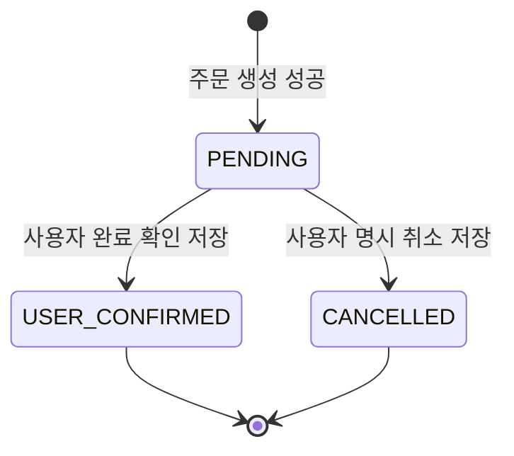

# SaveEats 통합 개발 명세서

버전: **v0.2 통합 설계 초안** / 작성일: 2026-09-30 (Asia/Seoul) / v0.2: 기획서 v1.2의 리뷰 정렬 확정 반영

**수정 이력**

- **2026-10-01 수정:** 팀 합의로 확정한 정책과 카탈로그 계약(catalog@0.1) 합의를 반영했다. 본문에는 `(2026-10-01 결정)`으로 표시한다.
  - 이메일 인증 없이 가입·로그인: AUTH-001, SEC-009, API-002, OPEN-ARCH-001 / OPEN-DB-003
  - 영업 종료(STORE_CLOSED)·같은 조합 합산 10 초과: DB-004, SEC-008, CART-004, CART-008, OPEN-CART-001
  - 대표 메뉴·리뷰 요약: DB-009, API-003
  - 가게 목록 이름순, 카탈로그 조회 응답 형식: API-001, API-002
  - 개발 단계 가상 데이터: OPS-003, OPEN-DB-009

상위 기준은 **SaveEats 최종 서비스 기획서 v1.2(20260930)**이다. PRD v1.1과 개발 명세 Step 1~9를 근거로 통합했다. 기존 FR/AC와 ARCH/DB/AUTH/SEC/CART/ORD/TRF/REV/IMG/HIST/REC/OPS/EVT/API/TASK ID는 유지한다. 이 문서는 구현·배포·실기기 검증 완료를 의미하지 않는다. 제품 규칙과 기술 제안이 충돌하면 상위 기획서를 우선하고 정책 변경은 별도 반영한다.

## 문서 사용과 범위

제품은 배달앱 경험을 유지하고 돈의 목적지를 바꾸는 서비스다. Guest 탐색·Cart → 이메일/비밀번호 로그인 → 본인 계좌 → 최종 고지 → 서버 PENDING 생성 → Toss 또는 직접 이어가기 → 사용자 완료 확인 → USER_CONFIRMED → 내역·리뷰의 MUST 흐름을 구현한다. 자동 금융 검증/VERIFIED는 LATER이다.

**확정 정책 / 기술 설계안 / 제품 결정 필요 / 기술 검증 필요 / SHOULD / LATER**를 구분한다. 숫자로 제시된 페이지 크기·주기·파일 크기·예약 수명·재시도 횟수는 별도 확정 정책 표시가 없으면 기술 초깃값이다. 실제 Analytics 연동은 SHOULD, 이벤트 계약은 MUST. Calendar/Badge/신고/알림 등 확장 우선순위를 올리지 않는다.

각 장은 단독으로 구현하지 않는다. DB 제약 + SEC 권한 + 도메인 트랜잭션 + API/Mock + 복구/검증을 함께 읽는다. 함수 이름은 논리 계약이며 SQL 인자 타입·signature와 실행 가능한 migration은 구현 시 고정한다. 원문 Step 초안의 추가 스키마는 이 파일의 DB·권한 장에 직접 반영했다. 미결정의 최신 상태는 제10장의 통합 결정 표를 기준으로 한다.

| 장 | 내용 | 주요 ID |
|---|---|---|
| 1 | 시스템 아키텍처 | ARCH |
| 2 | DB 스키마와 내부 작업 테이블 | DB |
| 3 | 인증·RLS·권한 | AUTH, SEC |
| 4 | Cart 저장·승격·동기화 | CART |
| 5 | 주문·Snapshot·상태·중복 방지 | ORD |
| 6 | Toss·직접 이어가기·PoC | TRF |
| 7 | 리뷰·Helpful·이미지 | REV, IMG |
| 8 | 내역·읽음·공통 복구 | HIST, REC |
| 9 | 운영·Seed·Analytics·API·개발 작업 | OPS, EVT, API, TASK |
| 10 | 정합성 검수·구현 전 결정·완료 조건 | 통합 검수 |

## 1. 시스템 아키텍처

### 1. 적용 범위와 상태 표기

- **확정 정책**: 상위 기획서에서 확정된 사용자 경험과 제품 규칙.
- **기술 설계안**: 이번 명세에서 추천하는 구현 방식. 제품 정책 확정을 의미하지 않는다.
- **제품 정책 결정 필요**: UX에 영향을 주지만 상위 문서에서 미정인 항목.
- **기술 검증 필요**: 실제 구현 및 기기 테스트가 필요한 항목.
- **SHOULD / LATER**: 기존 우선순위를 유지한다.

이 장은 책임 경계와 흐름을 요약한다. 상세 스키마는 DB, 권한은 AUTH/SEC, 입력·오류 계약은 각 도메인 및 API 절을 함께 적용한다. 실행 가능한 전체 SQL은 구현 산출물이다.

### 2. ARCH-001 전체 구조

**기술 설계안:** React Native + TypeScript 앱, Supabase Auth/PostgreSQL/Storage, 로컬 저장소, 외부 앱 실행 어댑터로 구성한다. 별도 Express 서버는 초기 구조에 추가하지 않는다. Expo 사용 여부와 각 라이브러리 버전은 현재 저장소 및 Toss 실기기 요구사항 확인 후 고정한다.

| 구성 | 책임 | 주요 경계 |
|---|---|---|
| React Native 화면 | 탐색, 입력, 상태 표시, 사용자 확인 | 가격·권한·완료 상태의 최종 판정 금지 |
| 앱 도메인/서비스 | Cart, 주문 요청, 복구 작업, 외부 앱 실행 조율 | 화면에서 직접 여러 DB 쓰기를 조합하지 않음 |
| Supabase Auth | 이메일·비밀번호 인증, 세션 | 업무 권한은 RLS/서버 검증으로 별도 보호 |
| PostgreSQL + RPC | 소유권, 가격/옵션 검증, 주문 생성, 상태 전이, 리뷰 제약 | 핵심 변경을 트랜잭션으로 수행 |
| Supabase Storage | 리뷰 이미지 파일과 접근 제어 | DB 리뷰 공개 여부와 이미지 접근 정책을 함께 설계 |
| 로컬 저장소 | Guest Cart, 탐색 기록, 완료확인 재시도 작업 | 서버 주문 상태의 대체 원장으로 사용하지 않음 |
| Feature Config | 원격 Toss Kill Switch | 앱 환경변수만으로 원격 차단을 대체하지 않음 |
| TransferLauncher | 검증된 Toss 실행/직접 이어가기 선택 | 송금 성공을 판정하지 않음 |
| Edge Functions | 비밀키 작업, 계정 탈퇴 등 서버 전용 처리 | 필요 작업에 한정; 단순 조회마다 경유하지 않음 |

Supabase 공식 문서는 Auth와 RLS의 조합, Data API 권한 제한, React Native 클라이언트 연동을 제공한다. 위 서비스 분할은 이를 바탕으로 한 SaveEats 설계안이다.

### 3. ARCH-002 읽기와 쓰기 경계

일반 조회는 권한이 제한된 Data API 또는 RPC를 사용한다. 활성 Store/Menu/Category와 공개 리뷰의 안전한 필드는 Guest 조회 가능하도록 설계한다. 사용자 계좌·Cart·Order·내역은 본인만 조회한다. 공개 리뷰 응답에 이메일, 실명 원본, 전체 계좌번호를 포함하지 않는다.

찜처럼 단일 행의 변경은 RLS와 제약을 적용한 직접 쓰기가 가능하다. 아래 핵심 작업은 서버/DB 명령으로 제한한다.

- 주문 생성: 현재 가격·품절·옵션·수량·Single-Store·계좌 소유권 검증, Snapshot, 상태 이력 생성.
- 주문 완료 확인/취소: 기존 상태 검사와 상태 이력 생성을 하나의 트랜잭션으로 처리.
- 리뷰 작성/재작성: 완료된 본인 주문, 서버 시각 기준 작성 기한, 활성 리뷰 unique 검증.
- 리뷰 수정/삭제 및 도움돼요: 소유권·금지 필드·자기 리뷰 제한·unique 보장.

RPC의 호출자 인증과 실행 권한을 명시한다. SECURITY DEFINER가 필요한 함수는 고정 search_path, 명시적 소유권 확인, 최소 실행 권한을 검토한다. 함수라는 이유만으로 RLS가 자동 보장된다고 가정하지 않는다. service_role/서버 비밀키는 모바일 앱에 넣지 않는다.

### 4. ARCH-003 주문 생성 흐름

**확정 정책:** 최종 CTA 이후 외부 앱 실행 전에 PENDING Order를 생성한다.

1. 앱이 최종 고지와 사용자 승인, 계좌, Cart의 가격 변경/품절 해결 여부를 확인한다.
2. 동일 생성 요청을 식별하는 idempotency key를 로컬에 보존한다.
3. 서버가 인증 사용자·현재 데이터·사용자 확인 가격을 다시 검사한다.
4. 가격이 달라졌거나 품절이면 주문 생성을 거절하고 사용자의 재확인으로 돌린다.
5. Order, Item/Option/계좌 Snapshot, 초기 상태 이력을 같은 트랜잭션으로 저장한다.
6. 서버 응답의 Order ID와 금액을 기준으로 이어가기 화면을 표시한다.
7. 사용자 동작과 최신 기능 설정에 따라 외부 앱을 실행하거나 직접 이어가기를 표시한다.

응답 유실 시 같은 key로 재시도하여 기존 Order를 반환받는다. 같은 key에 다른 내용이 오면 충돌로 거절한다. 버튼 loading lock은 보조 수단이며 DB unique/트랜잭션이 최종 중복 방지 수단이다. 서버 성공 전 외부 앱을 실행하지 않는다.

### 5. ARCH-004 외부 앱 경계

**확정 정책:** Toss는 편의 경로이며 직접 이어가기를 제공한다. 앱 복귀나 앱 실행 성공은 송금 성공 증거가 아니다.

TransferLauncher는 `launch`, `isAvailable`, 검증된 파라미터 지원 범위만 책임진다. 반환값은 실행 성공/불가/오류를 나타내며 송금 성공을 나타내지 않는다. 자동 검증 Provider는 LATER이며 지금 구현하지 않는다.

원격 feature_config에서 tossDeepLinkEnabled를 관리한다. 미검증 기기/파라미터, 설정 조회 실패 또는 유효성을 확인할 수 없는 오래된 설정이면 직접 이어가기로 전환하는 fail-closed 설계를 추천한다. 앱 시작 및 외부 실행 직전에 설정을 확인한다. OFF는 주문이나 기록을 삭제하지 않는다.

계좌번호와 금액은 각각 사용자 버튼 동작으로만 복사한다. 외부 앱 복귀 시 PENDING을 유지하고 완료 여부를 묻는다. PENDING 자동 만료는 미정으로 두며 임의 스케줄러를 추가하지 않는다.

### 6. ARCH-005 완료 확인과 복구

**확정 정책:** 사용자 완료 확인 시 USER_CONFIRMED. 상태 저장 실패는 송금 실패와 다르다.

1. `주문 완료했어요`를 누르면 userId, orderId, operationId를 포함한 완료확인 작업을 로컬에 먼저 영속화한다.
2. 서버의 완료확인 명령을 호출한다. 서버는 소유권을 검증하고 PENDING → USER_CONFIRMED와 completedAt, 상태 이력을 원자적으로 저장한다.
3. 동일 주문의 이미 완료된 요청은 같은 완료 결과를 반환하며 completedAt을 재설정하지 않는다.
4. 실패 또는 응답 유실이면 작업을 유지하고 `송금을 이미 완료했다면 다시 송금하지 마세요.`와 상태 저장 재시도를 제공한다.
5. 앱 재시작/네트워크 복귀 시 먼저 서버 상태를 조회한다. 이미 완료면 작업을 제거하고, PENDING이면 상태 저장 명령만 재시도한다.

이 복구 과정은 외부 금융앱을 자동 실행하지 않는다. 서버 확인 전 정상 완료 화면·완료 집계로 확정하지 않고 `완료 확인 저장 중/저장 실패`라는 로컬 동기화 상태로 표시한다. 이는 새로운 Order status가 아니다.

서버가 CANCELLED를 반환하거나 다른 사용자로 로그인한 경우 자동 처리를 중지한다. 작업은 사용자별로 격리하고 현재 로그인 사용자와 일치할 때만 처리한다. 취소와 완료 확인의 경합은 서버 상태 조건/행 잠금으로 해결하며 UI가 마지막 응답을 임의로 덮어쓰지 않는다.

로컬 기록 자체가 실패하면 오류를 알리고 서버 상태 확인 경로를 유지한다. 로컬 저장 성공만으로 모든 강제종료 상황이 해결된다고 가정하지 않는다. 이 구간은 별도 복구 테스트가 필수다.

### 7. ARCH-006 저장과 캐시

| 데이터 | 기준 저장 위치 | 로컬 처리 |
|---|---|---|
| Store/Menu/Option | 서버 Seed DB | 조회 캐시, 주문 시 서버 재검증 |
| Guest Cart | 로컬 | 재실행/로그인 취소 시 유지 |
| 로그인 사용자 Cart | 서버 저장 추천 | 로컬 미동기화 변경과 서버 revision 분리 |
| Order/Snapshot/StatusUpdate | 서버 | 조회 캐시와 복구 작업만 저장 |
| Review/Helpful | 서버 | 조회 캐시, 서버 제약 검증 |
| 최근 검색/최근 본 항목 | 로컬 추천 | 최근 본 항목 최대 10개 |
| Auth Session | SDK + 적합한 영속 저장 adapter | 토큰 보안/수명/실기기 검증 |
| 완료확인 재시도 | 사용자별 로컬 작업 큐 | 전체 계좌번호·비밀번호 저장 금지 |

Guest Cart는 비민감 로컬 저장소(예: AsyncStorage)로 구현하는 설계안을 사용한다. 세션과 계좌정보를 같은 일반 저장소로 묶지 않는다. 세션 adapter는 안전한 저장소의 용량 및 플랫폼 동작을 확인한 뒤 고정한다.

Cart 로그인 승격은 기획서의 최신 로컬 Cart 우선 규칙을 따른다. CART-005~010에서 빈 Cart/삭제/서버 revision/다른 계정 로그인 사례를 정의한다. 클라이언트 시각만으로 서로 다른 기기의 최신 여부를 확정하지 않는다. 복잡한 품목 병합은 추가하지 않는다.

전체 계좌번호의 저장 위치·암호화·키 관리는 **기술 검증 필요**다. 마스킹 Snapshot만으로 직접 이어가기의 계좌번호 복사를 구현할 수 없으므로 별도 보안 설계가 필요하다. 계좌 변경/삭제 후 기존 PENDING 주문의 목적지를 어떻게 계속 제공할지는 기획서가 명시적으로 정의하지 않은 경계이며 제10장의 제품 결정 표에서 정책 확인이 필요하다. 현재 계좌번호를 과거 주문에 자동 대입하지 않는다.

### 8. ARCH-007 리뷰와 unread

리뷰의 활성 unique는 orderId 기준 deletedAt IS NULL인 partial unique index를 추천한다. 기한은 서버에서 completedAt + 정확히 30×24시간으로 검사한다. 기존 활성 리뷰는 기한이 지나도 수정/삭제할 수 있다. 재작성은 새 Review ID이며 도움돼요 0부터 시작한다.

ReviewImage는 별도 엔티티로 둔다. MVP 최대 1장은 UI와 서버 양쪽에서 제한한다. 파일 업로드와 DB 저장은 하나의 DB 트랜잭션이 아니므로 IMG-002~005의 준비 업로드·immutable final·참조 확정·정리 구조를 적용한다. soft delete 후 신규 접근 발급을 차단하며 기존 signed URL의 잔여 수명은 별도로 다룬다.

OrderStatusUpdate는 상태 전이와 함께 서버에 생성한다. 앱은 행 50% 이상 약 1초 노출을 감지하여 읽음 명령을 호출한다. read 저장 실패는 UI 오류 없이 silent retry하고 이력은 삭제하지 않는다. Push/리뷰 알림과 이 구조를 분리한다.

### 9. ARCH-008 코드 경계와 협업

추천 폴더: src/app(초기화·navigation), src/features(auth/catalog/search/favorites/cart/account/order/history/review/my), src/shared(ui/time/errors), src/infrastructure(supabase/local/transfer/analytics), supabase/migrations, supabase/seed, docs/contracts.

화면 → feature 서비스 → repository/adapter 방향으로 의존한다. 공유 UI는 Supabase를 직접 호출하지 않는다. Order 서비스는 특정 Toss URL을 직접 조립하지 않고 TransferLauncher를 사용한다. 초기부터 과도한 범용 framework나 LATER 구현체를 만들지 않는다.

- 혜지: migration/RPC/RLS/Storage 및 계약의 서버 구현.
- 지우: 화면·navigation·로컬 Cart·외부 실행·복구 UI와 adapter 구현.
- 서정: 고지/카피·디자인·상태별 UX 검수 및 제품 정책 변경 관리.

Request/Response/ErrorCode를 공유 계약으로 먼저 작성하고 FE Mock과 BE 구현에서 같은 계약을 사용한다. API-002의 이름은 논리 계약이며 실제 SQL signature는 구현 전에 고정한다. DB migration은 Git 관리하며 원격 수동 수정만 남기지 않는다.

### 10. ARCH-009 시간·운영·오류

DB 시각은 UTC, 표시/월 경계는 Asia/Seoul이다. completedAt은 서버 완료확인 저장 시각을 기준으로 하는 설계안이며 사용자 기기의 임의 시각을 신뢰하지 않는다. 리뷰 기한에는 KST 자정 반올림을 적용하지 않는다.

금액은 원 단위 정수로 다루고 Snapshot 금액이 과거 기록의 기준이다. 완료 집계에 PENDING/CANCELLED를 포함하지 않는다. Analytics 실패가 주문 트랜잭션을 실패시키지 않는다. 이벤트 명세 MUST, 실제 도구 연동 SHOULD를 유지한다.

운영 로그에는 request/operation/order 식별자와 오류 종류를 사용하되 토큰, 전체 계좌번호, 딥링크 원문, 비밀번호를 남기지 않는다. 주문/계좌 오류를 우선 처리하고 리뷰/추천의 부분 실패로 전체 화면을 막지 않는다.

### 11. 미결정과 검증 목록

| ID | 항목 | 상태 | 처리 시점 |
|---|---|---|---|
| OPEN-ARCH-001 | 이메일 인증 필수 여부·미인증 제한·재설정 UX | 이메일 인증은 **결정됨 (2026-10-01 결정)** — 요구하지 않음. 재설정 UX만 제품 정책 결정 필요 | Auth 계약 작성 시 |
| OPEN-ARCH-002 | 전체 계좌번호 저장/암호화/탈퇴 처리 | 기술 검증 필요 | 계좌 Schema/RLS 전 |
| OPEN-ARCH-003 | PENDING 주문 중 계좌 교체/삭제 처리 | 제품 정책 결정 필요 | 주문/계좌 계약 작성 시 |
| OPEN-ARCH-004 | Toss OS/버전/은행/계좌/금액 지원 | 실기기 PoC | Toss 기능 활성화 전 |
| OPEN-ARCH-005 | 세션 저장·복귀·강제종료 복구 | 기술 검증 필요 | 공통 기반 구현 시 |
| OPEN-ARCH-006 | Cart 승격 revision/빈 상태 충돌 | 설계안 작성 완료, 구현 검증 전 | CART-005~010 |
| OPEN-ARCH-007 | 완료확인 작업 유실·재시도·경합 | 설계 후 테스트 필요 | 주문 구현 완료 전 |
| OPEN-ARCH-008 | Calendar/Badge/신고/알림/통계 확장 | SHOULD | 일정에 따라 범위 결정 |
| OPEN-ARCH-009 | 최소 요약 상세 지표 (리뷰 정렬 카피는 v1.2에서 확정) | 범위 확인 필요 | 해당 화면 명세 시 |

리뷰 정렬 카피는 기획서 v1.2에서 `최신순 / 리뷰 도움순 / 땡김도 높은 순 / 땡김도 낮은 순`으로 확정됐다. 마이의 요약 영역은 유지하되 상세 지표를 임의로 MUST에 승격하지 않는다.

### 12. 아키텍처 검증 완료 조건

- Guest 탐색/Cart를 인증·계좌 등록 없이 구현할 수 있다.
- 본인 개인 데이터 접근과 공개 리뷰의 안전한 응답 경계가 정의된다.
- 서버 성공 전 외부 앱이 실행되지 않으며 요청 재시도로 중복 주문이 생기지 않는다.
- Order 상태·금액을 클라이언트 직접 쓰기로 우회 변경할 수 없다.
- 외부 앱 복귀/실행 성공이 USER_CONFIRMED나 VERIFIED로 자동 바뀌지 않는다.
- 완료확인 저장 실패/앱 종료/응답 유실에서 동일 Order 상태 저장만 복구한다.
- Toss OFF 또는 설정 조회 실패에서 직접 이어가기를 제공한다.
- 계좌/가게/메뉴 변경이 과거 Snapshot을 덮어쓰지 않는다.
- SHOULD/LATER 없이 MUST 흐름이 성립한다.

이 항목들은 아직 통과한 테스트 결과가 아니라 구현 시 검증해야 하는 완료 조건이다.

### 참고 공식 문서

- https://supabase.com/docs/guides/getting-started/quickstarts/expo-react-native
- https://supabase.com/docs/guides/database/postgres/row-level-security
- https://supabase.com/docs/guides/database/secure-data

공식 문서의 일반 기능 지원은 SaveEats의 Toss PoC나 보안 검증 완료를 의미하지 않는다.

## 2. DB 스키마

**상태: 기술 설계안.** 실제 migration 적용, RLS 검증, 데이터베이스 테스트를 완료한 문서가 아니다. 제품 정책 결정 필요 항목을 확정 정책처럼 구현하지 않는다. 이 장은 컬럼·관계·제약·인덱스·Snapshot을 정의한다. 권한 설계는 SEC 절에 통합한다. 실행 가능한 전체 SQL migration은 구현 시 작성·검증한다.

### DB-001 공통 규칙

- 테이블/컬럼은 snake_case, API는 API-001의 camelCase DTO로 변환한다.
- PK는 uuid, 기본값 gen_random_uuid(). auth.users.id 참조는 Supabase Auth ID를 그대로 사용한다.
- 시각은 timestamptz. 서버가 생성하고 UTC 기준으로 취급한다. 화면과 월 경계는 Asia/Seoul이다.
- 금액은 원 단위 bigint, 통화는 KRW. 부동소수점 금액을 사용하지 않는다. API에서는 JS 안전 정수 범위 검사 후 number로 반환하고 초과값을 조용히 변환하지 않는다.
- 아래 표의 `?`는 NULL 허용. 그 외는 NOT NULL. 별도 언급 없는 id는 PK다.
- created_at 기본값 now(), updated_at은 변경 시 서버 갱신. 주문 완료 시각은 완료 명령의 서버 시각으로 한 번만 설정한다.
- FK 기본 삭제 동작은 RESTRICT. 상품 비활성화로 과거 주문/리뷰를 제거하지 않는다. 회원 탈퇴 보존/익명화는 미결정이며 auth.users 삭제에 주문 CASCADE를 연결하지 않는다.
- 서버 계산값·소유자·Snapshot·상태를 클라이언트가 직접 수정할 수 없게 한다. CHECK/UNIQUE/FK와 RPC 검증의 책임을 구분한다.
- 미래 상태 VERIFIED/FAILED는 이번 상태 CHECK에 넣지 않는다. 정식 검증 도입 시 migration으로 확장한다.

### DB-002 테이블 범위

| 영역 | MUST 설계 테이블 | 역할 |
|---|---|---|
| 계정 | profiles, destination_accounts | 계정 표시정보와 현재 목적지 |
| 카탈로그 | categories, stores, menus, menu_option_groups, menu_options | Seed → 정식 데이터 전환 경계 |
| 콘텐츠 | banners, popular_search_terms | 홈 배너·Seed 인기 검색어 |
| 찜 | store_favorites | Store only |
| Cart | carts, cart_items, cart_item_options | 로그인 Cart 저장 기술안 |
| 주문 | orders, order_items, order_item_options | 불변 Snapshot과 금액 |
| 상태 | order_status_updates | 상태 이력·읽음 |
| 리뷰 | reviews, review_menus, review_images, review_helpful | 활성 리뷰·메뉴 범위·이미지·도움 |
| 내부 명령 | private.cart_command_receipts, private.review_command_receipts | 같은 요청 재시도의 적용 결과 보존 |
| 이미지 작업 | private.review_uploads, private.storage_cleanup_jobs | 예약·검증·확정·정리 |
| 운영 | feature_config | Toss 원격 차단 |

Guest Cart, 최근 검색어, 최근 본 항목(최대 10개), 온보딩 완료 여부, 완료확인 재시도 큐는 로컬 저장한다. 서버에 Guest 사용자를 임의 생성하지 않는다. Analytics 이벤트 명세는 MUST이나 이벤트 적재 테이블/실제 도구 연동은 이번 MUST 스키마에 추가하지 않는다. Calendar/Badge/신고/알림/Push는 SHOULD 범위 결정 전 테이블을 만들지 않는다.

### DB-003 계정과 목적지

#### profiles

| 컬럼 | 타입/제약 | 설명 |
|---|---|---|
| id | uuid PK → auth.users.id, RESTRICT | 본인 계정 |
| name | text? | 실명 마스킹 표시의 원본, 공개 응답 금지 |
| created_at / updated_at | timestamptz | 서버 관리 |

비밀번호·이메일 인증 상태는 Auth에서 관리하며 복제하지 않는다. 이름 수집 시점/필수 여부/이름 미등록자의 표시명은 **제품 정책 결정 필요**다. nullable 설계로 가입을 임의 차단하지 않는다. 공개 리뷰는 서버가 만든 마스킹 표시명만 반환하고 profiles의 전체 행을 공개하지 않는다. 공개 닉네임은 LATER다.

#### destination_accounts

| 컬럼 | 타입/제약 | 설명 |
|---|---|---|
| id | uuid PK | 목적지 식별자 |
| user_id | uuid → profiles.id, UNIQUE | 사용자당 현재 계좌 1개 |
| bank_code | text | 내부 표준 은행 식별값; Toss 코드와 adapter에서 매핑 |
| bank_name | text | 등록 당시 표시명 |
| masked_account_number | text | UI 표시용; 원문을 대신하지 않음 |
| revision | bigint > 0, 기본 1 | 변경 경합 검증 |
| created_at / updated_at | timestamptz | 서버 관리 |

삭제는 현재 등록정보를 없애 미등록 상태로 만든다. 계좌 변경 시 revision을 증가시킨다. 주문은 당시 마스킹 Snapshot을 별도로 유지한다.

**전체 계좌번호 보관은 미확정:** 일반 노출 테이블/JSONB/로컬 Cart에 평문 필드를 추가하지 않는다. 후보는 Data API 비노출 private 스키마의 암호화 payload(계좌 id, ciphertext, key_version)이나 실제 저장 필요성·암호화·키관리·접근·삭제를 검증한 뒤 확정한다. private 스키마나 RLS만으로 암호화를 대체했다고 표현하지 않는다. 원문을 읽는 경로는 본인 인증 후 필요한 동작에 한정한다.

기존 PENDING 주문 중 계좌 변경/삭제 시 원래 목적지의 원문을 어떻게 제공할지는 OPEN-ARCH-003이다. 현재 계좌 원문을 과거 Snapshot에 자동 결합하지 않는다. 이 결정 전에는 해당 이어가기 계약과 민감정보 migration을 완료로 처리하지 않는다.

### DB-004 카탈로그와 Seed 콘텐츠

| 테이블 | 주요 컬럼 | 제약/관계 |
|---|---|---|
| categories | id, code text, name text, sort_order integer=0, is_active boolean=true | UNIQUE(code) |
| stores | id, category_id uuid, name text, description text?, image_ref text?, is_active boolean=true, is_open boolean=true, is_recommended boolean=false, source_type text='SEED', source_ref text?, catalog_revision bigint=1, created_at, updated_at | category_id FK; revision > 0 |
| menus | id, store_id uuid, name text, description text?, image_ref text?, base_price bigint, is_active boolean=true, is_sold_out boolean=false, is_popular boolean=false, popularity_score integer=0, sort_order integer=0, catalog_revision bigint=1, created_at, updated_at | store_id FK; price >= 0; UNIQUE(id,store_id) |
| menu_option_groups | id, menu_id uuid, name text, min_select integer=0, max_select integer, sort_order integer=0, is_active boolean=true | menu_id FK; 0 <= min_select <= max_select; max_select >= 1; UNIQUE(id,menu_id) |
| menu_options | id, group_id uuid, name text, additional_price bigint=0, is_active boolean=true, is_sold_out boolean=false, sort_order integer=0 | group_id FK; additional_price >= 0; UNIQUE(id,group_id) |
| banners | id, title text, image_ref text?, target_type text, target_id uuid?, sort_order integer=0, is_active boolean=true | 내부 이동先는 서버/Seed 검증; 임의 외부 URL 실행 금지 |
| popular_search_terms | id, term text, sort_order integer=0, is_active boolean=true | UNIQUE(term); Seed임을 데이터에 기록 |

각 콘텐츠에 source_type/source_ref와 이미지 출처·사용권 메타데이터를 Seed manifest로 관리한다. 임의 사용자 주문수/리뷰수는 Seed 컬럼에 넣지 않는다. `전체` 카테고리는 필터 해제용 UI 상태로 구현하고 모든 Store에 부여하는 카테고리 행으로 만들지 않는다. 초기 Store의 대표 카테고리 1개는 기술 설계안이며 다중 분류가 실제 필요할 때 연결 테이블로 확장한다.

옵션의 최소/최대 선택 수는 옵션 모델 표현 방식이다. 실제 Seed별 필수/복수 선택 규칙을 확인한 후 설정한다. MVP에서 같은 옵션을 중복 선택하거나 옵션 자체 수량을 추가하지 않는다. 음수 가격/할인 모델은 현재 명세 범위 밖이다.

카탈로그 변경 시 관련 Menu의 revision을 서버가 증가시킨다. 주문 시 revision과 실제 이름/가격/판매 가능 상태를 다시 검사한다. 영업 상태 is_open은 Seed 표현이며 자동 영업시간 계산 완료를 의미하지 않는다. **확정 정책 (2026-10-01 결정):** is_open=false인 Store의 메뉴는 Cart에 새로 담을 수 없다(앱 담기 차단, 안내 “지금은 영업이 종료됐어요”). 이미 담긴 Cart는 유지하되 validate_my_cart는 STORE_CLOSED로 주문 불가를 반환하고 create_order는 STORE_CLOSED로 거절한다(T04·T06에서 구현). 이미 생성된 PENDING Order의 이어가기·완료 확인은 is_open과 무관하게 허용한다.

#### store_favorites

`user_id uuid FK profiles`, `store_id uuid FK stores`, `created_at timestamptz`; PK(user_id,store_id). 비활성 가게는 조회에서 숨긴다. 활성 여부 변경으로 찜 레코드를 삭제하지 않는다.

### DB-005 Cart

로그인 사용자 Cart를 DB에 저장하는 **기술 설계안**이다. Guest Cart는 동일 계약 모양을 로컬에 보관한다.

| 테이블 | 컬럼 | 제약 |
|---|---|---|
| carts | id, user_id uuid UNIQUE FK profiles, store_id uuid? FK stores, revision bigint=1, created_at, updated_at | revision > 0; 빈 Cart도 revision을 보존 |
| cart_items | id, cart_id uuid FK carts, menu_id uuid FK menus, quantity integer, configuration_key text, acknowledged_unit_price bigint, acknowledged_catalog_revision bigint, created_at, updated_at | quantity BETWEEN 1 AND 10; price >= 0; UNIQUE(cart_id,configuration_key) |
| cart_item_options | cart_item_id uuid FK cart_items, group_id uuid FK menu_option_groups, option_id uuid FK menu_options | PK(cart_item_id,option_id) |

configuration_key는 menu_id + 정렬된 선택 option_id의 정규형으로 서버가 계산한다. 같은 메뉴라도 옵션 조합이 다르면 별도 item이다. 조합이 같은 항목의 수량 합산이 10을 넘을 때 자동 절삭하지 않으며 상세 동작은 Cart 계약에서 명시한다.

다음 규칙은 교차 행 검증이므로 RPC에서 처리한다: 모든 item이 carts.store_id에 속함, 옵션이 해당 메뉴의 그룹에 속함, 필수/최대 선택 수 충족, 빈 Cart의 store_id=NULL, 비어 있지 않은 Cart의 store_id!=NULL. Cart 수정과 revision 증가는 같은 트랜잭션이다. 가격은 과거 사용자 확인값이며 주문가격의 최종 원장이 아니다.

승격 명령은 local_cart_id, local_revision, 서버 expected_revision, 전체 Cart payload를 받는 방향으로 설계한다. 최신 로컬 Cart 우선 정책을 유지하되 기기 timestamp만으로 기기 간 최신성을 판정하지 않는다. 빈 Cart/삭제/다른 계정/재시도/충돌은 CART-005~010을 적용한다. 서버 Cart를 자동 merge하지 않는다.

#### private.cart_command_receipts

Data API 비노출. user_id uuid FK profiles, operation_id uuid, request_fingerprint text, cart_id uuid FK carts, applied_revision bigint CHECK>0, result_payload jsonb, created_at timestamptz. PK(user_id,operation_id). 공통 규칙상 별도 표기가 없는 필드는 NOT NULL이다.

Cart 교체/승격과 receipt를 같은 트랜잭션으로 저장한다. result_payload는 적용 당시 Cart와 validation 결과만 포함하며 계좌/토큰/원본 개인정보를 제외한다. 과거 applied_revision은 현재 서버 Cart revision과 다를 수 있다. 본인 명령 내부에서만 조회하며 클라이언트 직접 SELECT/쓰기 금지. MVP 자동 삭제 없음이라는 기술안과 retry 유효기간 검증은 CART-007을 따른다.

### DB-006 주문과 불변 Snapshot

#### orders

| 컬럼 | 타입/제약 | 설명 |
|---|---|---|
| id | uuid PK | 주문 ID |
| user_id | uuid FK profiles | 소유자 |
| store_id | uuid FK stores | One Order = One Store |
| idempotency_key | uuid | 생성 요청 식별자 |
| request_fingerprint | text | 정규화한 생성 payload hash; 계좌 원문 제외 |
| status | text | PENDING / USER_CONFIRMED / CANCELLED |
| total_amount | bigint > 0 | 서버 합산 금액 |
| currency | text DEFAULT 'KRW', CHECK='KRW' | 통화 |
| snapshot_version | integer DEFAULT 1, > 0 | Snapshot 형식 버전 |
| store_name_snapshot | text | 당시 가게명 |
| store_image_snapshot | text? | 당시 이미지 참조; 불변 asset/version 권장 |
| category_code_snapshot / category_name_snapshot | text | 당시 대표 분류 |
| account_id_reference | uuid? | 당시 목적지 id의 식별 참조; FK 아님 |
| account_revision_snapshot | bigint > 0 | 당시 목적지 revision |
| bank_code_snapshot / bank_name_snapshot | text | 당시 은행 |
| masked_account_snapshot | text | 당시 표시값; 전체 번호 금지 |
| source_cart_id | uuid NOT NULL, 식별 참조/FK 아님 | 생성에 사용한 Cart 추적, Cart 삭제와 Snapshot 분리 |
| source_cart_revision | bigint NOT NULL > 0 | 생성에 사용한 revision |
| disclosure_version | text NOT NULL | 승인한 고지 버전 |
| disclosure_acknowledged_at | timestamptz NOT NULL | 서버 요청 처리 시각, 실제 읽음 증명 아님 |
| status_revision | bigint DEFAULT 1, > 0 | 상태 이력 순서 |
| created_at | timestamptz | 최초 PENDING 생성 시각 |
| completed_at | timestamptz? | USER_CONFIRMED 최초 서버 확정 시각 |
| cancelled_at | timestamptz? | 명시 취소 서버 시각 |

UNIQUE(user_id,idempotency_key), UNIQUE(id,store_id). CHECK는 상태와 시각을 연결한다: PENDING이면 두 시각 NULL, USER_CONFIRMED이면 completed_at NOT NULL/cancelled_at NULL, CANCELLED이면 cancelled_at NOT NULL/completed_at NULL. 완료/취소 시각 >= created_at.

account_id_reference는 현재 계좌 삭제에 영향을 받지 않는 식별 참조다. 실제 생성 순간의 소유권과 revision은 RPC에서 확인한다. 과거 계좌 원문 보존을 뜻하지 않는다. 이름/가격/분류 Snapshot은 생성 이후 수정 금지. 상태 필드는 지정 명령만 변경한다. 과거 이미지 asset 삭제 시 placeholder를 제공하되 이름·가격 Snapshot은 그대로 유지한다.

#### order_items

| 컬럼 | 타입/제약 | 설명 |
|---|---|---|
| id / order_id | uuid PK / uuid FK orders | 주문 항목 |
| store_id / menu_id | uuid | 복합 FK(order_id,store_id) → orders; (menu_id,store_id) → menus |
| line_no | integer > 0 | UNIQUE(order_id,line_no) |
| menu_name_snapshot | text | 당시 메뉴명 |
| menu_image_snapshot | text? | 당시 이미지 참조 |
| base_price_snapshot | bigint >= 0 | 기본 단가 |
| option_total_snapshot | bigint >= 0 | 옵션 추가금 합 |
| unit_price | bigint >= 0 | base + option_total |
| quantity | integer 1~10 | 당시 수량 |
| line_total | bigint >= 0 | unit_price × quantity |

같은 행의 금액 식은 CHECK로 강제한다. item 합 = orders.total_amount, item 최소 1개, option 합 = option_total_snapshot은 주문 생성 RPC가 검증한다. 주문 자식 행을 직접 쓰는 권한은 제공하지 않는다.

#### order_item_options

`id uuid PK`, `order_item_id uuid FK`, `source_group_id uuid`, `source_option_id uuid`, `group_name_snapshot text`, `option_name_snapshot text`, `additional_price_snapshot bigint >= 0`, `sort_order integer`.

UNIQUE(order_item_id,source_option_id). source ID는 불변 추적값이며 현재 옵션에 대한 FK 없이 Snapshot을 보존한다. 주문 생성 시 현재 Menu/Group/Option 관계를 검증한다. 향후 Catalog 물리삭제 정책 도입 전에는 Store/Menu는 비활성화만 사용한다.

### DB-007 상태 이력과 멱등성

#### order_status_updates

| 컬럼 | 타입/제약 | 설명 |
|---|---|---|
| id / order_id | uuid PK / uuid FK orders | 상태 이벤트 |
| revision | bigint > 0 | UNIQUE(order_id,revision) |
| operation_id | uuid | UNIQUE(order_id,operation_id) |
| from_status | text? | 초기 생성은 NULL |
| to_status | text | 현재 MVP 상태 CHECK |
| created_at | timestamptz | 서버 변경 시각 |
| viewed_at | timestamptz? | NULL이면 unread |

초기 NULL→PENDING 이벤트도 생성하는 기술안이며 UI 빨간 점의 의미는 미확인 상태 업데이트다. 실제 화면 검수에서 초기 이벤트 표현을 확인한다. 이력에는 소유자 중복 컬럼을 두지 않고 orders 소유권으로 권한을 검사한다.

- 주문 생성: Order + item + option + revision 1 초기 이력을 한 트랜잭션으로 저장.
- 같은 생성 key + 같은 fingerprint: 기존 주문 반환. 다른 fingerprint: IDEMPOTENCY_CONFLICT. 현재 가격 재검증에 앞서 기존 성공 요청을 조회하여 재시도로 이미 생성된 주문을 바꾸지 않는다.
- 상태 변경: 주문 행 잠금 → 소유권/허용 전이 검사 → 상태/시각/revision/이력 동시 저장.
- 이미 USER_CONFIRMED인 완료확인 재시도: 최초 completed_at과 기존 결과 반환. 새 상태 이력을 만들지 않는다.
- PENDING→USER_CONFIRMED 또는 CANCELLED만 허용. 완료/취소 경합은 먼저 확정한 전이 이후 다른 전이를 거절한다.
- 읽음은 이벤트 ID 집합에 대해 최초 viewed_at을 서버에서 설정한다. 주문 전체/탭 전체 읽음 명령으로 대체하지 않는다. 읽음 후 새 이벤트는 NULL로 별도 생성한다.
- 로컬 저장 실패 복구는 새 주문 생성 key를 발급하지 않고 기존 order_id의 상태 저장만 재시도한다.

### DB-008 리뷰

#### reviews

| 컬럼 | 타입/제약 | 설명 |
|---|---|---|
| id | uuid PK | 재작성은 새 ID |
| order_id | uuid FK orders | 주문 기준 활성 unique |
| user_id | uuid FK profiles | 서버가 주문 소유자로 설정 |
| store_id | uuid FK stores | 서버가 주문에서 설정 |
| revision | bigint NOT NULL DEFAULT 1 CHECK>0 | 수정/삭제 CAS; 실질 변경에 증가 |
| craving_rating | smallint BETWEEN 1 AND 5 | 땡김도 |
| body | text | CHECK char_length(btrim(body)) BETWEEN 5 AND 500 |
| created_at / updated_at | timestamptz | 생성 순서 유지 |
| edited_at | timestamptz? | 실제 내용 수정 시 설정 |
| deleted_at | timestamptz? | soft delete |

복합 FK(order_id,store_id) → orders(id,store_id). user_id와 주문 소유자 일치는 RPC에서 검증한다. 조작 가능한 user_id를 요청에서 신뢰하지 않는다.

```sql
CREATE UNIQUE INDEX reviews_one_active_per_order
ON public.reviews (order_id) WHERE deleted_at IS NULL;
```

시간 경과에 따라 달라지는 작성 기한을 CHECK/인덱스 조건에 넣지 않는다. 서버 생성 명령은 status=USER_CONFIRMED, completed_at 존재, server_now <= completed_at + interval '720 hours'를 확인한다. 기획서의 ‘해당 시각을 초과하면 만료’에 따라 정확한 경계 시각은 허용한다. 기존 활성 리뷰의 수정/삭제에는 작성 기한 제한을 적용하지 않는다.

수정 허용: rating/body/image. 주문·가게·메뉴·금액·작성자·created_at 변경 금지. soft delete 후 복원 명령은 MVP에 제공하지 않는다. 재작성은 서버가 새 ID를 발급하고 이전 Helpful을 복사하지 않는다. char_length 기준과 앱의 Unicode 길이 계산은 동일 사례로 검증한다.

#### review_menus — 여러 메뉴 주문의 메뉴별 조회

`review_id uuid FK reviews`, `menu_id uuid FK menus`; PK(review_id,menu_id).

한 주문에 여러 메뉴가 있으므로 reviews.menu_id 하나로 줄이지 않는다. **기술 설계안:** 주문에 포함된 서로 다른 menu_id 전체를 서버가 연결한다. 메뉴 상세에서는 해당 연결이 있는 활성 리뷰를 조회한다. 사용자가 별도 대표 메뉴를 고르는 UI는 추가하지 않는다. 메뉴별 집계는 연결당 한 번, Store 집계는 Review당 한 번이다. 메뉴명/주문금액은 주문 Snapshot으로 표시하며 현재 메뉴가격을 사용하지 않는다.

#### review_images

| 컬럼 | 타입/제약 | 설명 |
|---|---|---|
| id / review_id | uuid PK / uuid FK reviews | Review 1:N 구조 |
| storage_path | text UNIQUE | 영구 공개 URL 저장 금지 |
| position | integer >= 0 | UNIQUE(review_id,position) |
| mime_type | text | 실제 파일 검증 후 설정 |
| byte_size | bigint > 0 | 검증 후 설정 |
| width / height | integer > 0 | 검증 후 설정 |
| created_at | timestamptz | 등록 시각 |

N장 구조를 유지하고 MVP 최대 1장은 review 행 잠금 + 서버 개수 검사로 제한한다. 업로드 전에 공개 행을 만들지 않는다. 준비 업로드→파일 검증→리뷰와 참조 확정→실패/미참조 파일 정리 순서로 설계한다. Storage와 DB는 단일 트랜잭션이 아니므로 재시도/정리 작업이 필요하다. bucket 비공개, 활성 공개 리뷰의 파일만 제한된 읽기 경로로 제공하는 방향이며 상세 정책·signed URL 수명·이미지 삭제/보존은 Storage 명세에서 결정한다. soft delete가 기존 발급 URL을 즉시 회수한다고 가정하지 않는다.

#### review_helpful

`review_id uuid FK reviews`, `user_id uuid FK profiles`, `created_at timestamptz`; PK(review_id,user_id).

서버가 활성 리뷰 존재와 자기 리뷰가 아님을 확인한다. 재시도 가능한 set_helpful(review_id, desired_boolean) 계약을 권장한다. 단순 toggle 재시도로 결과가 뒤집히지 않게 한다. 수정 시 기존 행 유지, 삭제 후 새 리뷰에는 새 행만 생성된다. 공개 응답은 Helpful count와 현재 사용자 선택 여부이며 도움을 누른 user_id 목록을 노출하지 않는다.

#### private.review_command_receipts

user_id uuid FK profiles, operation_id uuid, command_kind text, request_fingerprint text, target_id uuid, applied_review_id uuid, applied_revision bigint CHECK>0, result_payload jsonb, created_at timestamptz. PK(user_id,operation_id). 모두 NOT NULL을 기본으로 한다. target_id는 명령별 Order/Review 식별값이며 다형 FK를 만들지 않는다. create/update/delete/Helpful 성공과 no-op을 기록한다. Helpful의 applied_revision은 적용 당시 Review revision이며 Helpful 때문에 Review 내용 revision을 증가시키지 않는다.

명령 종류/대상/허용 입력/revision/upload ID를 fingerprint에 포함한다. 계좌·토큰·signed URL 제외. 적용 결과는 현재 상태를 보장하지 않으며 오래된 retry로 삭제 리뷰를 복원하지 않는다. 본인 업무 명령 내부에서만 조회/쓰기, MVP 임의 자동 삭제 없음(REV-004~009).

#### private.review_uploads

| 컬럼 | 타입/제약 | 책임 |
|---|---|---|
| id | uuid PK | 예약 ID |
| user_id / target_order_id | uuid NOT NULL FK profiles / orders | 소유자와 목표 주문 |
| target_review_id | uuid NULL FK reviews | 수정 대상, create는 NULL |
| staging_path | text NOT NULL UNIQUE | 서버 생성 업로드 key |
| final_path | text NULL UNIQUE | 클라이언트 쓰기 금지 immutable key |
| status | text NOT NULL, 허용 상태 CHECK | PREPARED/VALIDATING/READY/ATTACHED/REJECTED/EXPIRED/CLEANING |
| expires_at | timestamptz NOT NULL | 예약 유효기간 |
| processing_lease_until | timestamptz NULL | validator claim 수명 |
| verified_metadata | jsonb NULL | 검증한 크기/해상도/형식, 원본 EXIF 제외 |
| attached_review_id | uuid NULL FK reviews | 소비된 리뷰 참조 |
| created_at / updated_at | timestamptz NOT NULL | 서버 시각 |

READY/ATTACHED에는 final_path와 verified_metadata가 필요하고 ATTACHED에는 attached_review_id가 필요하다. 목표 Review가 목표 Order에 속함, user 소유권, 사진 1장 상한, 유효기간, READY→ATTACHED/CLEANING 배타 전이는 업무 명령/CAS에서 검사한다. 예약 상태와 파일 I/O의 원자성을 주장하지 않는다.

#### private.storage_cleanup_jobs

id uuid PK, object_path text NOT NULL UNIQUE, reason text NOT NULL, state text NOT NULL, next_attempt_at timestamptz NOT NULL, attempts integer NOT NULL DEFAULT 0 CHECK>=0, last_error_code text NULL, created_at timestamptz NOT NULL. state 기술 계약은 PENDING/PROCESSING/SUCCEEDED/FAILED이며 FAILED는 자동 retry 상한 이후 운영 점검 대상이다. 재시도 상한·lease 회수 방식은 worker 구현 계약에서 고정한다.

참조 제거/교체와 정리 job 생성은 DB 트랜잭션, bytes 삭제는 commit 이후 서버 worker 책임이다. 원문 오류 메시지 대신 허용 error code만 저장한다. 작업 필터용 (state,next_attempt_at) 인덱스, 예약용 (status,expires_at) 인덱스를 추가한다. 실제 credential 만료+grace 이후 재스캔과 lease/CAS는 IMG-002~004를 적용한다.

### DB-009 공개 조회와 집계

- 공개 catalog 응답은 활성 항목만, 공개 리뷰는 deleted_at IS NULL만 반환한다.
- 공개 리뷰 응답은 마스킹 표시명/땡김도/날짜/메뉴 Snapshot/본문/허용 이미지/주문금액/Helpful count로 제한한다. 계좌·이메일·원본 이름·내부 요청 hash는 반환하지 않는다.
- 공개 Review를 위해 전체 orders를 Guest에게 SELECT 허용하지 않는다. 권한을 제한한 조회 RPC 또는 안전한 projection으로 필요한 Snapshot 필드만 반환한다. VIEW를 만들었다는 이유만으로 RLS 우회를 방지했다고 가정하지 않는다.
- ReviewSummary는 활성 리뷰만 COUNT/AVG. 0개면 average=NULL, count=0. Seed 가짜 리뷰수/평균을 보충하지 않는다. **확정 정책 (2026-10-01 결정):** 리뷰 기능(T09) 전에는 {count: 0, averageCravingRating: null}을 반환하고 T09에서 실제 집계로 교체한다. 요약 조회 실패를 count=0으로 표현하지 않는다.
- 기본 최신순은 (created_at DESC,id DESC). 도움순은 count DESC와 생성 시각/id를 보조키로 한다. rating 정렬은 craving_rating과 동일 보조키를 사용한다. UI 정렬 명칭은 최신순/리뷰 도움순/땡김도 높은 순/땡김도 낮은 순(기획서 v1.2 확정).
- History는 생성 최신순 (created_at DESC,id DESC), 완료 재시각으로 재정렬하지 않는다. 페이지 크기 기술안 20, cursor pagination. Helpful 정렬처럼 값이 바뀌는 조회는 고정 Snapshot이 아니므로 REV-008의 ID dedupe/첫 page reset을 적용하며 값 변경 중 누락 방지를 보장하지 않는다.
- 완료 집계는 MVP status=USER_CONFIRMED만. 월간 간단 요약은 completed_at의 KST 월 범위를 UTC 경계로 변환해 조회하는 기술안이다. PENDING/CANCELLED 금액 제외. 상세 지표/별도 통계 화면은 SHOULD를 유지한다.

### DB-010 Feature Config

`feature_config`: key text PK, boolean_value boolean NOT NULL, revision bigint > 0 DEFAULT 1, updated_at timestamptz.

초기 행: key='tossDeepLinkEnabled', value=false. 운영 서버만 수정, 앱은 허용된 공개 key만 조회. 토큰·비밀키·계좌정보를 설정에 넣지 않는다. 조회 실패/지원 미검증/유효성 불명일 때 직접 이어가기로 전환한다. 앱 시작 및 외부 실행 직전에 조회하는 설계는 제1장을 유지한다. 설정 OFF는 기존 Order를 수정/삭제하지 않는다. 상세 갱신 정책은 API 계약 단계에서 정한다.

### DB-011 인덱스

PK/UNIQUE가 만든 인덱스를 중복 생성하지 않는다. 초기 추가 후보는 다음과 같다.

| 대상 | 인덱스 | 용도 |
|---|---|---|
| stores | (category_id,id) WHERE is_active | 카테고리 |
| menus | (store_id,sort_order,id) WHERE is_active | 가게 메뉴 |
| menu_option_groups | (menu_id,sort_order,id) | 옵션 조회 |
| menu_options | (group_id,sort_order,id) | 옵션 조회 |
| store_favorites | (user_id,created_at DESC,store_id) | 찜 목록 |
| cart_items | (cart_id) | Cart 조회 |
| orders | (user_id,created_at DESC,id DESC) | 내역 cursor |
| orders | (user_id,completed_at) WHERE status='USER_CONFIRMED' | 완료 요약 |
| order_items | (order_id) | Snapshot 조회 |
| order_item_options | (order_item_id) | Snapshot 옵션 |
| order_status_updates | (order_id,created_at DESC,id DESC) WHERE viewed_at IS NULL | unread |
| reviews | (store_id,created_at DESC,id DESC) WHERE deleted_at IS NULL | Store 공개 리뷰 |
| reviews | (user_id,created_at DESC,id DESC) WHERE deleted_at IS NULL | 내 리뷰 |
| review_menus | (menu_id,review_id) | Menu 공개 리뷰 |

name 부분검색은 소규모 Seed에서는 단순 쿼리로 시작할 수 있다. 실제 데이터량과 실행계획 확인 없이 trigram/full-text/초성검색을 모두 추가하지 않는다. FK의 자식측 인덱스 누락과 RLS predicate 실행계획은 migration 단계에서 확인한다.

### DB-012 제약과 쓰기 권한 책임

| 규칙 | 보장 위치 |
|---|---|
| 1~10 수량, 1~5 땡김도, 본문 길이, 상태/시각 일치 | NOT NULL + CHECK |
| 현재 목적지 1개, Store 찜 중복, Helpful 중복 | UNIQUE/PK |
| 활성 리뷰 1개 | partial UNIQUE |
| 동일 생성 요청 중복 | user_id + idempotency_key UNIQUE + RPC |
| One Order=One Store | Order 복합 FK + 생성 RPC |
| 메뉴/옵션 관계·필수 선택·가격·품절 | 서버 생성/Cart RPC |
| 금액 item/option 합, 주문 최소 1개 | 서버 트랜잭션 |
| 상태 전이/불변 Snapshot | 권한 제한 + RPC/행 잠금; migration에서 trigger 방어 검토 |
| 리뷰 기한/소유권/자기 Helpful 금지/이미지 1장 | 서버 RPC + 잠금 |
| 본인 개인 데이터/공개 필드 제한 | GRANT/RLS/조회 계약 |

Supabase Data API 노출 테이블에는 RLS를 적용한다. 직접 SELECT 권한과 RPC EXECUTE 권한을 별도로 제한한다. SEC-002~005에서 직접 SELECT/INSERT/UPDATE/DELETE와 RPC 실행 권한을 정의한다. 이 문서의 제약 예시만으로 보안 검증 완료를 주장하지 않는다.

### DB-013 미결정·검증 관리

| ID | 항목 | 상태 | 막는 작업 |
|---|---|---|---|
| OPEN-DB-001 / OPEN-ARCH-002 | 전체 계좌번호 저장·암호화·키관리·삭제 | 기술 검증 필요 | 민감정보 migration/계좌 원문 API |
| OPEN-DB-002 / OPEN-ARCH-003 | 계좌 변경/삭제 후 PENDING 목적지 제공 | 제품 정책 결정 필요 | 해당 이어가기 계약 |
| OPEN-DB-003 / OPEN-ARCH-001 | 이메일 인증 제한·재설정 UX | 이메일 인증은 **결정됨 (2026-10-01 결정)** — 요구하지 않음. 재설정 UX만 제품 정책 결정 필요 | 재설정 화면 |
| OPEN-DB-004 | 이름 수집·미등록자 공개 표시 | 제품 정책 결정 필요 | 가입/공개 작성자 표시 |
| OPEN-DB-005 | 탈퇴 시 주문·공개 리뷰 보존/익명화 | 제품 정책 결정 필요 | 탈퇴 기능/물리삭제 |
| OPEN-DB-006 / OPEN-ARCH-006 | Cart 승격·빈 상태·revision 충돌 | 설계안 작성 완료, 구현 검증 전 | CART-005~010 |
| OPEN-DB-007 | 이미지 준비 업로드/삭제/캐시 접근 | 상세 설계안 작성 완료, 구현 검증 전 | IMG-001~005 |
| OPEN-DB-008 | 여러 메뉴 리뷰 연결 방식 | 기술 설계안 | 구현 전 PRD 정합성 재확인 |
| OPEN-DB-009 | Seed 옵션 규칙/브랜드/이미지 출처 | 실제 데이터는 확인 필요. 개발 단계는 가상 데이터 사용으로 **결정됨 (2026-10-01 결정)** | 실제 서비스 Seed 확정 (개발용 Seed는 막지 않음) |

미결정은 해당 경계의 구현을 막지만 전체 명세 작성이나 catalog/주문 구조 설계를 중단할 이유는 아니다. SHOULD/LATER를 해결하려고 MVP 필수 테이블을 늘리지 않는다.

### DB-014 구현 시 검증 조건

1. 동일 key 동시 주문 생성은 1개의 Order/초기 이력만 생성한다. 다른 payload 재사용은 거절된다.
2. 다른 Store 메뉴, 다른 Menu 옵션, 미선택 필수 옵션, 0/11 수량은 거절된다.
3. 가격/품절이 변경되면 승인 전 주문 생성과 외부 실행이 차단된다.
4. 현재 상품/계좌 변경이 기존 Snapshot과 금액을 덮어쓰지 않는다.
5. 완료확인 응답 유실 후 재시도에서 completed_at/이력은 하나만 유지된다.
6. 완료와 취소가 동시에 실행되어도 하나의 유효 상태만 남는다.
7. 30일 경계 직전/정확한 경계/직후와 완료시각 없는 주문을 서버에서 판정한다.
8. 리뷰 동시 작성/재작성은 활성 1개만 성공한다. 재작성 Helpful은 0이다.
9. 만료 후 활성 리뷰 수정/삭제는 허용한다. 만료 후 삭제 리뷰 재작성은 거절한다.
10. 다른 사용자의 계좌/Cart/Order/삭제 리뷰와 공개 원본 이름은 읽거나 변경할 수 없다.
11. 새 상태 이벤트가 과거 읽음 요청에 의해 읽음 처리되지 않는다.
12. 리뷰 삭제는 공개 집계/목록에서 제외되며 이미지 접근의 실제 잔여 수명을 검증한다.

위 목록은 테스트 계획이며 실행 결과가 아니다.

### 공식 기술 근거

- PostgreSQL Partial Indexes: https://www.postgresql.org/docs/current/indexes-partial.html — 활성 행에만 unique 적용 가능.
- PostgreSQL Constraints: https://www.postgresql.org/docs/current/ddl-constraints.html — CHECK는 다른 테이블/행의 규칙을 대신하지 않으며 FK/UNIQUE와 구분해야 함.
- Supabase RLS: https://supabase.com/docs/guides/database/postgres/row-level-security — 노출 테이블의 행 권한과 view/function 보안 경계 확인.

위 일반 기능을 활용한 SaveEats 설계안이며 실제 Supabase 프로젝트 버전·migration·동시성·권한 테스트는 구현 단계에서 검증한다.

## 3. Auth · RLS · 권한

**기술 설계안이며 구현·보안 검증 완료 문서가 아니다.** 이 장은 인증 수명주기, 테이블별 권한, RPC 실행 경계, 공개 응답, Storage 경계를 구체화한다. 전체 migration과 SQL signature는 구현 산출물이며, 세부 payload는 각 도메인 및 API 계약을 적용한다. 이름 수집, 탈퇴 정책, 계좌 민감정보 보관, 비밀번호 재설정 UX는 제품/기술 미결정으로 유지한다. 이메일 인증은 요구하지 않기로 했다(2026-10-01 결정, AUTH-001).

### AUTH-001 인증 모델

| 주체 | 의미 | 허용 범위 |
|---|---|---|
| Guest / anon | 유효한 로그인 세션 없음 | 공개 탐색·리뷰 조회·로컬 Cart |
| authenticated | 이메일+비밀번호 계정의 유효 JWT | 공개 탐색 + 본인 개인 데이터/허용 명령 |
| 다른 사용자 | authenticated지만 대상 데이터 소유자와 다름 | 공개 리뷰 외 타인 개인 데이터 접근 금지 |
| 운영 서버 | 제한된 배포/운영 환경의 서버 자격증명 | Seed/설정/정리 작업; 모바일 사용자 역할 아님 |

Supabase Anonymous Sign-In은 사용하지 않는다. Guest Cart를 위해 Auth 계정을 생성하지 않는다. publishable key(기존 프로젝트의 anon key 포함)는 앱 연결용이고 사용자 인증이나 관리 권한의 대체물이 아니다. secret/service_role key는 앱·소스·로그에 포함하지 않는다.

`authenticated`라는 DB 역할은 이메일 인증 완료 자체를 의미하지 않는다. **확정 정책 (2026-10-01 결정):** 가입·로그인에 이메일 인증(확인 메일)을 요구하지 않는다. Auth 설정은 이메일 확인을 끈 상태(`supabase/config.toml`의 `[auth.email] enable_confirmations = false`, 원격 프로젝트도 같은 값)로 두고, 업무 명령은 이메일 확인 여부로 사용자를 구분하지 않는다. 로그인한 사용자는 모두 같은 본인 소유권 규칙을 적용받는다. 비밀번호 재설정 UX는 OPEN-ARCH-001/OPEN-DB-003의 남은 미결정이다.

### AUTH-002 앱 인증 상태

앱 내부 상태: INITIALIZING / GUEST / AUTHENTICATED / REFRESHING / REAUTH_REQUIRED. 이는 Order status와 무관하다.

- 초기 세션 복원 중 본인 데이터 화면을 다른 계정의 캐시로 먼저 채우지 않는다. 공개 탐색은 가능한 범위에서 유지한다.
- SDK의 세션 복원과 auth state change를 하나의 AuthRepository에서 처리한다. 화면별 Supabase client를 중복 생성하지 않는다.
- persistSession 및 토큰 저장 adapter는 제1장의 플랫폼 검증 항목을 유지한다. 공식 예제의 일반 저장소 사용을 보안 검증 완료로 간주하지 않는다.
- 앱 foreground/background에 맞춘 토큰 갱신과 이벤트 구독 해제를 구현한다. 네트워크 실패와 토큰 무효를 구분한다.
- 인증 실패 시 SDK 갱신을 확인한 뒤 동일 명령을 재시도한다. 무한 refresh/retry 루프를 만들지 않는다.
- 완료확인 복구 작업은 세션 만료에도 order_id/operation_id를 유지하고, 동일 계정 재인증 후 상태 저장만 재개한다.
- 서버는 JWT 검증을 수행하는 Auth/Data API 경로를 사용한다. Edge Function의 사용자 전용 경로는 검증된 사용자 ID를 얻고 권한을 검사한다. getSession 반환값이나 단순 JWT decode만으로 서버 권한을 판정하지 않는다.

### AUTH-003 개인 행동과 로그인 복귀

확정 정책: 찜, 계좌 등록, 주문 진행, 내역, 리뷰, 마이의 개인 데이터 행동에는 인증이 필요하다. 공개 리뷰 읽기는 Guest에게 허용하며 작성/수정/도움돼요는 인증이 필요하다.

1. 로그인 필요 행동을 pendingIntent로 보관한다. 허용된 내부 route, store/menu/order 식별자, 필요한 행동 종류만 저장한다.
2. 로그인 실패/취소는 Guest Cart를 유지하고 탐색으로 복귀한다.
3. 성공 시 본인 데이터 캐시를 초기화하고 Cart 승격 절차를 거친 뒤 원래 화면/행동으로 복귀한다.
4. 원래 대상이 비활성/삭제되거나 권한이 없으면 안전한 이전 화면과 해당 상태를 표시한다.
5. 로그인 성공만으로 주문 생성·외부 앱 실행·완료확인을 자동 수행하지 않는다. 주문 최종 고지와 사용자 동작을 다시 확인한다.

pendingIntent에 전체 계좌번호·비밀번호·외부 임의 URL을 저장하지 않는다. 찜 이어가기의 중복을 막기 위해 set_favorite(desired=true) 같은 목표값 명령 또는 PK 충돌을 안전하게 처리한다.

### AUTH-004 로그아웃과 계정 전환

- 서버 동기화 중인 명령을 취소 가능한 범위에서 중지하고, Auth 이벤트 이후 늦게 온 이전 계정 응답을 현재 UI에 반영하지 않는다.
- query/cache key에 user_id를 포함하고 로그아웃/전환 시 개인 캐시와 계좌 원문·사용자 Cart 화면을 제거한다. 이전 계정 Cart를 새 Guest Cart나 다른 계정 Cart로 자동 복제하지 않는다.
- Guest Cart와 로그인 Cart는 별도 소유 영역이다. 로그인 취소 중 보존 정책을 로그아웃 시 타인 데이터 노출 허용으로 확대하지 않는다.
- 미동기화 완료확인 큐는 사용자별로 격리한다. 다른 계정으로 로그인하면 처리하지 않고, 원래 계정으로 재인증할 때만 복구한다. 큐에는 계좌 원문을 넣지 않는다.
- 로그아웃은 토큰 정리이며 주문 취소·기록 삭제·계좌 삭제가 아니다. 로컬 토큰 삭제와 이미 발급한 access token의 서버 유효기간은 구분한다. 즉시 전체 토큰 무효화가 구현됐다고 가정하지 않는다.

### SEC-001 권한 계층

권한은 **GRANT(가능한 작업) + RLS(대상 행) + 서버 검증(업무 규칙)**으로 나눈다. UI 버튼 비활성화는 보조 수단이다.

1. Data API 노출 테이블 모두 ENABLE ROW LEVEL SECURITY.
2. 기존 anon/authenticated의 과도한 table/function 권한을 회수한 후 필요한 권한만 부여한다.
3. 사용자 쓰기는 허용 명령으로 제한한다. 소유자라는 이유로 Order 모든 컬럼 UPDATE를 허용하지 않는다.
4. 소유자 ID는 `(select auth.uid())`에서 얻는다. 클라이언트가 전달한 user_id를 신뢰하지 않는다.
5. role/user_metadata의 앱 입력값으로 운영자 권한을 만들지 않는다. MVP에는 사용자용 관리자 역할을 추가하지 않는다.
6. 함수/뷰/Storage/Realtime에도 별도 권한 경계를 확인한다. 현재 Realtime은 MUST 의존성이 아니다.

### SEC-002 직접 테이블 접근 권한표

S=직접 SELECT, I/U/D=직접 INSERT/UPDATE/DELETE. ‘명령’은 지정 RPC/서버 경로만 허용한다는 뜻이다. 이 표의 권한은 anon/authenticated에 대한 설계다. 운영 서버의 권한은 별도 제한한다.

| 테이블 | Guest S | 로그인 S | 로그인 I/U/D | 조건 및 대체 경로 |
|---|---|---|---|---|
| profiles | 금지 | 본인 | 전부 금지 | 생성은 서버 provisioning; 변경은 정책 확정 후 명령 |
| destination_accounts | 금지 | 본인 마스킹 필드 | 전부 금지 | 등록/교체/삭제는 계좌 명령 |
| categories | 활성 | 활성 | 전부 금지 | 운영 Seed만 쓰기 |
| stores | 활성+활성 분류 | 동일 | 전부 금지 | 공개 필드 projection |
| menus | 활성+활성 Store | 동일 | 전부 금지 | 품절은 표시하며 삭제하지 않음 |
| menu_option_groups | 활성+활성 Menu/Store | 동일 | 전부 금지 | 옵션 미선택/로딩 정책 유지 |
| menu_options | 활성+활성 상위 항목 | 동일 | 전부 금지 | 품절 정보 조회 가능 |
| banners / popular_search_terms | 활성 | 활성 | 전부 금지 | 공개용 컬럼만 |
| store_favorites | 금지 | 본인 | I/D만 허용, U 금지 | I는 활성 Store+본인, D는 본인 |
| carts | 금지 | 본인 | 전부 금지 | Cart 교체/승격 명령 |
| cart_items | 금지 | 본인 Cart 자식 | 전부 금지 | 부모 소유권 검사 |
| cart_item_options | 금지 | 본인 Cart의 Item 자식 | 전부 금지 | 부모 체인 검사 |
| orders | 금지 | 본인 허용 컬럼 | 전부 금지 | 생성/완료/취소 명령 |
| order_items / order_item_options | 금지 | 본인 Order 자식 | 전부 금지 | 불변 Snapshot |
| order_status_updates | 금지 | 본인 Order 자식 | 전부 금지 | 읽음 명령만 |
| reviews | 금지 | 본인 활성 행 | 전부 금지 | 타인 공개 리뷰는 조회 RPC |
| review_menus / review_images | 금지 | 본인 활성 리뷰 자식 | 전부 금지 | 공개 표시는 조회 경로; 이미지 bytes 별도 |
| review_helpful | 금지 | 본인이 누른 활성 리뷰 행 | 전부 금지 | set_helpful 명령; 집계는 공개 조회 |
| feature_config | 공개 허용 key만 | 동일 | 전부 금지 | tossDeepLinkEnabled |
| private.cart_command_receipts / private.review_command_receipts | 금지 | 직접 접근 금지 | 전부 금지 | 본인 명령 내부의 재시도 결과만 반환 |
| private.review_uploads | 금지 | 직접 접근 금지 | 전부 금지 | 준비/검증/참조 확정 명령, 본인·대상 검증 |
| private.storage_cleanup_jobs | 금지 | 직접 접근 금지 | 전부 금지 | 서버 worker 전용 |
| 계좌 private payload(미확정) | 금지 | 직접 접근 금지 | 전부 금지 | 검증 완료한 서버 전용 경로 |

타인 orders/profiles를 공개 리뷰 SELECT에 맞춰 열지 않는다. 삭제 리뷰를 본인 목록에 다시 노출하거나 복원 UI를 추가하지 않는다. 비활성 Store 찜은 favorite 조회 projection에서 숨기되 본인이 원하면 남아 있는 찜 행을 삭제할 수 있다.

직접 SELECT에는 필요한 컬럼만 GRANT하거나 허용 projection을 사용한다. 예: orders.request_fingerprint는 일반 화면 조회에서 제외한다. 카탈로그 source_ref/권리 관리 정보도 공개 필드에 자동 포함하지 않는다. `SELECT *`를 앱 계약으로 삼지 않는다.

### SEC-003 RLS 정책 패턴

아래 SQL은 정책 의도를 보여주는 일부 예시이며 전체 migration이 아니다. 모든 노출 테이블에는 실제 정책/권한 migration이 필요하다.

```sql
ALTER TABLE public.orders ENABLE ROW LEVEL SECURITY;
REVOKE ALL ON TABLE public.orders FROM anon, authenticated;
-- 실제 구현은 본인 조회에 필요한 컬럼만 GRANT SELECT(column, ...)한다.
CREATE POLICY orders_owner_read ON public.orders
FOR SELECT TO authenticated
USING ((select auth.uid()) IS NOT NULL
       AND user_id = (select auth.uid()));

ALTER TABLE public.order_items ENABLE ROW LEVEL SECURITY;
CREATE POLICY order_items_owner_read ON public.order_items
FOR SELECT TO authenticated
USING (EXISTS (
  SELECT 1 FROM public.orders o
  WHERE o.id = order_items.order_id
    AND o.user_id = (select auth.uid())
));
```

자식 조회 정책에 사용한 부모에는 필요한 SELECT와 RLS가 있어야 한다. orders→items→options 한 방향으로 검사하고 서로를 재귀 참조하는 정책을 만들지 않는다. 최소 필요한 FK/user_id 인덱스와 실행계획을 확인한다.

찜은 SELECT와 DELETE에 본인 USING, INSERT에 본인+활성 Store WITH CHECK를 둔다. UPDATE GRANT/정책을 만들지 않아 소유자/가게 변경을 막는다. 삭제/비활성 Store에는 신규 찜 INSERT를 거절한다.

RLS는 row 수준이다. 본인 행 UPDATE 허용만으로 status/user_id/금액 같은 컬럼을 보호할 수 없다. 중요한 테이블은 직접 쓰기 GRANT를 주지 않는다. 이미 존재하는 permissive 정책이 OR로 접근 범위를 넓히는지도 함께 확인한다.

### SEC-004 RPC 실행 규칙

- 일반 조회·직접 찜 쓰기는 SECURITY INVOKER와 RLS를 우선한다.
- 앱 직접 쓰기를 금지한 업무 테이블의 변경, Guest 공개 리뷰 조회처럼 제한된 필드 반환을 위해 권한 상승이 필요할 때만 SECURITY DEFINER를 사용한다.
- DEFINER 함수 소유자는 필요한 테이블/작업만 가진 전용 NOLOGIN 역할을 추천한다. 해당 역할의 RLS 적용/우회 여부를 명시적으로 설정·검증한다. 가능하면 넓은 postgres/service_role 권한을 함수 소유자에 사용하지 않는다.
- search_path=''로 고정하고 테이블/함수명을 스키마까지 명시한다. 입력 기반 dynamic SQL/임의 테이블 이름을 허용하지 않는다.
- 인증 명령은 함수 입구에서 auth.uid() NOT NULL을 검사하고 대상 소유권을 다시 검증한다. RLS를 우회할 수 있는 함수에서 앱의 RLS가 대신 보호해줄 것으로 가정하지 않는다.
- 새 함수의 PUBLIC 기본 EXECUTE를 회수한다. anon/authenticated에는 함수 이름+정확한 signature 단위로 허용한다. overload/기존 함수 권한까지 점검한다.
- internal helper는 Data API 비노출 스키마에 둔다. 외부 함수에서 필요한 호출만 허용한다. table grant와 function execute는 별개다.

```sql
-- 함수 생성과 같은 migration 트랜잭션에서 실행한다.
REVOKE EXECUTE ON FUNCTION public.confirm_order(uuid, uuid)
  FROM PUBLIC, anon, authenticated;
GRANT EXECUTE ON FUNCTION public.confirm_order(uuid, uuid)
  TO authenticated;
```

함수명/signature는 아래 계약의 초안과 맞춰 migration에서 확정한다. ALTER DEFAULT PRIVILEGES는 실제 함수 생성자 역할별로 적용해야 하며 기존 객체 권한을 소급 수정하지 않는다. 테이블·함수·정책 생성과 권한 회수/부여를 같은 migration에 넣어 노출 공백을 만들지 않는다.

### SEC-005 업무 명령 권한 계약

| 명령 초안 | 주체 | 서버 필수 검증 | 직접 우회 금지 항목 |
|---|---|---|---|
| ensure_my_profile | 로그인 | uid 기반 생성, 중복 안전 | 타인 id/권한 metadata 복제 |
| register/replace/delete_account | 로그인 | 본인, revision, 입력 검증 | 계좌 소유자·민감 payload 직접 변경 |
| replace/promote_cart | 로그인 | 본인, revision, Single Store/옵션/수량 | 자식 개별 변경으로 일관성 우회 |
| create_order | 로그인 | uid, 멱등키, 계좌, 가격/품절/옵션, 고지 계약 | 임의 금액/상태/Snapshot |
| confirm_order | 로그인 | 본인 Order, 유효 전이, operation_id | VERIFIED/완료시각 직접 설정 |
| cancel_order | 로그인 | 본인 PENDING, 경합 검사 | 완료 주문 취소/물리삭제 |
| mark_status_updates_viewed | 로그인 | event ID마다 본인 Order 연결 | 타인/나중 이벤트 일괄 read |
| create_review | 로그인 | 본인 완료 Order, 720h 기한, 활성 unique | 타인 주문/기한/작성자 변조 |
| update_review | 로그인 | 본인 활성 Review, 허용 필드만 | order/store/menu/created_at 변조 |
| delete_review | 로그인 | 본인 활성 Review, soft delete | 물리삭제/이전 ID 복원 |
| set_helpful | 로그인 | 활성 Review, 자기 리뷰 금지, PK | arbitrary user_id/toggle retry |
| list_public_reviews / get_review_summary | Guest/로그인 | Scope/활성/필드 whitelist/pagination | 타인 계좌/프로필/원본 Order 노출 |
| get_my_summary | 로그인 | uid와 완료 상태/KST 기간 | 타인 user_id/임의 전체 조회 |
| prepare/finalize_review_image | 로그인 | 본인·파일경로·실제 파일·1장·Review 권한 | 타인 Storage 참조/미검증 파일 공개 |

set_helpful은 desired_boolean을 받는다. 읽음 명령은 클라이언트가 화면 노출을 감지한 event ID만 받되 서버가 소유권과 존재를 확인한다. 완료확인은 ORD, 읽음은 HIST, 리뷰 삭제는 REV, 공통 envelope은 API/REC 계약을 적용한다. 가입 시 ensure_my_profile은 본인 최소 레코드만 만들며 원본 이름 필수 수집을 임의 추가하지 않는다.

### SEC-006 공개 리뷰 조회

공개 함수는 명시적 DTO를 반환한다. 허용: review_id, 마스킹 표시명, rating, 작성/수정 시각, 메뉴 Snapshot 표시값, 본문, 주문금액, Helpful count, 허용 이미지 참조. 로그인 사용자에게만 본인 Helpful 선택 여부와 본인 작성 여부를 계산한다.

금지: 전체 계좌번호/마스킹 계좌, 은행 Snapshot, 이메일, profiles.name 원본, user_id/order_id 전체 내부 행, fingerprint, 토큰. 개인정보가 포함될 수 있는 order JSON 전체를 반환하지 않는다. 사용자 공개 프로필 모아보기는 LATER라서 공개 user_id 기반 목록 API를 추가하지 않는다.

Guest가 함수에 arbitrary user_id를 전달해 ‘내 선택 여부’를 조회하지 못하게 한다. DB의 auth.uid()만 사용한다. Store/menu scope는 제2장 review_menus 연결과 활성 리뷰만 사용하며, 조회 대상 비활성 카탈로그의 처리 계약을 명시한다. 페이지 크기 최대값·정렬 enum·cursor를 검증한다. 공개 함수에서 삭제 리뷰는 작성자 여부와 무관하게 제외한다.

이름 미등록자의 표시명은 OPEN-DB-004 결정 전 임의 확정하지 않는다. 기본 이름을 실명인 것처럼 합성하지 않는다.

### SEC-007 리뷰 이미지와 Storage

기술 설계안: 비공개 bucket과 서버에서 발급하는 제한된 업로드/읽기 경로. 리뷰가 공개여도 bucket 전체를 public으로 전환하지 않는다.

- 임시 업로드는 인증된 본인 namespace + 서버 생성 upload_id/object key에 한정한다. 경로 예시 `staging/{uid}/{upload_id}/{random}.jpg`.
- 클라이언트가 정한 문자열 prefix만 보고 권한을 승인하지 않는다. 검증된 uid, bucket, 업로드 예약/서명 대상, 파일 크기/형식을 함께 검사한다.
- INSERT만 필요한 업로드 경로에 upsert/UPDATE를 허용하지 않는다. 타인 key overwrite·삭제·목록 나열을 거절한다.
- finalize는 실제 업로드 파일과 uid, 활성/작성 권한, 참조 개수, 저장경로를 확인한다. 외부 임의 URL을 review_images에 넣지 않는다.
- 공개 이미지 읽기 경로는 현재 활성 공개 Review의 이미지로 연결되는지 서버가 검사한 뒤 짧은 signed URL 또는 검증된 전달 경로를 제공한다. Guest에게 bucket 전체 SELECT/list 권한을 주지 않는다.
- soft delete/사진 교체 후 신규 읽기 URL 발급을 중단한다. 기존 signed URL·다운로드·캐시의 즉시 회수는 보장하지 않는다. 만료값/파일 정리 시점은 Storage 세부 명세에서 확정한다.
- Storage API로 파일 삭제/정리를 수행하고 storage.objects를 직접 SQL 삭제해 파일까지 지워졌다고 간주하지 않는다.

프로비저닝/정리 서버의 secret 권한은 클라이언트 JWT와 분리한다. 서버가 service_role을 사용하면 RLS 우회가 가능한 만큼 호출자 검증과 object 범위 제한을 직접 수행한다. 준비 업로드가 DB와 파일 저장을 단일 트랜잭션으로 만드는 것은 아니다.

### SEC-008 오류와 복구

| 오류 계약 초안 | 뜻 | 앱 대응 |
|---|---|---|
| AUTH_REQUIRED / SESSION_EXPIRED | 인증 불가 | 본인 재인증, Cart/완료확인 큐 유지 |
| RESOURCE_NOT_FOUND | 없거나 본인 접근 불가 | 타인 객체 존재를 구별해 노출하지 않음 |
| INVALID_INPUT | 범위/허용 필드/관계 오류 | 해당 입력 수정 |
| CART_REVISION_CONFLICT / ACCOUNT_REVISION_CONFLICT | 확인 후 대상 변경 | 최신 상태 확인, 조용히 덮어쓰기 금지 |
| IDEMPOTENCY_CONFLICT | 같은 생성키에 다른 내용 | 새 주문으로 자동 재시도 금지 |
| INVALID_ORDER_TRANSITION | 이미 다른 상태 확정 | 서버 상태 조회 후 UI 일치 |
| STORE_CLOSED | Cart 검증·주문 생성 시 Store 영업 종료 (2026-10-01 결정) | “지금은 영업이 종료됐어요”; Cart 유지, 기존 PENDING 이어가기·완료 확인은 허용 |
| REVIEW_DEADLINE_EXCEEDED | 서버 기준 작성 만료 | 작성 기간 카피 |
| ACTIVE_REVIEW_EXISTS | 이미 활성 리뷰 존재 | 기존 리뷰 보기 |
| CONFIG_UNAVAILABLE | Toss 설정 확인 실패 | 직접 이어가기 |

DB 오류 raw 문자열과 계좌/토큰을 사용자에게 그대로 표시하지 않는다. 직접 SELECT가 RLS로 빈 결과를 반환하는 경우와 RPC가 통제된 오류를 주는 경우를 구분한다. 네트워크 실패는 접근 거절과 별도 처리한다.

송금 이후 SESSION_EXPIRED/저장 오류가 나도 외부 앱을 다시 열지 않는다. 같은 order_id 상태 저장만 재시도한다. 완료 기록의 기준은 서버 응답이며 로컬 큐 성공을 은행 검증으로 표현하지 않는다.

### SEC-009 정책 미결정과 적용 조건

| 참조 | 항목 | 이번 처리 |
|---|---|---|
| OPEN-ARCH-001 / OPEN-DB-003 | 이메일 인증 필수/미인증 범위/재설정 UX | 이메일 인증은 **결정됨 (2026-10-01 결정)** — 요구하지 않음(AUTH-001). 재설정 UX는 정책 결정 필요 |
| OPEN-DB-004 | 이름 수집과 이름 없는 작성자 표시 | Auth provisioning과 수집 UX 분리; 공개 카피 미확정 |
| OPEN-ARCH-002 / OPEN-DB-001 | 계좌 원문 보관/키관리/삭제 | private 경계만 정의; 원문 API 검증 전 미완료 |
| OPEN-ARCH-003 / OPEN-DB-002 | PENDING 중 계좌 교체/삭제 | 본인 권한만으로 해결되지 않는 제품 정책 |
| OPEN-DB-005 | 탈퇴/주문·리뷰 보존/익명화 | Auth 관리자 deleteUser를 앱에 직접 노출하지 않음 |
| OPEN-DB-007 | 업로드/파일 정리/읽기 URL 수명 | Storage 상세 설계·실제 테스트 필요 |

이메일 인증은 요구하지 않는다(2026-10-01 결정). 따라서 인증 링크 경로는 MVP에 없다. 재설정 링크는 허용 앱 callback URL과 만료/잘못된 링크 경로를 검증하고 다음 Auth 계약에서 UX를 확정한다.

### SEC-010 구현 검증 행렬

최소 fixture: Guest, 사용자 A/B, A의 PENDING/완료/취소 Order, 활성/삭제 Review, 품절/비활성 catalog, 임시/확정 이미지. Auth JWT 경로와 실제 Data API/RPC/Storage API 모두 검사한다. SQL 관리자로 성공한 테스트를 모바일 권한 테스트로 대체하지 않는다.

| 검증 | 기대 결과 |
|---|---|
| Guest 공개 탐색/리뷰 | 활성 공개 필드만 조회 가능 |
| Guest account/order/cart 쓰기와 authenticated 전용 RPC | 거절 |
| A가 B의 profile/account/cart/order/자식 조회 | 빈 결과 또는 권한 오류; 민감 필드 없음 |
| A가 own Order status/amount/Snapshot 직접 PATCH | 거절 |
| A가 B의 order_id로 완료/취소/리뷰 작성 | 통제된 오류, 상태 불변 |
| Review 공개 함수 raw JSON/계좌/이메일 점검 | 금지 필드 없음 |
| 이름 metadata에 운영자 플래그 입력 | 권한 증가 없음 |
| 실행 권한 미부여 함수/overload/내부 helper 호출 | 거절 |
| 본인 찜 I/D와 타인 user_id 찜 INSERT | 본인만 성공; U는 거절 |
| 완료 재시도/완료-취소 동시 요청 | 단일 유효 상태/최초 시각/이력 보존 |
| 720h 경계·동시 리뷰·자기 Helpful | 제2장 제약에 따라 판정 |
| event 목록에 B 이벤트 또는 신규 미노출 이벤트 포함 | B 변경 불가; 클라이언트는 신규 자동포함 안 함 |
| 로그아웃/계정전환 직후 이전 응답·캐시·복구 큐 | 다른 계정에 반영/전송 안 됨 |
| 토큰 만료+완료 저장 실패 | 재인증 후 동일 주문 저장만 재시도 |
| 타인/임의 Storage key upload/finalize/overwrite/list | 거절 |
| 삭제 Review 이미지 신규 URL 발급 | 거절; 기존 URL 잔여 수명 별도 측정 |
| service key 없는 빌드 산출물/로그 | secret/원문 계좌/토큰 미포함 |

테이블별 allow/deny를 supabase/tests에 pgTAP 등으로 작성하고 supabase test db를 실행한다. Storage와 세션/앱 복귀는 통합·실기기 테스트를 추가한다. migration 재적용 후 GRANT/policy/function owner/default privilege가 의도와 일치하는지 확인한다. 이 목록은 아직 실행한 결과가 아니다.

### 공식 기술 근거

- https://supabase.com/docs/guides/database/postgres/row-level-security — GRANT와 RLS, anon/authenticated 구분, view 권한 및 검증 절차.
- https://supabase.com/docs/guides/database/functions — invoker/definer, search_path, function 실행 권한.
- https://supabase.com/docs/guides/auth/quickstarts/react-native — 세션 지속/갱신과 React Native 수명주기.
- https://supabase.com/docs/guides/storage/security/access-control — Storage RLS와 작업별 권한.

SaveEats의 공개/개인 데이터 분리와 명령 계약은 위 기능에 기초한 자체 기술 설계안이다. 공식 기능 지원이 이 앱의 보안 테스트 완료를 의미하지 않는다.

## 4. Cart 저장과 로그인 승격

이 장에서 OPEN-ARCH-006 / OPEN-DB-006의 저장·승격·revision 설계안을 구체화한다. 제품 정책 변경은 하지 않는다. 아래 빈 Cart 판정과 로그인 이후 다중 기기 충돌 처리는 정책을 구현하기 위한 추천 기술안이며 UI 검수 대상이다.

### CART-001 확정 정책과 책임

- Guest 탐색·Cart 허용, 로그인 중/실패/취소에도 Cart 유지.
- 로그인 성공 시 사용자 Cart로 승격. 복잡한 품목 merge 없이 충돌 시 최신 로컬 Cart 우선.
- Single-Store Cart / One Order = One Store.
- 다른 Store 메뉴 담기는 기존 Cart 삭제 확인 후 진행.
- 수량 1~10. 0으로 삭제하지 않고 삭제는 별도 동작.
- 가격 변경 전/후를 표시하고 확인 후 주문. 품절 메뉴/옵션 해결 전 주문 CTA 비활성.
- 옵션/최종 가격 로딩이 신뢰 불가하면 담기 차단.

앱은 사용자 편집 의도·로컬 저장·동기화 UI를 책임진다. 서버는 소유권·구조·revision·현재 상품 검증을 책임진다. Cart 가격은 사용자 마지막 확인값이며 주문가격의 원장이 아니다. 주문 생성은 별도 서버 트랜잭션으로 현재 가격을 다시 검증한다.

### CART-002 저장 영역과 최신 판정

| 영역 | 키/소유권 | 용도 |
|---|---|---|
| Guest | saveeats.cart.guest.v1 | 현재 기기의 미로그인 편집 |
| 사용자 로컬 | saveeats.cart.user.{uid}.v1 | 해당 계정의 서버 기준+미동기화 편집 |
| 서버 | carts.user_id UNIQUE | 계정당 현재 Cart 1개 |

키에 이메일/계좌를 넣지 않는다. 사용자 Cart를 다른 계정이나 Guest 영역으로 자동 복사하지 않는다. 로그아웃 시 본인 Cart의 표시/캐시를 제거하고 다음 Guest 탐색은 별도 영역으로 시작한다.

최신 로컬은 현재 소유 영역 안의 **가장 높은 local_revision의 영속 저장된 사용자 편집**이다. 기기 updated_at은 표시/진단만 사용한다. 기기 간 clock을 비교해 최신을 판정하지 않는다. 로그인 승격 대상은 이번 Guest 세대의 사용자 편집이며, 오래된 다운로드 캐시를 새로운 Guest 편집으로 취급하지 않는다.

#### 로컬 envelope

| 필드 | 타입 | 설명 |
|---|---|---|
| schemaVersion | 1 | 저장 형식 |
| owner | guest 또는 user+uid | 영역 확인 |
| localCartId | UUID | 세대 식별; 소비 완료/초기화 때 새 세대 |
| localRevision | 안전 정수 >= 0 | 사용자 편집마다 증가 |
| hasUserMutation | boolean | 새 초기 빈 Cart와 직접 비운 Cart 구별 |
| storeId | UUID 또는 null | 빈 Cart는 null |
| items | CartItem[] | 현재 편집 결과 |
| baseServerRevision | 정수 또는 null | 마지막 서버 기준 |
| acknowledgedLocalRevision | 정수 | 서버에 반영됐다고 확인한 로컬 버전 |
| pendingCommand | 객체 또는 null | 응답 유실 재시도용 고정 요청 |
| promotion | 객체 또는 null | targetUid, 승격 대상 세대/버전, 처리 단계 |

Item: clientItemId, menuId, 선택 optionIds(정렬/중복 제거), quantity, acknowledgedUnitPrice, acknowledgedCatalogRevision, 표시용 menuName/optionNames/imageRef. 마지막 표시값은 오프라인 UI 보조이며 주문 검증값으로 신뢰하지 않는다. 계좌·JWT·Order 완료 상태를 넣지 않는다. 서버 configuration_key는 menuId+정규화 optionIds로 계산한다.

### CART-003 로컬 변경과 저장 실패

- 소유 영역당 한 writer/직렬 작업 큐를 사용한다. 수량 연속 변경, 삭제, 옵션 변경을 같은 순서로 적용한다.
- 한 envelope를 통째로 저장하는 adapter를 사용한다. JSON 단위 저장을 DB 트랜잭션/무조건 강제종료 안전하다고 가정하지 않는다.
- 저장 성공 후 localRevision을 포함한 새 상태를 게시하고 서버 동기화 대상으로 삼는다. 저장 실패는 마지막 영속 상태를 유지하고 “장바구니를 저장하지 못했어요. 다시 시도해주세요.”를 표시한다.
- optimistic UI를 쓰면 미저장 표시와 rollback을 정의한다. 저장되지 않은 변경을 저장 완료로 안내하지 않는다.
- 앱 시작 시 형식·owner·수량·옵션 배열·금액 안전 정수·버전을 검증한다. 손상/지원 불가 버전은 조용히 초기화하지 않고 복구 실패와 초기화 선택을 제공한다.
- 저장소 quota/IO 실패는 로그인 실패·서버 오류와 분리한다. 필요하면 원본을 제한된 복구 슬롯에 격리하고 민감 데이터를 기록하지 않는다.

동기화 상태: HYDRATING / LOCAL_READY / SYNCING / SYNCED / OFFLINE_DIRTY / CONFLICT / STORAGE_ERROR. 상품 validation 상태는 이와 별개다. 이는 Cart 내부 상태이며 Order status가 아니다.

### CART-004 편집 규칙

| 행동 | 처리 |
|---|---|
| 같은 Store 메뉴 담기 | 정규화 조합 기준 생성/변경 |
| 영업 종료 Store 메뉴 담기 | 차단 (확정 정책 (2026-10-01 결정)) |
| 다른 Store 메뉴 담기 | “장바구니에 다른 가게의 메뉴가 있어요. 비우고 새 메뉴를 담을까요?” / 취소·비우고 담기 |
| 확인 취소 | 기존 Cart 그대로 |
| 확인 승인 | 기존 전체 제거+새 item 추가를 하나의 로컬 변경으로 저장 |
| 수량 감소 1에서 추가 감소 | 비활성, 0 삭제 금지 |
| item 삭제 | 별도 삭제 동작, 마지막 item이면 storeId=null |
| 전체 비우기 | items=[], hasUserMutation=true, revision 증가 |
| 옵션 변경 | 해당 조합 재계산; 서버에서 메뉴/옵션 소속 재검증 |

**확정 정책 (2026-10-01 결정):** 같은 조합 합산이 10을 넘는 담기, 또는 옵션 변경으로 같은 조합이 겹쳐 합산이 10을 넘는 경우 그 동작을 거절한다. 기존 Cart를 그대로 유지하고 자동 절삭/수량 손실은 하지 않는다. 안내: “한 메뉴는 최대 10개까지 담을 수 있어요.” (PRD FR-MENU-011, FR-CART-019)

### CART-005 로그인 승격 판단표

| 로컬 Guest 상태 | 서버 Cart | 추천 처리 |
|---|---|---|
| 초기 빈 상태, hasUserMutation=false | 있음/없음 | 서버 Cart 로드, 서버를 비우지 않음 |
| 이번 Guest 세대에서 담기/수정한 비어 있지 않은 Cart | 있음/없음 | 최신 로컬 전체를 승격; 서버 품목 merge 안 함 |
| 이번 Guest 세대에서 명시적으로 비운 Cart | 있음/없음 | 빈 상태 자체를 승격해 삭제 의도 유지 |
| 이미 승격 소비 완료된 Guest 세대 | 있음/없음 | 재승격하지 않음 |
| 손상/읽기 실패한 Guest Cart | 있음/없음 | 서버를 덮어쓰지 않고 로컬 복구 먼저 |
| A에게 승격 시작한 미완료 세대, 현재 B 로그인 | 있음/없음 | 자동 전송 금지; A 재인증으로 복구 |

빈 초기 상태와 명시적 비움의 구분은 SSOT의 로컬 우선 정책을 구현하는 기술 해석이다. ‘로그인하면 무조건 빈 Cart로 서버 삭제’나 ‘빈 Cart는 항상 무시’를 적용하지 않는다.

#### 승격 순서

1. 로그인 성공 후 targetUid/sessionGeneration을 고정한다. Guest envelope를 읽고 소비 여부를 판단한다.
2. 승격 필요 시 최신 localRevision과 targetUid를 로컬에 기록하고 해당 승격 동안 Cart 편집을 잠깐 잠근다. 탐색 화면은 사용할 수 있다.
3. 본인 서버 Cart/revision을 조회한다. 없으면 원자적인 ensure_cart로 빈 행(revision=1)을 생성/조회한다.
4. 고정 operationId, payload fingerprint, expectedServerRevision, Guest 세대/버전을 pendingCommand에 영속 저장한다.
5. promote_cart를 호출한다. 서버 전체 교체와 receipt 저장은 한 트랜잭션이다.
6. 성공/기존 receipt 확인 후 본인 로컬에 서버 결과/반영 버전을 먼저 저장한다.
7. Guest에 소비 완료 표식을 기록하고 새 세대로 초기화한다. 초기화 실패 시 이전 operationId를 재사용하여 중복 승격을 막는다.
8. 캐시 게시 후 원래 행동으로 복귀한다. 계좌 등록·최종 주문 고지는 이후 원래 주문 절차를 유지한다.

앱 종료는 2~7 각 구간에서 발생할 수 있다. 서버 성공 직후 종료돼도 Guest가 다른 계정에 재전송되지 않도록 targetUid와 operationId를 지우기 전에 본인 저장·소비 표식을 완료한다.

### CART-006 서버 교체 알고리즘과 재시도

공통 replace/promote_cart 서버 처리:

1. auth.uid() 확인, 요청 owner를 서버 uid로 고정.
2. ensure_cart는 UNIQUE(user_id) INSERT ON CONFLICT로 동시 최초 생성 처리.
3. Cart 행 FOR UPDATE 잠금. 기존 (uid,operationId) receipt 먼저 조회.
4. 같은 operationId+fingerprint면 **과거 적용 결과** 반환. 다른 payload면 CART_IDEMPOTENCY_CONFLICT.
5. receipt 없으면 expectedRevision 일치 확인. 다르면 아무것도 수정하지 않고 CART_REVISION_CONFLICT.
6. Single Store, item/option 소속, 중복 조합, 수량, payload 형식 검증.
7. 자식 전체 교체/빈 상태 설정, revision+1, 서버 시각 설정, receipt 저장 후 commit.

단순 replace_cart 재시도만으로 응답 유실을 해결하지 않는다. receipt가 없으면 이미 성공한 변경을 다시 적용하거나 후속 편집을 덮어쓸 수 있다. receipt의 appliedRevision과 최신 서버 revision은 다를 수 있으며 과거 receipt 반환값을 현재 Cart처럼 UI에 덮어쓰지 않는다. 필요하면 최신 서버 Cart를 별도 조회한다.

#### 동시 수정 충돌

- **로그인 승격 중:** 충돌 응답의 최신 revision으로 같은 로컬 의도를 재시도한다. 실패 요청은 적용되지 않았으므로 새 operationId를 사용하고 새 expectedRevision을 포함한다. 로컬 우선 정책에 맞춰 전체 교체하며 merge하지 않는다. 반복 충돌은 짧은 자동 재시도(최대 2회) 후 “장바구니를 연결하지 못했어요. 다시 시도해주세요.”로 유지한다.
- **로그인 후 일반 편집:** expectedRevision 충돌 시 dirty 로컬을 유지하고 “다른 기기에서 장바구니가 변경됐어요.”를 표시한다. ‘이 기기 내용 적용 / 서버 내용 불러오기’는 **UX 설계 제안**이다. 승인 전 자동 서버 우선/자동 무한 덮어쓰기를 만들지 않는다.
- 세션 전환 후 응답은 sessionGeneration/uid가 일치할 때만 UI에 반영한다. 서버가 이미 commit한 요청은 앱 요청 취소만으로 rollback되지 않는다.

### CART-007 Cart receipt 계약

정식 스키마는 DB-005의 private.cart_command_receipts에 통합했다. Cart 반영과 receipt 저장은 같은 트랜잭션이다. 재생 결과는 적용 당시 상태이므로 최신 Cart 조회와 분리한다. 직접 접근 권한은 SEC-002를 따른다. MVP receipt 자동 삭제 없음은 기술안이며 보존 정책을 바꿀 때 retry 유효기간/expired-key 계약도 함께 정의한다.

### CART-008 가격·품절·비활성 검증

서버 동기화와 주문 가능 검증을 구분한다. 조회 시와 주문 전 validate_cart를 수행한다. 일반 Cart 승격은 현재 판매 불가를 이유로 사용자 편집을 조용히 삭제하지 않는다.

| validation | 표시/처리 |
|---|---|
| VALID | 현재 가격 일치, 구조/판매 가능 |
| PRICE_CHANGED | 기존/현재 가격 표시; 확인 전 주문 불가 |
| MENU_SOLD_OUT / OPTION_SOLD_OUT | 해당 항목 표시; 해결 전 주문 불가 |
| STORE_CLOSED | “지금은 영업이 종료됐어요”; Cart 유지, 주문 불가 (2026-10-01 결정) |
| INACTIVE_ENTITY | 이용 불가 표시; 삭제/교체 필요 |
| OPTIONS_INVALID | 옵션 재선택 필요 |
| VALIDATION_UNAVAILABLE | “옵션 정보를 불러오지 못했어요. 다시 불러와주세요.”; 주문 불가 |

기존 ID와 관계가 유효하되 비활성/품절인 항목은 Cart에 남길 수 있다. 새 담기는 활성/선택 가능한 상품만 허용한다. 구조가 변조됐거나 물리삭제되어 저장 FK를 만족하지 못하는 payload는 reject하고 로컬 원본 유지; 승인 없이 문제 item만 빼고 성공하지 않는다. MVP 카탈로그는 비활성화를 사용하므로 이전 옵션이 사라져 과거 Cart를 조용히 잘라내는 문제를 피한다.

가격 확인은 현재 quote의 item별 가격과 catalogRevision을 로컬에 영속 저장한 뒤 사용자 Cart와 동기화한다. 서버가 사용자 확인 가격을 임의로 현재 가격으로 덮어쓰지 않는다. 명칭/옵션 구조 변경도 revision과 validation으로 재검토한다. 확인 직후 가격이 다시 바뀌면 create_order에서 거절하고 재확인을 요청한다.

### CART-009 오프라인과 일반 동기화

- Guest는 저장된 비민감 Cart를 오프라인에 유지할 수 있다. 신뢰 가능한 옵션 데이터를 새로 확보하지 못한 담기는 차단한다.
- 로그인 사용자 편집은 로컬 먼저 저장하고 한 계정당 동기화 요청 1개만 실행한다.
- 전송 중 추가 편집은 더 높은 localRevision으로 저장한다. 이전 응답은 해당 전송 버전까지만 acknowledged 처리한다. 최신 로컬을 이전 응답으로 덮어쓰지 않는다.
- 다음 전송은 최신 로컬 전체를 새 operationId로 만들고 바로 전 성공 revision을 expectedRevision으로 사용한다. 미전송 중간 버전은 합칠 수 있지만 응답 유실 요청의 operationId/payload는 바꾸지 않는다.
- 네트워크 복귀/앱 foreground/수동 재시도에서 pendingCommand부터 확인한다. 여러 화면이 독립 retry를 실행하지 않는다.
- 기술 재시도안: 1/2/4초+jitter, 해당 실행에서 최대 3회 후 사용자 재시도. 백그라운드 실행이나 정확한 타이머를 보장하지 않는다.
- 로컬 변경이 없을 때만 서버 fetch 결과를 그대로 반영한다. dirty 상태에서는 fetch로 로컬을 지우지 않는다.
- 서버 sync/validation 성공 전 최종 주문 진행을 차단한다. 이미 생성된 PENDING의 이어가기와 Cart sync를 결합하지 않는다.

카피 제안: “장바구니를 동기화하고 있어요.” / “장바구니가 기기에 저장됐어요. 연결되면 동기화할게요.” / “주문하려면 인터넷 연결이 필요해요.” 로그인 자체가 성공했는데 sync 실패했다고 비밀번호 오류로 표시하지 않는다.

### CART-010 FE/BE 계약 초안

#### get_my_cart / ensure_my_cart

uid는 request로 받지 않는다. 응답: cartId, serverRevision, storeId, items, validation, serverUpdatedAt. 직접 테이블 조회는 제3장의 본인 SELECT와 일치한다.

#### replace_my_cart / promote_guest_cart

Request: operationId, expectedServerRevision, localCartId, localRevision, storeId, items[{menuId,optionIds,quantity,acknowledgedUnitPrice,acknowledgedCatalogRevision}]. fingerprint는 서버가 정규화해 계산한다.

Response: operationId, appliedRevision, replayed boolean, appliedCart, validation. replayed 응답은 ‘현재 최신 Cart’라는 뜻이 아니다. API에는 임의 userId와 UI 전용 이름으로 서버 Snapshot을 덮어쓰는 입력을 넣지 않는다.

Errors: AUTH_REQUIRED, INVALID_CART_STRUCTURE, CART_REVISION_CONFLICT(currentRevision), CART_IDEMPOTENCY_CONFLICT, CATALOG_ENTITY_UNAVAILABLE, STORAGE_ERROR(로컬), NETWORK_UNAVAILABLE(전송). 내부 SQL/타인 정보는 반환하지 않는다. validation 문제와 구조 reject를 구분한다.

#### validate_my_cart

현재 item별 상품 상태·old/current unit price·catalog revision·옵션 선택 유효성·canCheckout 반환. validation은 조회 시점의 결과이며 미래 가격 보장이 아니다. 주문 요청에는 최종 승인값을 포함하고 서버가 다시 비교한다.

### CART-011 주문 생성과 Cart 비우기 경계

**제품 정책 결정 필요:** SSOT에는 PENDING 생성/완료/취소 중 어느 시점에 Cart를 비우는지 확정되어 있지 않다. 승격 설계에서 임의로 Cart를 비우지 않는다. 구현 전 이 지점의 UX를 확정해야 한다.

기술 불변조건:

- Order는 자신의 Snapshot으로 이어가며 Cart를 다시 읽어 주문 내용을 바꾸지 않는다.
- 응답 유실 create_order를 다시 실행할 때 동일 key를 유지한다.
- Cart 비우기 정책 확정 후에도 주문에 사용한 revision에 한정해 clear한다. 사용자가 이후 담은 새 Cart를 늦은 Order 응답이 삭제하면 안 된다.
- PENDING 취소가 과거 Cart를 자동 복원하거나 이미 완료된 주문을 새 주문으로 복제하지 않는다. 복원 UX는 별도 결정 없이는 추가하지 않는다.

### CART-012 검증 시나리오

| 시나리오 | 기대 결과 |
|---|---|
| Guest 담기→종료→재실행 | 영속 Cart 동일 |
| 로그인 실패/취소 | Guest Cart 유지 |
| 초기 빈 Guest + 서버 Cart | 서버 Cart 로드, 삭제 없음 |
| 명시적 비움 Guest + 서버 Cart | 빈 편집 의도를 전체 승격 |
| Guest Store A + 서버 Store B | 로컬 A 전체 우선, merge 없음 |
| 승격 요청 commit 후 응답 유실 | 동일 operationId replay, revision 추가 증가 없음 |
| 승격 서버 성공→로컬 저장/Guest 초기화 실패 | targetUid+receipt로 복구, 다른 계정 재승격 금지 |
| 최초 Cart 생성 동시 요청 | user_id당 1개 |
| 동기화 중 추가 수량 편집 | 이전 응답이 최신 localRevision을 지우지 않음 |
| 삭제→재시도/앱 재시작 | 삭제 item 부활 없음 |
| 일반 편집 다중기기 충돌 | 무단 merge/무한 overwrite 없음 |
| 오프라인 dirty→로그아웃→B 로그인 | A Cart/queue가 B에 전달되지 않음 |
| 가격 변경/품절 상태 Guest 승격 | 항목 유지+문제 표시, 승인 전 주문 차단 |
| 구조 변조/다른 Store/옵션/0·11 수량 | 전체 요청 거절; 부분 성공 없음 |
| 소유자 B의 Cart direct write/RPC 조작 | 권한 거절 |
| 외부 Order 응답 뒤 새 메뉴 담기 | 늦은 clear가 새 Cart 삭제하지 않음 |
| 로컬 IO 실패/손상 JSON/지원 불가 버전 | 자동 초기화·저장 성공 오표시 없음 |

이는 테스트 계획이며 실행 결과가 아니다. 단위 reducer/저장 adapter 오류 테스트, 서버 동시성/receipt/RLS 테스트, 앱 종료·계정 전환 실기기 테스트로 검증한다.

### CART-013 남은 결정

| ID | 항목 | 상태 |
|---|---|---|
| OPEN-CART-001 | 같은 조합 합산/옵션 변경 충돌의 UI | **결정됨 (2026-10-01 결정)** — 10 초과 동작 거절, 기존 Cart 유지 (CART-004) |
| OPEN-CART-002 | 일반 로그인 이후 다중 기기 충돌 선택 UI | 기술/UX 제안 검수 필요 |
| OPEN-CART-003 | 주문 중 Cart 비우는 시점 | 제품 정책 결정 필요 |
| OPEN-CART-004 | receipt 보존·payload 상한·저장 adapter 버전 | 구현 기술 검증 필요 |

OPEN-ARCH-006 / OPEN-DB-006은 이 통합 명세로 **설계안 작성 완료, 구현 검증 전**으로 진전된다. 다른 문서의 정책/ID를 재번호화하지 않는다. DB-005와 SEC-002 및 Cart 명령 계약에 receipt를 반영했다.


### 기술 근거

- PostgreSQL Explicit Locking: https://www.postgresql.org/docs/current/explicit-locking.html — 행 잠금과 동시 쓰기 경계. 위 revision/receipt 알고리즘은 이를 활용한 SaveEats 기술 설계안이다.
- 제3장 공식 Supabase Auth/RLS/Functions 참조를 유지한다. 모바일 로컬 저장의 내구성은 실제 adapter/OS에서 검증하며 원격 DB 트랜잭션과 동일하게 취급하지 않는다.

## 5. 주문 · 상태 · Snapshot · 중복 방지

**기술 설계 초안.** 실제 migration/함수/복구 큐 구현이나 테스트 통과 결과가 아니다. 제품 정책·기술 설계·PoC·미결정을 구분한다. 이 장은 주문 생성·상태 전이·Snapshot·중복 방지·완료 저장 복구의 계약을 정의한다. Toss URL/지원 범위는 TRF-010의 실기기 PoC 대상이다.

### ORD-001 확정 정책

- 최종 고지와 CTA 이후 외부 앱 이동 전에 PENDING을 선생성한다.
- One Order = One Store, 금액/메뉴/옵션/목적지 표시 Snapshot 유지.
- 외부 앱 실행/복귀/계좌번호 복사는 송금 성공 증거가 아니다.
- 사용자가 완료를 확인하면 USER_CONFIRMED와 completedAt 저장. 자동 금융 검증 없이 VERIFIED를 사용하지 않는다.
- 아직이에요는 PENDING 유지. 사용자 명시 취소만 CANCELLED.
- 상태 저장 실패는 송금 실패가 아니다. 같은 Order ID의 상태 저장만 재시도한다.
- PENDING 자동 만료는 미정. 임의 timeout 취소/FAILED 스케줄러를 추가하지 않는다.
- Toss는 편의 경로이며 Kill Switch/직접 이어가기 제공. Order에 Toss URL/앱 실행 상태를 핵심 상태로 넣지 않는다.

### ORD-002 서버 상태 머신

| 현재 | 명령/동작 | 다음 | 결과 |
|---|---|---|---|
| 주문 없음 | create_order 성공 | PENDING | Snapshot·초기 이력 함께 생성 |
| PENDING | 외부 앱 실행/복귀/아직이에요 | PENDING | 상태 이력 추가 없음 |
| PENDING | confirm_order | USER_CONFIRMED | 최초 완료시각·상태이력 1회 |
| PENDING | cancel_order | CANCELLED | 명시 취소시각·상태이력 1회 |
| USER_CONFIRMED | confirm_order 재시도 | 동일 | 기존 완료 결과; 시각/이력 불변 |
| CANCELLED | cancel_order 재시도 | 동일 | 기존 취소 결과; 시각/이력 불변 |
| USER_CONFIRMED | cancel_order | 불허 | INVALID_ORDER_TRANSITION |
| CANCELLED | confirm_order | 불허 | INVALID_ORDER_TRANSITION |
| 완료/취소 | PENDING으로 되돌리기 | 불허 | 복원/새 송금 자동 유도 없음 |

MVP terminal 상태는 USER_CONFIRMED/CANCELLED. VERIFIED/FAILED는 향후 공식 검증 도입 시 별도 전이·migration을 설계한다. 네트워크 오류를 FAILED로 기록하지 않는다.



### ORD-003 앱 작업 상태와 서버 상태 분리

| 앱 내부 작업 상태 | 서버와 관계 | UX/허용 동작 |
|---|---|---|
| READY | 아직 생성 요청 없음 | 최종 고지·CTA |
| CREATE_SAVING | 생성 의도 로컬 저장 중 | CTA 중복 입력 잠금 |
| CREATE_IN_FLIGHT | 성공 여부 미확정 | 외부 앱 실행 금지 |
| CREATE_UNKNOWN | 응답 유실, 생성됐을 수 있음 | 동일 키 확인/재시도 |
| PENDING_READY | 서버 PENDING 확인 | 사용자 동작으로 이어가기 |
| CONFIRM_QUEUED / CONFIRM_SYNCING | 서버는 아직 PENDING일 수 있음 | 완료 확인 저장만 진행 |
| CONFIRM_SAVE_FAILED | 송금 실패를 의미하지 않음 | 상태 저장 재시도/조회 |
| SERVER_CONFIRMED | 서버 USER_CONFIRMED | 주문 완료·리뷰 진입 |
| CANCEL_UNKNOWN | 취소 결과 유실 | 서버 조회/동일 명령 재시도 |
| CONFLICT | 서버 terminal 상태와 로컬 의도 불일치 | 자동 작업 중지·서버 상태 표시 |

이 값은 orders.status 컬럼에 넣지 않는다. 외부 실행 loading state도 주문 상태가 아니다. 서버 성공 확인 전 정상 완료 집계/완료 화면으로 확정하지 않는다.

### ORD-004 최종 확인과 생성 요청

1. 로그인, Cart sync/validation, 계좌 등록 상태를 확인한다.
2. 승인한 menu/option/quantity/price/catalog revision과 account id/revision을 최종 화면에 고정한다.
3. 고지: “음식은 주문되지 않아요. 주문금액 27,000원이 등록한 계좌로 이동합니다.” CTA: “27,000원 내 계좌로 주문하기”.
4. 클릭 시 생성 idempotencyKey와 immutable request를 로컬에 먼저 저장한다. ownerUid/sessionGeneration을 포함한다.
5. 서버 create_order 호출. 로컬 저장 실패라면 전송하지 않고 저장 재시도 안내.
6. 서버 응답의 Order ID/금액/상태를 확인하고 로컬에 연결한다.
7. PENDING일 때만 이어가기 제공. 응답이 이미 완료/취소면 해당 상태 화면으로 이동한다.

계좌 등록/로그인 후 최종 고지 없이 자동 create_order를 호출하지 않는다. 최종 화면이 보이는 중 Cart·계좌가 바뀌면 재조회·재확인한다. 계좌/가격 확인 데이터는 서버 검증 대상이다.

#### create_order 입력 초안

idempotencyKey UUID, requestVersion=1, cartId UUID, expectedCartRevision, storeId, accountId, expectedAccountRevision, items[{menuId, optionIds, quantity, approvedUnitPrice, approvedCatalogRevision}], approvedTotalAmount, disclosureVersion, disclosureAcknowledged=true.

uid, status, completedAt, Snapshot 이름, 시스템 검증 플래그는 입력받지 않는다. 고지 버전/ack는 표시·사용자 확인 기록이지 법적 동의 충족이나 사용자가 실제로 읽었음을 증명하지 않는다.

### ORD-005 생성 트랜잭션과 잠금

추천 기술안: 짧은 단일 DB 트랜잭션. 외부 네트워크/금융앱 호출을 트랜잭션 안에 넣지 않는다.

1. 인증된 uid 확인, 입력 정규화/fingerprint 계산.
2. 본인 profiles 행을 FOR UPDATE 잠가 동일 사용자 생성 요청을 직렬화한다. UNIQUE(user_id,idempotency_key)는 최종 제약으로 유지한다.
3. 동일 key Order를 먼저 조회. 같은 fingerprint면 현재 Order 상태와 기존 Snapshot 반환. 다르면 IDEMPOTENCY_CONFLICT. **재시도 성공 주문에는 현재 Cart/계좌/카탈로그 유효성 검사를 다시 적용하지 않는다.**
4. 신규 요청이면 Cart 행 잠금, 소유권/revision/요청 item 동일성 검사. 추가 입력 item으로 Cart 검증을 우회하지 못한다.
5. 목적지 행 소유권/revision 확인 및 잠금. 현재 표시값을 읽는다. 변경/삭제 명령과 공통 잠금 순서를 맞춘다.
6. 대상 Store/Menu와 옵션의 구조/가격/활성/품절을 잠금 상태에서 재검증한다. 그룹 선택수, 수량 1~10, Single Store, 모든 승인가격/총액을 비교한다.
7. orders + order_items + order_item_options + revision 1 초기 상태 이력을 삽입한다. 실패하면 전체 rollback.
8. commit 후 응답. Analytics는 실패해도 이 트랜잭션을 rollback시키지 않는다.

카탈로그 일관성 기술안: Store/Menu 등 기존 부모를 FOR SHARE로 잠그고 읽는다. 옵션 추가/삭제/가격 변경을 포함한 운영 작업은 해당 부모 FOR UPDATE와 catalog_revision 증가를 같은 트랜잭션에서 수행한다. 기존 옵션 행만 잠그면 신규 삽입을 막지 못하므로 모든 catalog writer가 부모 잠금 규약을 따라야 한다. Seed/운영 수동 쓰기도 예외로 두지 않는다.

잠금 순서는 사용자 profiles → Cart → 목적지 → Store → 정렬된 Menu → 그룹/옵션으로 고정한다. 부모 분류 활성 변경도 동일 규약/재검증에 포함한다. 다른 기능이 함께 잠그는 행은 같은 순서를 사용한다. 적용 migration에서 교차 기능 deadlock을 검증한다. serializable을 채택하면 serialization 실패를 동일 요청으로 제한 재시도하며 수준 자체를 중복 방지 대체물로 삼지 않는다.

### ORD-006 요청 키와 응답 유실

서버 fingerprint는 정규화된 의미 필드로 계산한다: 요청 버전, Cart/revision, Store, 계좌 id/revision, 정렬된 item/option 조합, 수량, 승인가격/총액, 고지 버전/확인값. 전체 계좌번호·토큰·클라이언트 클릭시각·Toss launcher 선택은 제외한다.

| 상황 | 처리 |
|---|---|
| Double Tap | 로컬 단일 작업 재사용, 서버 key UNIQUE |
| timeout/5xx/네트워크 끊김 | CREATE_UNKNOWN, 동일 payload/key 유지 |
| get_order_by_request_key에서 존재 | 기존 Order를 현재 상태로 복구 |
| 조회에서 아직 없음 | in-flight 요청 가능; 새 key 발급하지 않고 동일 key 재시도 |
| 같은 key 다른 내용 | 충돌; 자동 새 key 생성 금지 |
| 서버의 명확한 가격/품절/revision reject | 수정·재확인 후 새 생성 시도 가능 |
| 생성 성공 후 사용자가 명시적으로 별도 주문 | 별도 사용자 의도/새 고지/새 key; 복구 retry와 구분 |

조회 ‘없음’은 과거 요청이 실행되지 않았다는 보장이 아니다. CREATE_UNKNOWN 상태에서 Cart 편집으로 unresolved 요청 payload를 바꾸거나 새로운 생성 key를 자동 발급하지 않는다. 서버 명확한 validation 거절 후에만 기존 시도를 종료하고 재확인한다.

동일 상품/금액이라는 이유만으로 사용자 별도 주문을 서버가 임의 중복 제거하지 않는다. 여러 기기에서 서로 다른 key를 생성하는 실제 중복 의도 판정은 이 보장의 범위 밖이다. MVP에서 사용자당 PENDING 1개 제한을 새로 추가하지 않는다. 신규 생성 retry로 취소된 Order를 다시 PENDING으로 만들지 않는다.

### ORD-007 Snapshot 계약

| Snapshot | 서버 출처 | 불변 필드 |
|---|---|---|
| 가게 | 생성 시 Store/Category | id, name, image ref, category code/name |
| 메뉴 Item | 생성 시 Menu | id, name, image ref, base price, quantity |
| 옵션 | 생성 시 Group/Option | 원본 id, 그룹명/옵션명, 추가 단가 |
| 금액 | 서버 계산 | option total, unit price, line total, order total, KRW |
| 목적지 표시 | 생성 시 본인 계좌 | 당시 id/revision, bank code/name, masked number |
| 생성 맥락 | 검증된 요청 | snapshot version, 생성 Cart id/revision, 고지 버전 |

unitPrice=basePrice+sum(optionPrice), lineTotal=unitPrice×quantity, total=sum(lineTotal). 실제 존재하지 않는 배달비/최소주문금액을 추가하지 않는다. 생성 후 이름/가격/목적지 Snapshot을 업데이트하지 않는다. 현재 Menu는 ‘같은 메뉴 보기’ 유효성에만 사용한다.

전체 계좌번호를 Order JSON/로그/로컬 생성 요청에 넣지 않는다. 마스킹 Snapshot으로 직접 이어가기의 복사를 구현할 수 없으므로 원문 제공 계약은 OPEN-DB-001/002 결정이 필요하다. 현재 계좌번호를 과거 PENDING에 자동 대입하지 않는다.

#### 생성 추적 컬럼

source_cart_id/source_cart_revision/disclosure_version/disclosure_acknowledged_at은 DB-006 orders에 반영했다. 원본 추적과 고지 버전을 보존하며 계좌 원문을 추가하지 않는다. 서버 ack 시각은 실제 읽음의 증명이 아니다.

### ORD-008 완료확인 명령

confirm_order(orderId, operationId), uid는 서버 인증에서 얻는다.

1. 주문 행 FOR UPDATE, 소유권 확인.
2. 같은 operationId 이력이 있으면 요청 종류가 완료인지 확인하고 기존 결과 반환. 다른 명령에 재사용하면 OPERATION_CONFLICT.
3. USER_CONFIRMED라면 다른 operationId더라도 현재 완료 결과 반환; 이력/시각 추가 없음.
4. CANCELLED라면 INVALID_ORDER_TRANSITION, 자동 재전환 없음.
5. PENDING이면 잠금 획득/검증 후 서버 clock_timestamp()를 한 번 캡처해 completed_at와 상태이력 created_at에 사용한다. 클라이언트 시각이나 실제 송금시각으로 대체하지 않는다.
6. status_revision+1, PENDING→USER_CONFIRMED 이력을 같은 트랜잭션으로 저장한다.

completedAt이 최초 서버 저장 시각인 것은 기술 설계안이다. 장기 오프라인 완료확인은 실제 외부 송금시각과 다를 수 있다. 리뷰 기한은 저장된 completedAt+720h이고, 재시도는 시각을 뒤로 늘리지 않는다.

### ORD-009 취소와 경합

cancel_order(orderId, operationId)는 같은 행 잠금/소유권/operation 종류 검사 규칙을 적용한다. CANCELLED 재시도는 기존 결과. USER_CONFIRMED는 거절. PENDING만 명시 취소 처리하며 cancelled_at/상태이력/status_revision을 원자적으로 저장한다.

완료/취소 동시 요청은 먼저 잠금을 얻어 commit한 전이만 성공한다. 후속 명령은 서버 상태를 반환/거절하고 UI는 임의 마지막 응답으로 덮어쓰지 않는다. 취소는 은행 송금 취소/환불 기능이 아니다.

취소 UI 제안: “SaveEats 주문 기록을 취소할까요? 이미 보낸 돈은 취소되지 않아요.” / 돌아가기·주문 취소. 카피는 제품 검수 대상이다. 로컬 완료확인 작업이 이미 존재하면 취소 자동 retry를 실행하지 않고 먼저 서버 상태 확인/완료 저장 복구를 제공한다. 여러 기기에서 이미 취소됐는데 사용자가 돈을 보낸 경우 시스템이 송금 실패나 환불 완료로 안내하지 않는다.

### ORD-010 로컬 완료확인 큐

필드: version, ownerUid, orderId, operationId, kind=CONFIRM, phase, createdLocallyAt(진단용), attemptCount, lastErrorCode. 계좌 원문/딥링크 원문/비밀번호 제외. 사용자별 저장영역과 직렬 writer를 사용한다.

- ‘주문 완료했어요’ 클릭 → 큐 영속 저장 → 명령 전송. 저장 실패는 정상 저장 완료로 표시하지 않는다. 우선 로컬 저장 재시도와 서버 상태 조회 제공; 내역에서 동일 Order 수동 완료확인 가능.
- 명령 성공 → 서버 최신 상태 캐시 반영 → 큐 완료/제거. 제거 실패 재실행은 동일 operationId로 안전하게 복구한다.
- 앱 재시작/foreground/네트워크 복귀 → 동일 사용자 여부 확인 → 서버 상태 먼저 조회.
- USER_CONFIRMED면 큐 제거, PENDING이면 **상태 저장 명령만** 재시도. CANCELLED면 conflict로 보존/자동 재시도 중지.
- 로그아웃/다른 계정에서는 격리. 원래 계정 재인증 후에만 처리.
- 제안 retry: 1/2/4초+jitter 최대 3회 이후 수동 retry. 영구 오류는 자동 retry하지 않는다. OS background 실행을 보장하지 않는다.
- 큐가 존재하는 Order의 이어가기 화면은 ‘완료 확인 저장’ 문제를 우선 표시하며 외부 앱 자동 실행/새 주문 만들기를 하지 않는다.

기본 카피: “완료 확인을 저장하지 못했어요. 송금을 이미 완료했다면 다시 송금하지 마세요.” / “상태 저장 다시 시도” / “내역 확인”. 사용자 확인을 은행의 시스템 검증 성공으로 설명하지 않는다.

### ORD-011 API 응답과 오류

공통 응답: orderId, status, statusRevision, createdAt, completedAt, cancelledAt, Snapshot DTO, replayed 여부. Snapshot은 본인 화면에 필요한 마스킹 표시값만 제공한다. 최신 statusRevision보다 오래된 응답은 UI 상태를 뒤로 바꾸지 않는다.

| 오류 | 의미/복구 |
|---|---|
| AUTH_REQUIRED / SESSION_EXPIRED | 같은 사용자 재인증, 고정 key/queue 유지 |
| RESOURCE_NOT_FOUND | 없거나 접근 불가; 타인 존재 구별 노출 금지 |
| CART_REVISION_CONFLICT | Cart 최신 확인/고지 재확인 |
| ACCOUNT_REVISION_CONFLICT / ACCOUNT_REQUIRED | 계좌 확인/등록 후 고지 재확인 |
| PRICE_CHANGED / ITEM_UNAVAILABLE / INVALID_OPTIONS | item별 문제, 새 승인 전 외부 실행 차단 |
| IDEMPOTENCY_CONFLICT / OPERATION_CONFLICT | 키 재사용 문제, 새 주문 자동 retry 금지 |
| INVALID_ORDER_TRANSITION | 서버 상태 확인, 자동 되돌리기 없음 |
| NETWORK_UNAVAILABLE / REQUEST_TIMEOUT | 결과 미확정; 동일 요청 retry |
| LOCAL_PERSISTENCE_FAILED | 전송 전 저장 실패 또는 큐 정리 실패를 구분 |

네트워크 5xx/timeout을 ‘주문 생성 안 됨’으로 확정하지 않는다. 서버 RPC의 명확한 validation reject와 transport 오류를 FE 계약에서 구분한다. 내부 DB 원문 오류를 앱에 그대로 반환하지 않는다.

### ORD-012 상태 이력과 읽음

DB-007 유지: order_status_updates(orderId, revision, operationId, fromStatus, toStatus, createdAt, viewedAt). Order 상태와 이력의 원자적 저장, UNIQUE(order_id,revision)/UNIQUE(order_id,operation_id).

실제 전이만 이력을 만든다. 아직이에요/외부 복귀/동일 terminal retry는 추가하지 않는다. 초기 NULL→PENDING 이력의 알림 표시 세부는 DB-007의 UX 검수 항목으로 유지한다. 상태 저장 실패로 이력만 생성되거나 상태만 바뀌는 부분 commit을 허용하지 않는다.

읽음은 개별 event ID, 본인 소유권 검사, 최초 viewed_at 유지. 행 50% 이상 약 1초 노출 정책을 따른다. read 저장 실패는 silent retry. 새 상태 이벤트가 이미 read인 이전 event에 묻혀 사라지지 않는다. 리뷰 미작성/Push와 구분한다.

### ORD-013 Cart 비우기 정책 — 결정 필요

OPEN-CART-003은 현재 미확정. **추천: PENDING 생성 성공 시 해당 생성에 사용한 Cart revision만 비우기.** 주문은 Snapshot으로 이어가므로 Cart에 같은 메뉴가 남아 재주문하는 혼동을 줄일 수 있다. 생성 실패/미확정에는 지우지 않으며 이후 사용자가 담은 새 Cart는 건드리지 않는다. 이 추천은 확정 정책이 아니다.

확정 후 구현할 기술 경계:

- source_cart_revision이 현재 revision과 일치할 때만 조건부 clear.
- PENDING 생성 시 clear를 선택하면 서버 생성 트랜잭션에 Cart clear+revision 증가를 넣고 응답에 clear 결과/revision을 포함한다.
- 로컬 clear는 생성 대상 localRevision과 현재 편집을 비교하고 더 최신 편집은 유지한다.
- 응답 유실 replay는 이후 Cart를 다시 비우지 않는다.
- 완료 시 clear를 선택하면 생성 원본과 최신 Cart 비교/수정 정책을 별도로 명세한다. 과거 주문 완료가 현재 신규 Cart를 삭제하면 안 된다.

이 결정 전 create/confirm 핵심 구조는 명세할 수 있지만 최종 Cart 연계 구현을 완료로 처리하지 않는다.

### ORD-014 검증 계획

| 시나리오 | 기대 결과 |
|---|---|
| 같은 key 동시 create 2개 | Order/Item/초기 이력 1세트 |
| 동일 key 다른 payload | 충돌, 기존 Snapshot 불변 |
| commit 성공 직후 응답 유실 | 동일 key로 기존 Order 복구 |
| create 응답 유실 뒤 계좌 삭제/가격 변경/Cart 변경 | 기존 성공 Order replay; 현재 데이터로 재작성 없음 |
| 신규 create와 가격/옵션/계좌 변경 동시 실행 | 승인된 단일 일관 상태 또는 reject; 혼합 Snapshot 없음 |
| Order insert 후 Item/이력 저장 실패 | 전체 rollback, 외부 실행 없음 |
| 0/11 수량·다른 Store·변조 금액·필수 옵션 누락 | 생성 거절 |
| 외부 앱 실행/복귀/timeout | 상태 PENDING, 송금 검증 오표시 없음 |
| confirm commit 후 응답 유실/큐 제거 실패 | 최초 완료시각·이력 유지 |
| confirm/cancel 동시 | terminal 한 개, 부분 상태 없음 |
| operationId를 완료와 취소에 재사용 | 충돌 또는 전이 거절, 의도 뒤집힘 없음 |
| 세션 만료/계정 전환·타인 order_id | 타인 처리 금지, 본인 재인증 복구 |
| 앱 종료를 큐 저장/전송/응답/삭제 사이에 주입 | 동일 Order 상태 저장만 복구 |
| 취소 후 사용자 완료확인 | 자동 복원/재송금/환불 성공 안내 없음 |
| 완료 retry 후 리뷰 기한/월간 집계 | 최초 서버 completedAt 기준 |
| 늦은 create 응답과 새 Cart 편집 | 새 Cart 삭제 없음 |
| 조회 없음이지만 기존 create 아직 in-flight | 새 key 없이 같은 요청 retry |

위는 실행 결과가 아니다. RPC 동시성/DB rollback/RLS, 네트워크 응답 유실, 로컬 IO 오류, 실기기 강제종료 테스트를 별도로 실행해야 한다. 개인 돈의 실제 이동 없이도 실패 주입 대부분을 검증할 수 있으며 외부앱 PoC는 별도 계획으로 수행한다.

### ORD-015 남은 항목

| 참조 | 항목 | 상태 |
|---|---|---|
| OPEN-CART-003 | Cart clear 시점 | 제품 정책 결정 필요; ORD-013 추천안 |
| OPEN-ARCH-002/003, OPEN-DB-001/002 | 전체 계좌번호와 PENDING 목적지 제공 | 정책/보안 검증 필요 |
| OPEN-ARCH-004 | Toss 지원/복귀 | PoC, 미검증 파라미터 비활성 |
| OPEN-ARCH-007 | 큐 내구성/응답 유실/경합 | 이번 설계안 작성, 구현 검증 전 |
| OPEN-ORD-001 | 고지 버전/텍스트 관리 및 Catalog 잠금 규약 | 기술 구현 계약 필요 |


### 공식 기술 근거

- https://www.postgresql.org/docs/current/explicit-locking.html — FOR UPDATE/FOR SHARE와 행 잠금, deadlock 경계.
- https://www.postgresql.org/docs/current/transaction-iso.html — 트랜잭션 격리와 동시 변경/재시도.

위 기능을 활용한 생성/전이/Snapshot 알고리즘은 SaveEats 기술 설계안이다. DB UNIQUE·잠금은 주문 요청의 중복 저장을 막는 수단이며 외부 금융앱의 중복 송금 자체를 보장하지 않는다.

## 6. Toss · 직접 이어가기 · PoC

**기술 설계 초안 + PoC 계획.** 실제 Toss 송금 딥링크 지원, 금융 연동, 실기기 검증 또는 자동 송금 검증 완료 문서가 아니다. 현재 확보한 공식 React Native 문서는 URL 실행/앱 상태의 일반 기능 근거다. 이번 조사에서 외부 React Native 앱의 Toss 은행·계좌·금액 사전입력을 확정할 수 있는 공식 계약은 확보하지 못했다. 미지원이라고 확정하는 의미도 아니다. 미검증 URL·scheme·bank code·callback parameter는 문서에 실행 가능한 값으로 만들지 않는다.

### TRF-001 확정 정책

- 외부 앱 실행 전 서버 PENDING 생성 완료.
- Toss는 편의 경로, 주문 도메인은 Toss에 종속되지 않음.
- Android/iOS 실기기 PoC를 통과한 파라미터만 활성화.
- 직접 주문 이어가기 필수, 계좌번호와 금액은 각각 사용자 버튼으로만 복사.
- 직접 흐름에 토스 열기 제공. 앱 미설치/실행 불가에는 화면과 Order 유지.
- tossDeepLinkEnabled Remote Kill Switch OFF면 직접 흐름으로 전환.
- 외부 앱 실행/복귀/복사 성공은 송금 완료의 증거가 아님.
- 사용자의 완료 확인 저장만 USER_CONFIRMED. VERIFIED/자동 금융 API는 LATER.
- 완료 저장 실패에는 재송금 유도 없이 같은 Order 상태 저장만 retry.

### TRF-002 책임 경계

| 구성 | 책임 | 반환하지 않는 결과 |
|---|---|---|
| OrderService | PENDING 조회·소유권·완료확인 큐·상태 명령 | 외부 앱 추정 송금 성공 |
| DestinationResolver | 해당 Order의 목적지 원문 제공/일치 검증 | 현재 계좌를 과거 주문에 자동 대입 |
| FeatureConfigRepository | 원격 flag/revision 조회 | 앱 환경변수만으로 원격 차단 보장 |
| TossLaunchAdapter | 검증된 plain open/prefill 실행 | 은행 transaction success |
| TransferCoordinator | 사용자 요청·설정·capability·Order 조율 | 임의 create/confirm 자동 실행 |
| ClipboardAdapter | 사용자 요청 값 한 종류 복사 | 자동 복사/clipboard 읽기 |
| ReturnCoordinator | lifecycle/route 복귀·현재 Order 확인 | callback의 success 문자열로 완료 판정 |

DestinationResolver는 민감정보 정책 검증 전 계약만 정의한다. 마스킹 Snapshot만으로 계좌 복사를 구현할 수 없다. 계좌 원문을 장바구니·일반 로그·Analytics·복구 큐에 저장하지 않는다.

### TRF-003 Adapter 계약 초안

```ts
type Availability = 'AVAILABLE' | 'UNAVAILABLE' | 'UNKNOWN';
type LaunchMode = 'OPEN_ONLY' | 'PREFILL';
type LaunchResult =
  | { kind: 'DISPATCHED'; attemptId: string }
  | { kind: 'UNAVAILABLE'; reason: string }
  | { kind: 'BLOCKED'; reason: string }
  | { kind: 'ERROR'; code: string };

interface TossLaunchAdapter {
  getAvailability(): Promise<Availability>;
  getCapabilities(): ValidatedCapabilities;
  launch(input: ValidatedLaunchInput): Promise<LaunchResult>;
}
```

DISPATCHED는 OS에 실행 요청이 수락됐다는 뜻이다. 대상 앱 실제 송금 화면 도달이나 금융 결과 성공을 의미하지 않는다. timeout 역시 송금 실패가 아니다. reason/code는 제어된 enum으로 API 계약에서 고정하고 URL/계좌 원문을 넣지 않는다.

ValidatedCapabilities: adapterVersion, evidenceId, platform, testedOsRange, testedAppVersion(기록), openOnlyValidated, validatedParameterCombinations, supportedBanks(있을 때), verificationDate, active boolean.

ValidatedLaunchInput: attemptId, mode, orderId(내부 context), orderAmount, destination(메모리 내 필요한 값), capabilityId. Order ID는 내부 복귀 추적용이며 검증되지 않은 Toss query parameter로 전송하지 않는다. Adapter는 arbitrary URL 입력을 받지 않는다.

### TRF-004 활성화 판단

| 조건 | 실행 계획 |
|---|---|
| 원격 flag ON + 해당 플랫폼/은행/파라미터 조합 검증 + 목적지 일치 | 검증된 PREFILL 선택 가능 |
| flag OFF / 원격 조회 실패 / 설정 유효성 불명 | 직접 이어가기 |
| 기본 앱 열기만 PoC 통과 | 직접 흐름의 토스 열기(OPEN_ONLY) |
| 설치/실행 가능 여부 불명 | 불명 상태로 안내; 검증된 실행 방법만 사용자 동작으로 시도 |
| 앱 미설치/실행 에러 | 직접 흐름 유지 + 사용 중인 금융앱 안내 |
| 계좌 원문 없음/불일치/정책 미확정 | 자동 실행·복사 차단, 목적지 문제 안내 |
| 완료확인 큐 존재 | 상태 저장 복구 우선, 외부 앱 자동 실행 없음 |
| 서버 완료/취소 상태 | 해당 상태 화면, 이어가기 금지 |

부분 성공은 각 파라미터를 따로 ‘지원’ 체크한 뒤 조합해서 보내는 방식이 아니다. 은행+계좌, 은행+계좌+금액 등 **실제로 함께 통과한 조합**만 사용한다. 금액 미지원이면 정확한 금액을 화면/금액 복사로 제공한다. 금액을 보냈는데 잘못 입력되는 결과는 ‘부분 성공’으로 활성화하지 않는다.

Toss 앱 버전은 OS 일반 API로 항상 알 수 있다고 가정하지 않는다. 버전별 evidence를 남기되 런타임 식별 불가 범위는 공개 출시 전 검증/운영 정책으로 관리한다. 미확인 환경에서 무조건 통과로 간주하지 않는다. 검증 범위 확대 없이 모든 iOS/Android 기기에 전역 enable하지 않는다.

### TRF-005 Remote Kill Switch

제2장 feature_config key=tossDeepLinkEnabled, 초기 false. 기본 앱 OPEN_ONLY와 송금 PREFILL은 별도 capability다. flag OFF는 사전입력 경로를 차단하며 직접 이어가기의 검증된 plain 토스 열기를 없애는 의미로 확대하지 않는다. 기본 앱 열기 자체가 위험/불가하면 local adapter capability를 비활성화해 버튼을 실행 불가 처리한다.

1. 앱 시작 및 PREFILL 버튼 동작 직전에 원격 config 조회. 앱 시작 캐시만으로 실행하지 않는다.
2. 직접 이어가기 OFF 화면은 네트워크 실패에도 제공 가능한 표시값으로 유지한다.
3. 실행 시점 조회 timeout 기술안 3초, 실패면 직접 흐름. 오래된 ON cache로 우회하지 않는다.
4. 설정 응답 revision/값/허용 key 검증. 기능 ON과 capability 모두 만족해야 한다.
5. OFF는 PENDING/Order Snapshot/계좌/내역을 삭제하거나 CANCELLED로 바꾸지 않는다.

서버 flag 조회와 OS 실행 사이에는 경합 창이 있다. Kill Switch가 이미 열린 외부 앱을 회수하거나 사용자 송금을 멈추게 하는 장치라고 설명하지 않는다. 환경변수 변경/새 앱 배포가 원격 OFF의 대체 수단은 아니다. 관리 UI는 MVP 필수가 아니며 제한된 운영 서버 변경으로 시작한다.

### TRF-006 사용자 실행 흐름

1. 해당 Order를 서버에서 조회하고 본인 PENDING 확인. create 결과 미확정이면 먼저 제5장 복구.
2. 로컬 완료확인 큐 확인. 있으면 저장 복구 화면 우선.
3. 서버 Snapshot 금액과 당시 목적지 표시값으로 이어가기 화면 구성.
4. PREFILL 실행 버튼이면 config+capability 조회, 목적지 일치 검증, 최소 파라미터 구성.
5. attemptId, uid, orderId, capabilityId, localPhase를 비민감 로컬 context에 저장.
6. 원문은 필요한 순간 메모리에서만 URL 조립에 사용. scheme/route allowlist, 파라미터 encode, 은행 매핑 검증.
7. 사용자 동작으로 Linking 실행. 동일 UI 작업 double tap은 잠금; 자동 launch retry 금지.
8. 실행 에러/미검증이면 같은 Order의 직접 흐름으로 돌아감. 송금 실패 카피 금지.

대표 카피: “토스를 열지 못했어요. 아래 정보를 확인하고 사용 중인 금융앱에서 이어가주세요.” 앱 설치를 확정할 수 없는 오류에는 “토스가 설치되지 않았어요”로 단정하지 않는다.

새 PENDING 생성, 현재 계좌로 변경, 같은 금액 재송금은 실행 에러 처리에 포함하지 않는다. OS가 요청을 수락한 뒤 앱 전환이 느린 경우도 추가 실행을 자동 반복하지 않는다.

### TRF-007 직접 주문 이어가기 화면

제목: **직접 주문 이어가기**

표시: 당시 계좌 “토스뱅크 •••• 1234”, Order 금액 “27,000원”. 안내 제안: “사용 중인 금융앱에서 주문금액을 이 계좌로 보내주세요. 완료한 뒤 SaveEats로 돌아와주세요.”

버튼: 계좌번호 복사 / 금액 복사 / 토스 열기. 하단: 주문을 완료하셨나요? 아직이에요 / 주문 완료했어요. 완료 확인은 제5장 큐와 서버 명령을 사용한다.

- 계좌번호 복사는 인증된 DestinationResolver로 원문을 확인한 뒤 해당 값만 복사한다. 금액은 원/쉼표 없는 정수 문자열(예: 27000), 계좌 형식은 검증한 해당 은행 번호 문자열을 사용한다.
- 두 값 자동 동시 복사, 화면 진입/앱 복귀 시 자동 복사, clipboard 자동 읽기 금지.
- 성공한 write에만 “계좌번호를 복사했어요.” / “금액을 복사했어요.” 표시. 실패하면 재시도.
- Clipboard에 실제 값이 남을 수 있음을 고려하되 자동 읽기/임의 다른 clipboard 덮어쓰기/무조건 삭제를 추가하지 않는다. 선택 라이브러리의 민감정보 옵션 지원은 구현 검증 후 사용한다.
- 원문 unavailable이면 계좌 복사 비활성+목적지 확인 재시도. 마스킹 번호를 계좌번호 대신 복사하지 않는다.
- 토스 열기 미지원이어도 직접 이어가기의 다른 금융앱 안내/금액/완료확인 흐름 유지. 자동 스토어 이동을 추가하지 않는다.

현재 목적지가 바뀐 과거 PENDING은 원래 Snapshot 기준이며 OPEN-DB-002가 해결되기 전 새 계좌를 조용히 표시/복사하지 않는다. 이 경계가 미정인 상태는 수동 흐름 구현 완료로 판정할 수 없다.

### TRF-008 외부앱 복귀

React Native AppState와 Linking은 lifecycle/URL 신호이지 금융 증거가 아니다.

- 기존 실행 중 URL 이벤트와 cold start getInitialURL을 한 ReturnCoordinator로 모은다.
- active→inactive→active는 시스템 dialog 등에서도 발생할 수 있다. 모든 foreground 이벤트에 완료 질문 모달을 무조건 띄우지 않는다.
- 저장된 관련 attempt/order context가 있고 현재 화면/사용자와 일치할 때 상태 조회 후 복귀 UI 제공. attempt별 중복 신호를 합친다.
- cold start는 인증 초기화/같은 uid 확인/서버 상태 조회/완료확인 큐 복구 순서. 마지막 context가 있다고 외부 앱을 자동 재실행하지 않는다.
- 유효 callback이 실제 지원되는지는 PoC 대상. callback이 없어도 사용자 직접 앱 실행과 History 주문 이어하기로 복구한다.
- incoming URL은 allowlist route/형식 검증 후 server ownership 확인. success=true, amount, bank, account 등 외부 query를 상태 변경 근거로 쓰지 않는다.
- 여러 PENDING이 있을 때 단순히 가장 최근 Order를 ‘방금 보낸 주문’으로 확정하지 않는다. 연관 attempt가 있으면 해당 Order, 없으면 History에서 사용자 선택.

복귀 후 서버 PENDING → “주문을 완료하셨나요?” / 아직이에요·주문 완료했어요. 완료된 서버 상태 → 완료 화면. 취소 상태 → 취소 내역. 조회 실패 → “주문 상태를 확인하지 못했어요.” / 다시 시도·내역 보기. 미확인 상태에서 재송금 안내를 하지 않는다.

### TRF-009 플랫폼 설정과 빌드

- iOS canOpenURL에는 조회 대상 scheme에 대한 LSApplicationQueriesSchemes 등 설정 확인이 필요하다. 후보 scheme은 evidence 확보 후 추가한다.
- Android package visibility/queries와 필요한 manifest 설정을 실제 target SDK와 사용 경로에 맞춰 확인한다. canOpenURL 실패가 항상 앱 미설치라는 뜻은 아니다.
- canOpenURL true는 송금 route/은행/금액 지원을 보장하지 않는다. getAvailability는 허용된 기본 probe만 사용하며 실제 고객 계좌가 담긴 URL로 불필요한 설치 probing을 하지 않는다.
- Expo Go만으로 release 네이티브 설정을 검증했다고 간주하지 않는다. Expo 사용 여부는 제1장 미결정 유지; 해당 프로젝트의 development/release build로 확인한다.
- 앱 자체 incoming scheme/universal link의 소유권/충돌/route 검증을 확인한다. custom scheme hijacking 위험 때문에 원문·토큰을 SaveEats callback에 싣지 않는다.
- Toss의 인증/결제 SDK 문서를 임의 개인 송금 API 계약으로 전용하지 않는다. provider 금융 자동검증 인터페이스는 LATER이며 현재 launcher와 구분한다.

### TRF-010 PoC 절차와 성공 기준

PoC는 외부 연동 실행 가능성을 확인하는 작업이며 이 명세 작성 중 실제로 수행하지 않았다. 은행/계좌/금액 화면 사전입력 확인은 **실제 송금 최종 승인 전 화면에서** 대부분 검증할 수 있다. 실제 돈 이동이 필요한 검증은 별도 테스트 계획과 계좌 소유자 동의 후 수행한다.

1. 공식 지원/약관/연동 범위 자료 확보 또는 공급자 확인. URL·parameter 후보는 출처와 확인 시각 기록, production 활성값과 분리.
2. 원문 테스트 값은 테스트 담당자 본인 계좌만, 공유 결과에 전체 번호/딥링크 원문/인증정보 미포함.
3. Android/iOS 물리기기에서 OS/Toss/SaveEats build 버전 기록.
4. OPEN_ONLY, 은행+계좌, 은행+계좌+금액 등 조합별 실제 화면 값 비교.
5. 사전입력된 은행·계좌·금액을 원래 의도와 정확히 대조. 무시/잘못된 값/다른 경로는 실패.
6. 미설치/지원 불명/권한 설정 누락/URL encode/앱 종료/수동 복귀/콜드 스타트/Kill Switch 검증.
7. 기능 evidence와 운영 허용 범위 검토 후 config 활성화. 성공 증거 없는 영역은 disabled.

| PoC ID | 케이스 | 통과 조건 |
|---|---|---|
| POC-TRF-001 | Android/iOS OPEN_ONLY | 의도한 앱 열림; 기본 launcher 증거 |
| POC-TRF-002 | 은행+계좌+금액 조합 | 각 값 정확, 사용자 승인 전 멈춤 |
| POC-TRF-003 | 부분 조합 | 실제 함께 통과한 조합만 capability 기록 |
| POC-TRF-004 | 한글 은행명/특수문자/계좌 정규화 | encoding/매핑 오입력 없음 |
| POC-TRF-005 | Toss 미설치/조회 설정 누락 | UNKNOWN와 미설치 분리; 직접 흐름 유지 |
| POC-TRF-006 | openURL reject/지연 | 새 주문/자동 재launch/FAILED 없음 |
| POC-TRF-007 | background→active/inactive dialog | 관련 Order에만 복귀 UI, 중복 없음 |
| POC-TRF-008 | 외부앱 중 SaveEats process kill | 재실행 후 동일 PENDING 복구 |
| POC-TRF-009 | callback 없음/위조 callback | History 복구/서버 ownership; 자동 완료 없음 |
| POC-TRF-010 | Kill Switch ON→OFF/조회 timeout | 새 PREFILL 차단, 주문 유지 |
| POC-TRF-011 | 완료 저장 실패/세션 만료 | 상태 저장만 retry; 외부앱 자동 실행 없음 |
| POC-TRF-012 | PENDING 중 계좌 교체/삭제 | 확정된 목적지 정책에 맞는 검증; 원문 오대입 없음 |
| POC-TRF-013 | 복사 성공/실패/앱 복귀 | 사용자 버튼만 복사, 성공한 경우만 안내 |
| POC-TRF-014 | 여러 PENDING/계정전환/중복 tap | 관련 Order/uid 유지, 타인 전송 없음 |

미설치/오류를 모든 OS에서 구별 가능한지 확인하고 불가능하면 UNKNOWN 계약을 유지한다. 시뮬레이터 성공만으로 물리기기 PoC 통과 처리하지 않는다.

### TRF-011 결과 기록 양식

| 필드 | 기록 값 |
|---|---|
| evidenceId / 담당 / 날짜 | 미실행 |
| SaveEats commit/build / adapter version | 미확정 |
| 플랫폼/기기/OS/Toss 버전 | 미기록 |
| URL 후보 출처 / 공급자 확인 | 미확보 |
| 은행 / 입력 조합 | 미검증 |
| 실제 화면 값 일치 여부 | 미검증 |
| 앱 복귀/미설치/실행 에러/Kill Switch | 미검증 |
| 결과 | NOT_TESTED |
| activationAllowed | false |
| 재검증 사유 | OS/Toss/adapter/build 설정 변경 또는 오류 발견 |

결과 enum: NOT_TESTED / PASS / PARTIAL / FAIL / BLOCKED. PASS는 해당 환경·조합에 한정되며 금융 송금 검증 상태 VERIFIED를 의미하지 않는다. 캡처/동영상은 마스킹 후 보관한다.

### TRF-012 구현/협업 범위

- FE: TransferCoordinator, UI, Linking/AppState 통합, 사용자 복사, 실행 잠금, 복귀/강제종료 context, PoC 빌드.
- BE: config 조회/변경 권한, Order 소유권/상태 API, 확정 후 DestinationResolver 원문 경로, 로그 마스킹.
- 기획/QA: 최초/최종 고지, 직접 흐름 카피, 결과 오류 표현, 미결정 목적지 정책, 증거별 활성 범위 확인.

Mock은 DISPATCHED/UNAVAILABLE/UNKNOWN/ERROR/config OFF를 모두 제공한다. Mock 성공은 Toss 실제 지원으로 집계하지 않는다. FE/BE 개발은 원문 API 계약 placeholder로 병렬 진행할 수 있지만 실제 복사/사전입력 완료 판정은 정책·보안·기기 검증 뒤에 한다.

### TRF-013 남은 항목

| 참조 | 항목 | 상태 |
|---|---|---|
| OPEN-ARCH-004 | Toss 기본 실행·송금 사전입력·callback | PoC 필요, 현재 전부 미검증 |
| OPEN-DB-001 | 전체 계좌번호 저장/암호화/원문 제공 | 기술·보안 검증 필요 |
| OPEN-DB-002 | 계좌 변경/삭제 후 과거 PENDING 목적지 | 제품 정책 결정 필요 |
| OPEN-TRF-001 | 앱 버전 식별 불가 환경의 활성화 범위 | 기술/운영 검증 필요 |
| OPEN-TRF-002 | clipboard adapter와 민감정보 옵션 | 사용 스택 확정 후 검증 |


### 공식 기술 근거

- https://reactnative.dev/docs/linking — URL 실행/수신, canOpenURL의 네이티브 설정과 제한.
- https://reactnative.dev/docs/appstate — lifecycle 상태 관찰. 해당 신호는 금융 송금 성공 증거가 아니다.

Toss 공식 인증/결제 문서는 이 외부 앱 송금 흐름의 지원 근거로 사용하지 않았다. 공개 검색 결과나 커뮤니티의 URL 예시는 검증된 provider 계약을 대체하지 않는다.

## 7. 리뷰 · Helpful · 이미지 Storage

**기술 설계 초안이며 실제 RPC·Storage·권한·동시성 테스트 완료 문서가 아니다.** 제품 정책을 유지하면서 작성/수정/soft delete/재작성/Helpful/이미지의 요청·트랜잭션·복구 계약을 구체화한다. 신고 SHOULD, 다중 이미지 UI/공개 닉네임/AI 답글 LATER는 필수 구현으로 승격하지 않는다.

### REV-001 확정 정책

- 한 Order에는 동시에 활성 Review 1개. 삭제는 soft delete, 기한 내 재작성은 새 Review ID.
- 완료 후 정확히 30×24시간, completedAt 기반. 기한 초과 시 신규 작성/재작성 불가.
- 이미 작성한 활성 리뷰는 기한이 지나도 수정/삭제 가능.
- 땡김도 정수 1~5, 본문 5~500자, 사진 선택 최대 1장. DB는 Review 1:N Image 구조.
- 수정 허용: 땡김도/본문/사진. Order/Store/Menu/금액/작성자 변경 금지. 수정은 Helpful 유지.
- 재작성 Helpful은 0부터. 이전 Helpful을 새 ID로 복사하지 않음.
- 공개 리뷰, MVP 공개/비공개 선택 없음. 실명 마스킹, 원본 이름/계좌 공개 금지.
- Helpful 로그인 필요, 자기 리뷰 금지, user+review UNIQUE, 취소 가능.
- Store/Menu 진입 Scope만 다르며 제목은 SaveEats 리뷰. 내 리뷰는 createdAt DESC, 수정으로 재정렬하지 않음.

### REV-002 작성 자격과 시간 경계

get_review_eligibility(orderId)는 본인 Order를 검사하고 serverNow, completedAt, reviewDeadline, activeReviewId, eligibility를 반환한다. 서버 상태 USER_CONFIRMED + completedAt 존재가 MVP 선행조건이다. PENDING/CANCELLED/비정상 완료시각은 작성 불가.

| 상태 | 화면/동작 |
|---|---|
| 활성 리뷰 없음 + serverNow <= completedAt+720h | 리뷰 쓰기 |
| 활성 리뷰 존재 | ✓ 리뷰 작성 완료 · 보기, 기한 무관 수정/삭제 |
| 삭제 이력 있음 + 기한 이내 | 리뷰 쓰기, 새 ID |
| 삭제 이력 있음/없음 + 기한 초과 | 리뷰 작성 기간이 지났어요 |

기획서의 ‘해당 시각을 초과하면 만료’에 따라 정확한 경계 시각은 허용한다. KST 자정/30일째 날짜끝으로 반올림하지 않는다. 앱 시각은 사전 안내만, 최종 판정은 서버.

create는 Order 잠금 획득 후 clock_timestamp()를 캡처하여 기한을 검사한다. 오래 대기한 트랜잭션의 시작시각 now()로 만료를 우회하지 않는다. 이미지 업로드 준비/작성 화면 진입은 기한 예약이 아니다. 제출 시 만료되면 저장 거절, 업로드는 미참조 정리 대상이다.

### REV-003 입력 정규화와 불변 데이터

rating은 정수 1~5. 본문은 plain text, SQL btrim과 동일하게 앞뒤 U+0020 공백을 제거한 값의 Unicode code point 길이를 5~500으로 계산하는 기술안. JS UTF-16 length를 그대로 사용하지 않고 Array.from 길이와 서버 char_length를 동일 사례로 검증한다. tab/줄바꿈/이모지 길이와 공백만 본문은 QA 사례에 포함한다. 허용 공백/길이 UX 변경 필요 시 정책으로 별도 정리하고 클라이언트만 다르게 trim하지 않는다.

user/store/menu/금액은 요청에서 신뢰하지 않고 Order Snapshot에서 결정한다. Review의 메뉴 연결은 제2장 review_menus의 주문에 포함된 서로 다른 menuId 전체를 연결하는 기술안을 유지한다. 한 리뷰를 Store/메뉴별로 복제하지 않는다. Menu 집계는 연결당 1회, Store 집계는 Review당 1회. 별도 대표 메뉴 선택 UI는 추가하지 않는다.

현재 카탈로그 비활성화가 과거 완료 주문의 리뷰 권한을 없애지 않는다. 공개 목록의 비활성 Store/Menu 직접 진입 처리와 리뷰 자체 활성 여부는 구분한다. 정확한 비활성 대상 진입 카피는 후속 화면 검수 대상이다.

### REV-004 생성과 재작성 트랜잭션

create_review(orderId, operationId, rating, body, preparedUploadId?)

1. auth.uid() 및 본인 Order 확인, Order 행 FOR UPDATE.
2. 같은 uid/operationId receipt 먼저 검사. 같은 fingerprint면 기존 적용 결과 반환; 다른 입력이면 REVIEW_OPERATION_CONFLICT.
3. Order 완료 상태/completedAt/서버 기한 검사, 활성 리뷰 존재 검사.
4. uploadId가 있으면 본인·목적 Order·검증 READY·미소비 상태를 잠금 상태로 확인.
5. Review 새 ID 생성, 작성자/Store와 menu 연결을 서버 설정.
6. 이미지 0/1개 참조·upload ATTACHED·receipt를 같은 DB 트랜잭션으로 확정.
7. commit 후 공개/내 리뷰/Summary/Order eligibility 캐시 갱신.

부분 unique index `reviews(order_id) WHERE deleted_at IS NULL`이 최종 방어다. Order 잠금은 create/delete/recreate의 같은 주문 경합을 직렬화한다. 새 작성인지 재작성인지 별도 사용자 lifetime 횟수 제한을 두지 않는다.

응답 유실은 같은 operationId/payload 재시도. 이미 성공한 생성이 삭제된 뒤 오래된 retry가 도착해도 새 리뷰를 만들지 않는다. receipt 결과의 reviewId를 반환하고 최신 삭제/활성 상태를 별도 조회한다. 기존 ID는 복원하지 않는다.

### REV-005 수정과 revision

update_review(reviewId, operationId, expectedRevision, rating, body, imageAction)

imageAction은 KEEP / REMOVE / REPLACE(preparedUploadId). 파일 배열 전체 임의 upsert와 분리한다.

- 잠금 순서: 본인 Order → Review → upload 예약(있을 때). receipt 먼저 검사 후 활성/소유권/revision 검증.
- 작성 기한은 수정 제한으로 사용하지 않는다.
- 허용 내용/사진 참조 변경만 트랜잭션 처리. Order/작성자/createdAt/메뉴 연결 불변.
- 실질 내용 변경에만 revision 증가, editedAt/updatedAt 서버 설정. 동일 내용 저장은 no-op 결과로 처리 가능.
- Helpful 행과 Review ID 유지. 사진 교체는 새 object path, 기존 path overwrite 금지.
- 교체 성공 시 이전 이미지 참조를 제거하고 정리 작업을 DB에 기록한다. 파일 삭제 실패가 정상 새 리뷰를 rollback시키지 않는다.
- 신규 업로드/검증/DB 확정 실패 시 기존 본문·사진 유지. 편집 초안은 화면에서 유지, 성공했다고 알리지 않는다.
- 두 편집이 경합하면 expectedRevision 충돌로 최신 조회·재편집 요청. 오래된 응답으로 새 내용을 덮어쓰지 않는다.

### REV-006 soft delete와 재작성

delete_review(reviewId, operationId, expectedRevision)

본인 Order→Review 잠금, receipt/소유권 확인, 활성·revision 검사, deletedAt 최초 설정과 revision 증가, 연결 이미지 정리 작업·receipt 기록을 한 트랜잭션으로 저장한다. 이미 삭제된 본인 Review 재시도는 기존 결과로 안전하게 종료한다. 물리 삭제/undelete API는 MVP에 제공하지 않는다.

삭제 UI는 항상 확인 모달. 일반: “리뷰를 삭제할까요?” / 취소·삭제. 기한 초과: “삭제하면 이 주문에는 리뷰를 다시 작성할 수 없어요.”를 포함한다. 화면에서 경계 통과가 발생할 수 있으므로 모달 열기 전에 eligibility를 갱신한다. 삭제는 기한과 무관하게 허용하며 앱 시각으로 재작성 가능을 보장하지 않는다.

삭제 commit 직후 공개 목록/Summary/이미지 신규 읽기 발급에서 제외한다. Helpful/메뉴 연결 이력은 삭제 Review ID에 남을 수 있지만 공개 집계에서 제외한다. 새 리뷰는 신규 생성 명령/새 operationId, 기한 검증, Helpful=0. soft-deleted 원본 DB 보존 기간/탈퇴 처리 정책은 OPEN-DB-005와 별도이며 임의 영구 보존 확정으로 해석하지 않는다.

### REV-007 Helpful

set_helpful(reviewId, operationId, desiredBoolean)

서버 uid, 활성 Review, 자기 리뷰 아님 확인. Review 행 잠금으로 delete와 Helpful 경합을 조율한다. 같은 operationId receipt는 기존 결과를 반환하며 새 상태 변경을 재실행하지 않는다.

true → INSERT ON CONFLICT DO NOTHING, false → 본인 행 DELETE. PK(review_id,user_id) 유지. retry에서 toggle 반전을 쓰지 않는다. 클라이언트는 해당 Review Helpful 요청을 직렬화하고 미확정 요청을 먼저 해결한 뒤 후속 intent를 보낸다. 오래된 응답은 최신 선택 UI를 덮어쓰지 않는다.

응답은 적용 결과와 최신 count 조회를 구분한다. 수정 Helpful 유지, 삭제 Review 신규 Helpful 금지, 재작성 ID에 이전 행 이관 금지. 사용자 ID 목록은 공개하지 않는다. 낙관적 UI 실패는 서버 조회로 정합성을 복구한다.

### IMG-001 파일 기준 — 기술 설계안

| 항목 | 추천 초기값 |
|---|---|
| 사진 수 | 서버/UI 최대 1장; DB 1:N 유지 |
| 업로드 크기 | 변환 후 최대 5 MiB |
| 긴 변 | 최대 1600px |
| 최종 보관 형식 | JPEG 1장, 정적 이미지 |
| 변환 | 방향 보정·resize·압축·EXIF/GPS 제거 |
| 예외 | HEIC/PNG 등은 기기에서 지원되는 decode 후 JPEG 변환; 실패 시 재선택 안내 |

위 크기/형식은 제품 정책이 아니라 구현 초깃값이며 기기 품질/메모리 테스트 후 고정한다. SVG/동영상/애니메이션을 확장자만 바꿔 허용하지 않는다. 압축값만 믿지 않고 서버가 byte size·magic bytes·decode 가능·해상도/픽셀 상한을 확인한다. 서버 재인코딩의 메모리/CPU 한계는 검증 대상이다. 원본을 공개 파일로 사용하지 않는다.

React Native upload body 형식은 선택한 supabase-js/파일 라이브러리의 공식 지원을 구현 시 확인한다. 브라우저 Blob/FormData 코드를 그대로 옮겨 실기기 검증 없이 완료 처리하지 않는다. 파일 picker 권한 거절은 리뷰 본문/평가를 잃게 하지 않는다.

### IMG-002 준비 업로드→검증→참조 확정

비공개 bucket `review-images` 추천. 객체 key는 서버 생성 랜덤 ID, uid/order 개인정보를 공개 URL에 넣지 않는다. 제3장의 사용자 staging namespace는 서버 내부 소유권 범위로 관리하며 최종 공개 key는 랜덤화한다.

1. prepare_review_upload(targetOrderId 또는 targetReviewId, operationId): 인증/소유권/작성 또는 수정 권한 확인, 예약 생성, 특정 staging key의 업로드 권한 제공.
2. 클라이언트 upload: upsert=false, 정해진 key만. 원본 업로드 성공은 Review 저장 성공이 아님.
3. validate_review_upload(uploadId): 서버가 실제 bytes를 읽어 확인/재인코딩하고 **클라이언트 쓰기 권한이 없는 별도 immutable final key**로 저장한다.
4. 검증된 metadata/final path와 READY를 예약에 저장한다. 실패 파일은 공개하지 않는다.
5. create/update_review가 READY 예약을 잠그고 목적 대상·소유자·미소비·유효기간을 다시 검사해 참조를 확정한다.
6. 참조 commit 이후 ATTACHED. staging 원본은 정리 큐. DB 확정 실패 시 final도 미참조 정리 대상.

서명 업로드 권한이 살아 있는 동안 staging bytes가 바뀔 수 있어도 검증 후 final bytes는 클라이언트가 덮어쓸 수 없어야 한다. 검증 파일과 공개 파일이 달라지는 TOCTOU를 막는다. 같은 path upsert나 검증 전 staging path의 공개 참조를 사용하지 않는다.

Storage I/O를 DB 트랜잭션/행 잠금 안에서 오래 수행하지 않는다. 검증 작업에는 claim/상태와 제한된 수명 lease를 사용한다. 검증 재시도 시 예약의 기존 final ID를 확인하고 동시 validator가 서로 다른 READY 파일로 바꾸지 않도록 CAS한다. 서비스 키는 서버에만 둔다.

### IMG-003 예약/정리 계약

reviews.revision 및 private.review_command_receipts/review_uploads/storage_cleanup_jobs의 컬럼·키·제약은 DB-008에 통합했다. 직접 접근은 SEC-002에서 금지한다. 아래는 해당 스키마의 상태·수명 계약이다.

예약 status: PREPARED → VALIDATING → READY → ATTACHED. 검증 실패 REJECTED, 만료 EXPIRED, 정리 claim CLEANING. READY→CLEANING과 READY→ATTACHED는 같은 예약 행 잠금/CAS로 하나만 성공한다. CLEANING/EXPIRED/REJECTED 파일은 finalize 금지. 파일 하나를 여러 Review에 붙이지 않는다.

유효기간 기술안: 준비 예약 30분, 미참조/만료 파일의 정리 grace 24시간. 실제 서명 업로드 권한 만료가 예약 만료와 같다고 가정하지 않는다. cleanup은 마지막 업로드 credential 만료+grace 이후 재스캔해 늦게 들어온 원본도 제거한다. receipt는 MVP 동안 임의 자동 삭제하지 않고 추후 retry 유효기간과 정리 계약을 함께 정의한다.

### IMG-004 정리 작업과 삭제 경합

- 삭제/사진 교체 transaction에서 기존 immutable 파일의 정리 job을 저장한다. DB commit 이전 파일을 먼저 삭제하지 않는다.
- 미참조 READY 파일은 예약을 CLEANING으로 claim하고 활성 참조 없음 확인 후 삭제한다. finalize는 해당 예약에 실패하여 삭제 중 파일을 새 참조로 만들지 못한다.
- 클라이언트가 직접 Storage 파일을 삭제하지 않는다. 확정 파일 경로를 재사용/재참조하지 않는다.
- Storage API remove로 실제 파일 삭제. storage.objects SQL 삭제로 bytes 삭제를 대신하지 않는다.
- 파일 없음은 정리 성공으로 처리. 네트워크 실패는 backoff 재시도. 반복 실패는 운영 점검 대상으로 남긴다.
- 앱 프로세스 종료와 무관하게 서버 scheduled worker/관리 작업이 실행해야 한다. cron 방식/최대 동시 작업/비용은 구현 시 검증한다.
- cleanup의 실패가 Review를 공개 상태로 되돌리거나 새 리뷰 생성을 차단하지 않는다.

삭제된 리뷰 파일의 정리 방향은 기술 설계안이다. moderation/개인정보 보존 근거가 필요한 상용 운영에서는 정책 결정 없이 복구용 영구 보존을 추가하지 않는다. 이미 다운로드/캡처된 이미지 회수는 보장하지 않는다.

### IMG-005 공개 읽기와 캐시

Guest도 활성 공개 리뷰 이미지를 볼 수 있다. **공개 Review ≠ public bucket 전체 허용.**

get_review_image_access(imageId)는 서버에서 image→활성 Review 연결을 확인해 제한된 signed URL을 발급한다. storage_path 임의 입력을 받지 않는다. 만료 기술안 5분, 이미지 DTO는 imageId/width/height와 필요한 일시 URL만 포함한다. DB에는 영구 URL 대신 immutable path를 보관한다.

soft delete/사진 교체 후 신규 URL 발급 차단. 기존 signed URL은 Auth 로그아웃/JWT 키 교체로 즉시 무효화된다고 가정하지 않는다. 파일 정리 전까지 잔여 유효시간이 있고 이미 받은 bytes는 남을 수 있다. 앱 목록 캐시는 mutation 성공 시 즉시 무효화한다. 삭제 즉시 회수가 제품 요구가 되면 매 요청 검증 proxy 설계로 별도 재검토한다.

저장/서명 URL의 query/token을 로그·Analytics에 남기지 않는다. 읽기 API에는 페이지/요청 크기 상한과 남용 제한을 둔다. bucket list/read wildcard를 anon에 허용하지 않는다. 사진 로딩 실패는 본문/평가 표시를 유지하고 image placeholder/재시도를 제공한다.

### REV-008 조회·Summary·정렬

공개 list Scope는 storeId 또는 menuId, 기본 최신순. sort enum은 LATEST / HELPFUL / RATING_DESC / RATING_ASC. 실제 UI 정렬 문구는 기획서 v1.2의 최신순/리뷰 도움순/땡김도 높은 순/땡김도 낮은 순이다.

active만 COUNT/AVG, count=0이면 average=null. 삭제를 제외한 Helpful count, 작성일+id 보조 정렬키. my_reviews는 본인 active createdAt DESC, 수정시각으로 재정렬 금지. stale list의 삭제 항목 detail 조회는 활성 없음으로 처리하며 공개 API에 삭제 본문을 다시 반환하지 않는다.

기술안: page size 20, 최대 50. cursor는 scope/sort/마지막 정렬값을 검증한다. Helpful/rating 값은 수정 가능해 page 간 순서가 변할 수 있다. client ID dedupe와 mutation 후 첫 page reset으로 대응하며 조회 전체의 고정 Snapshot 보장은 하지 않는다. 보조키만으로 값 변경 중 누락까지 방지한다고 주장하지 않는다.

공개 DTO: reviewId, maskedAuthorName, rating, createdAt, editedAt?, 메뉴/가게 표시 Snapshot, 본문, 주문금액, images, helpfulCount. 로그인일 때만 myHelpful/isMine. 이메일·원본 이름·은행·계좌·내부 Order/user ID 원장을 노출하지 않는다. 이름 수집/이름 없는 작성자 표시 OPEN-DB-004는 미결정 유지.

### REV-009 API 계약 요약

| API 초안 | 입력 핵심 | 결과/규칙 |
|---|---|---|
| get_review_eligibility | orderId | serverNow/deadline/activeReviewId/eligibility |
| create_review | orderId/operationId/rating/body/uploadId? | 새 id/revision/replayed, 기한 검증 |
| update_review | reviewId/operationId/expectedRevision/rating/body/imageAction | 같은 id, Helpful 유지 |
| delete_review | reviewId/operationId/expectedRevision | deletedAt, 재작성 가능 여부는 서버 현재 기준 |
| set_helpful | reviewId/operationId/desired | 본인 선택 결과, count |
| prepare_review_upload | target/operationId | uploadId/정해진 upload 권한/예약 만료 |
| validate_review_upload | uploadId | READY와 검증 metadata; 공개 전 |
| get_review_image_access | imageId | 활성 여부 검증 후 일시 URL |
| list_public_reviews/my_reviews | scope/sort/cursor/pageSize | 제한된 DTO/nextCursor |

Receipt 재생은 적용 당시 결과와 현재 상태를 구분한다. 같은 operationId로 새 리뷰 생성/이미지 교체/Helpful을 다시 적용하지 않는다. fingerprint에는 명령 종류/대상/허용 입력/revision/upload ID를 포함하되 임시 파일 URI나 signed URL은 제외한다.

오류: AUTH_REQUIRED, RESOURCE_NOT_FOUND, ORDER_NOT_COMPLETED, REVIEW_DEADLINE_EXCEEDED, ACTIVE_REVIEW_EXISTS, REVIEW_REVISION_CONFLICT, REVIEW_OPERATION_CONFLICT, SELF_HELPFUL_NOT_ALLOWED, INVALID_REVIEW_INPUT, UPLOAD_EXPIRED, UPLOAD_NOT_READY, UPLOAD_TARGET_MISMATCH, INVALID_IMAGE, IMAGE_LIMIT_EXCEEDED. 요청 timeout은 성공 여부 미확정이므로 같은 key 확인/재시도한다.

화면 카피: “리뷰 작성 기간이 지났어요.” / “리뷰가 변경됐어요. 최신 내용을 확인해주세요.” / “사진을 올리지 못했어요. 다시 시도해주세요.” / “리뷰를 저장하지 못했어요. 다시 시도해주세요.” 사진 실패 시 사용자 승인 없이 사진을 빼고 본문만 저장하지 않는다.

### REV-010 검증 계획

| 시나리오 | 기대 결과 |
|---|---|
| completedAt+720h 직전/동일/직후 | 서버 경계에 따라 허용/허용/거절 |
| 잠금 대기 중 deadline 통과 | 잠금 이후 시각 기준 거절 |
| 기한 내 upload 시작, 기한 후 제출 | 신규 작성 거절, 파일 정리 |
| 동시 작성 2개/삭제 후 재작성 동시 | active 1개만, 새 ID |
| create 성공 응답 유실→삭제→오래된 retry | 이전 적용 결과, 새 active 생성 안 됨 |
| 만료 후 수정/삭제 | 허용, 재작성은 불가 |
| update/delete/recreate 동시 | revision/잠금 기반 일관성, 이전 ID 복원 없음 |
| 수정 Helpful 유지·재작성 Helpful | 기존 유지/신규 0 |
| 자기 Helpful·타인 uid 입력·old retry | 거절/서버 uid만/재실행 안 됨 |
| 이미지 교체 upload/검증/DB 실패 | 기존 사진/본문 유지 |
| staging overwrite와 검증 경합 | immutable final bytes만 공개 |
| 타인/다른 대상/소비 upload 재사용 | 거절 |
| READY cleanup과 finalize 동시 | attach 또는 clean 하나만, 깨진 참조 없음 |
| EXIF/GPS·거짓 MIME·대형 픽셀·SVG | 재인코딩/거절, 민감 metadata 미공개 |
| soft delete·사진 교체 | 공개 목록/summary/신규 image access 제외 |
| 기존 signed URL·cache | 실제 잔여 수명 확인, 즉시 회수 오주장 없음 |
| Storage delete 실패/앱 종료 | 서버 정리 재시도, 리뷰 공개 복원 없음 |
| 계정 전환/세션 만료/본문 저장 IO 실패 | 타인 전송 없음, 초안/미확정 key 처리 일관 |
| 메뉴 여러 개 Order | Review 하나, 메뉴 연결/집계 중복 없음 |

단위 validation·RPC/pgTAP·동시성·Storage API 권한·실기기 파일 변환을 검증한다. 여기서는 문서 정합성을 확인했으며 위 테스트를 실행하지 않았다.

### REV-011 남은 항목

| 참조 | 항목 | 상태 |
|---|---|---|
| OPEN-DB-007 | 이미지 예약/검증/정리/일시 접근 | 이번 상세 기술안 작성, 구현 검증 전 |
| OPEN-DB-004/005 | 이름/미등록 표시/탈퇴·보존 | 제품 정책 결정 필요 |
| OPEN-DB-008 | 여러 메뉴 리뷰 연결 | 기존 기술안 유지, UI/PRD 검수 필요 |
| OPEN-REV-001 | 서버 decode/re-encode runtime와 메모리/작업 상한 | 기술 검증 필요 |
| OPEN-REV-002 | 예약·URL 만료/정리 grace/receipt 보존 | 초기 기술안, 실제 API 수명/비용 검증 |
| SHOULD | Review 신고 | 우선순위 유지; MVP 필수 작업 아님 |


### 공식 기술 근거

- https://supabase.com/docs/guides/storage/uploads/standard-uploads — 작은 파일 업로드/동일 path overwrite 및 캐시 경계.
- https://supabase.com/docs/guides/storage/serving/downloads — private bucket 접근·일시 signed URL과 만료.
- https://supabase.com/docs/guides/storage/security/access-control — Storage 작업별 RLS/서버 자격증명 경계.

예약/immutable final/receipt/정리 큐는 위 기능을 활용한 SaveEats 자체 기술 설계안이다. DB와 Storage를 하나의 원자적 트랜잭션으로 만든다는 뜻이 아니다.

## 8. 내역 · 읽음 · 공통 복구

### HIST-001 확정 정책

- 내역은 본인 주문의 createdAt 최신순 고정, 무한스크롤. 완료·읽음·리뷰 수정으로 주문 순서가 바뀌지 않는다.
- PENDING은 주문 완료가 필요해요 / 주문 이어하기. USER_CONFIRMED는 내 계좌로 27,000원 배달.
- 과거 표시값은 Order Snapshot, 같은 메뉴 보기는 현재 Menu가 유효할 때만.
- 다음 페이지 실패는 기존 데이터 유지+하단 재시도. 첫 로딩 실패는 전체 Error State.
- 빨간 점은 미확인 OrderStatusUpdate. 리뷰 미작성/Push/리뷰 알림과 무관.
- 행 50% 이상 약 1초 노출 시 해당 상태 이벤트 read. 탭 진입·상세 진입만으로 읽음 처리하지 않는다.
- 화면 체류 중 새 이벤트도 unread로 먼저 만들고 같은 노출 조건을 적용한다.
- read 실패는 UI read 상태 유지와 silent retry. 이력은 삭제하지 않는다.

### HIST-002 조회 DTO와 권한

list_my_orders(cursor?, pageSize=20) — uid는 JWT에서, 최대 pageSize=50. 각 행은 orderId, createdAt, status/statusRevision, completedAt/cancelledAt, Store/Menu/금액/마스킹 목적지 Snapshot, unreadUpdates[{eventId,revision,createdAt}], reviewEligibility, validCurrentMenuRefs를 반환한다.

실제 데이터양에 맞춰 행별 필요한 표시 필드로 제한한다. 전체 계좌번호/로그 원문/fingerprint를 내려보내지 않는다. 메뉴 유효성/리뷰 eligibility의 부분 실패가 주문 Snapshot·상태 자체를 숨기지 않도록 부가 조회 경계를 분리할 수 있다. eligibility는 제7장 서버 규칙을 참조한다.

get_my_order(orderId)는 본인 상세·현재 상태·상태이력 조회. 다른 사용자/없음은 RESOURCE_NOT_FOUND로 구별 노출하지 않는다. 기본 테이블 직접 쓰기는 제3장과 동일하게 금지한다.

### HIST-003 keyset pagination

기본 ORDER BY created_at DESC,id DESC. 다음 page는 `(created_at,id) < (:cursorTime,:cursorId)`로 조회하고 limit+1로 hasMore/nextCursor를 결정한다. UUID는 동일 timestamp 보조키로 사용한다. cursor 형식/시각/UUID와 사용자 scope를 검증하며 cursor를 소유권의 대체물로 사용하지 않는다.

- 최초 요청 성공 전 Empty로 확정하지 않는다. 0개 성공 응답일 때만 Empty.
- 다음 page는 cursor별 1개 요청만. 동일 onEndReached 중복은 차단한다.
- 실패는 cursor를 전진시키지 않고 기존 rows 유지, 같은 cursor 재시도.
- rows는 orderId로 dedupe. 응답은 auth sessionGeneration/listGeneration이 일치할 때만 적용한다.
- pull refresh 성공 시 page 체인을 새 첫 page로 교체한다. refresh 실패면 기존 rows와 실패 표시 유지.
- refresh 이전의 load-more 응답은 버린다. 늦은 응답이 새 chain에 붙지 않게 한다.
- pagination 중 새 주문은 위쪽 새로고침으로 반영한다. keyset은 전체 조회의 고정 Snapshot을 보장하지 않으며 commit 순서와 createdAt 순서가 같다고 가정하지 않는다.
- 상태 업데이트는 기존 위치의 row를 변경한다. PENDING을 상단으로 따로 정렬하는 정책을 추가하지 않는다.

### HIST-004 상태별 행동

| 서버 상태/로컬 작업 | 표현/행동 |
|---|---|
| PENDING, 완료확인 큐 없음 | 주문 완료가 필요해요 / 주문 이어하기 |
| PENDING, 완료확인 큐 있음 | 완료 확인 저장 중/실패 / 상태 저장 다시 시도 |
| USER_CONFIRMED | 내 계좌로 N원 배달, 서버 eligibility에 따른 리뷰 버튼 |
| CANCELLED | 주문 취소, 완료 금액 집계 제외 |
| 상태 조회 불가 | 캐시 표시+확인 실패, 외부 실행 전 재조회 |

주문 이어하기는 기존 orderId로 제6장 흐름을 연다. 새 create_order를 호출하지 않는다. 저장 실패 큐가 있으면 외부 앱 자동 실행 없이 제5장 상태 저장 복구를 먼저 제공한다. 상세 진입은 Snapshot 확인이며 read의 우회 경로가 아니다.

현재 menu active이고 접근 가능한 경우에만 같은 메뉴 보기. 과거 Menu 삭제/비활성에도 주문/메뉴명 Snapshot은 유지한다. 여러 메뉴 버튼 배치는 화면 디자인 검수 사항이다. 기록의 월간 간단 요약은 완료 상태만, completedAt KST 월 범위 기술안을 유지한다. 상세 통계 확장 SHOULD를 추가하지 않는다.

### HIST-005 unread 원장과 로컬 overlay

서버 원장: order_status_updates.viewed_at=NULL. 본인 Order 연결을 통해 권한 검사. 실제 상태 전이/초기 이벤트 생성은 제5장/DB-007. 초기 NULL→PENDING의 빨간 점 적용 세부는 기존 UX 검수 항목이며 여기서 확정 정책으로 승격하지 않는다.

앱은 이벤트 단위 pendingReadIds(사용자별 영속 큐)와 서버 unreadIds를 관리한다. 화면 unread는 서버 이벤트에서 본인 pendingReadIds를 제외해 계산한다. Order별 빨간 점은 유효 미확인 이벤트 1개 이상. Bottom Navigation 내역 점은 **모든 본인 주문** 기준이며 현재 로드한 page만 기준으로 꺼지지 않는다.

서버 summary: get_my_history_unread_summary → unreadEventCount, unreadOrderCount, asOf. asOf는 조회 관찰값이며 강한 전체 변경 revision이 아니다. UI overlay 계산에는 정확히 아직 서버 unread인 pending ID 수가 필요하므로 summary 응답에 pending IDs와 교집합 수/ID를 제공하는 reconcile 계약을 사용한다. 서버 count에서 로컬 queue 전체 크기를 무조건 빼지 않는다.

기술안 get_my_history_unread_state(pendingEventIds 최대100): totalUnread, pendingStillUnreadIds, hasUnreadAfterOverlay. 한 조회 statement의 일관된 결과로 반환하고 uid를 서버에서 고정한다. local overlay가 변경 중이면 generation을 비교해 재조회한다. 너무 큰 큐는 batch로 전송/확인하고 정확한 summary를 다시 얻는다. 값 확인 전 캐시 점을 유지하며 모르는 count를 0으로 확정하지 않는다.

### HIST-006 노출 시간 알고리즘

FlatList의 itemVisiblePercentThreshold=50과 viewability callback을 위치 신호로 사용한다. 필요하면 자체 시간 관리와 minimumViewTime을 검증해서 조합하되 중복 타이머를 만들지 않는다. 설정 객체/콜백은 안정된 참조로 유지한다. **새 이벤트는 row가 이미 viewable이어도 fresh timer가 필요하므로 기본 viewability callback만으로 구현 완료하지 않는다.**

기술안 연속 노출 1000ms:

1. 탭 focus+앱 active+row>=50%+큰 overlay에 가려지지 않음을 만족하면, 현재 화면 데이터에 실제 반영된 unread event별 timer 시작.
2. monotonic clock으로 시간 측정. 네트워크/기기 wall clock을 노출 시간에 사용하지 않는다.
3. 50% 미만, 스크롤 이탈, 앱 background/inactive, 탭 blur, 상세 진입, 화면 가림 시 timer 취소/누적 리셋.
4. 만료 시 위 조건·row/order/event 연결·데이터 generation 재확인.
5. timer 시작 이후 도착한 새 event를 기존 batch에 자동 포함하지 않는다. 새 event own timer를 시작한다.
6. read 대상 exact eventIds를 큐/overlay에 반영하고 서버 batch 명령 호출.

50%는 viewport 대비 비율이 아니라 해당 row의 보이는 비율이다. 가변 row 높이/큰 글자/사진/키보드/모달에 따른 geometry와 가림 검증이 필요하다. 컴포넌트 재활용 index가 아니라 orderId/eventId로 timer를 식별한다. background에서 타이머를 뒤늦게 실행해 read하지 않는다. 화면 잠금 시간을 노출로 누적하지 않는다.

### HIST-007 읽음 명령과 silent retry

mark_status_updates_viewed(eventIds UUID[], 최대100)

- 인증 uid, event마다 본인 Order 소유권 확인. 타인 ID를 포함한 요청은 RESOURCE_NOT_FOUND로 전체 거절하는 기술안. 대상 조회 자체가 타인 존재를 노출하지 않는다.
- 서버는 `viewed_at=COALESCE(viewed_at,server_time)`으로 최초 read만 저장한다. 클라이언트 viewedAt 입력을 받지 않는다.
- exact ID만 처리, orderId 전체/탭 전체/이후 이벤트 범위 UPDATE 금지. 동일 batch 재시도는 멱등적.
- 성공 응답 acknowledgedEventIds, observedReadAt, summary 조회용 invalidation. 응답 유실은 동일 ID retry.
- UI read는 큐/overlay로 즉시 표시하며 실패 toast/modal 없음. retry는 계정별 단일 worker.
- 전송 성공 확인 후 큐 제거. 서버에서 이미 read된 ID는 reconcile로 제거 가능. 새 unread 조회가 pending ID를 read 전으로 되돌리지 않음.
- 로컬 read 큐 IO 실패는 UI overlay 유지, 메모리 retry 수행. 종료 후 미저장 점이 다시 보일 수 있는 한계는 테스트한다. 사용자의 금융 상태 오류로 표시하지 않는다.
- 영구 오류/계정 불일치는 자동 반복하지 않으며 내부 점검/본인 재인증 후 reconcile. API pagination/ID cap에 맞춰 batch 분할.

UI 점의 카피/접근성 이름은 ‘확인하지 않은 주문 상태 업데이트가 있어요’. 시각 점 하나가 리뷰 쓰기 유도나 죄책감 문구로 바뀌지 않는다.

### HIST-008 새 데이터 반영 전략

MVP는 Supabase Realtime/Push를 필수로 추가하지 않는다. 신규 event 탐지 기술안: 앱 foreground, 내역 focus, 본인 주문 변경 성공, pull refresh, 내역 focused+active 동안 15초 간격 lightweight 조회. 앱 background/blur에는 polling 정지하고 이미 in-flight인 요청만 허용한다.

현재 보이는/로드된 row는 fetch_status_updates(orderIds, afterRevisionByOrder) 등 제한된 조회로 갱신하며 최신 statusRevision보다 오래된 상태 응답은 적용하지 않는다. 상태 조회 기술 상한은 한 요청에 orderIds 50개이며 afterRevisionByOrder는 그 ID만 포함한다. 상한 초과는 분할 요청하고 서버도 검증한다. 성능 결과에 따라 계약 버전을 갱신한다. 전체 내역 점은 summary로 조회한다. polling 비용/반응성은 실제 테스트 후 조정한다.

실제 서버 생성 즉시 모든 클라이언트에 표시된다고 보장하지 않는다. 앱이 새 이벤트를 받으면 unread로 반영하고 해당 event timer를 새로 시작한다. 기존 read overlay/event가 새 event를 자동 읽음 처리하지 않는다.

### REC-001 공통 복구 경계

| 문제 | 원장/불변조건 | 상세 참조 |
|---|---|---|
| Cart 동기화 응답 유실 | 기존 operationId/payload 확인, revision 보존 | CART-006~009 |
| 주문 생성 결과 불명 | 같은 key, 새 생성 자동 금지 | ORD-006 |
| 외부 앱 불가/복귀 불명 | Order PENDING 유지, 실행 결과≠송금 결과 | TRF-004~008 |
| 송금 후 완료 저장 실패 | 기존 Order 상태 저장만 | ORD-010 |
| 완료/취소 경합 | 서버 terminal 상태, 임의 되돌림 없음 | ORD-008~009 |
| Review 응답 유실/충돌 | receipt/revision, 새 ID 자동 생성 금지 | REV-004~007 |
| 이미지 참조/정리 실패 | DB 공개 차단, 서버 파일 정리 retry | IMG-002~005 |
| read 저장 실패 | optimistic overlay+silent retry | HIST-005~007 |

도메인별 큐를 한 generic ‘모든 실패 재실행’ 큐로 합치지 않는다. 특히 launcher 재실행과 상태 저장 retry는 서로 다르다. 공유할 것은 retry scheduler/계정 격리/관찰용 오류 envelope이며 각 도메인 명령·멱등성·중단 조건을 유지한다.

### REC-002 시작/재연결 순서

1. Auth 초기화, uid/sessionGeneration 확정. Guest에는 본인 큐 실행 없음.
2. 사용자별 저장 로드. 실패 영역은 격리하고 다른 영역을 막지 않는다.
3. 완료확인 큐의 서버 상태 조회/복구 우선. unresolved create의 동일 key 조회. 외부 앱 자동 실행 없음.
4. 계좌/Order 최신 상태 확인, Cart 미확정 명령/승격 복구.
5. Review/이미지 진행 작업 reconcile. 공개조회/검색은 가능한 범위에서 별도 사용.
6. read worker 낮은 우선순위로 batch retry. Analytics 장애가 앞 작업을 막지 않음.

‘우선’은 사용자 돈/중복 유도 문제를 먼저 처리한다는 뜻이며 한 영구 오류로 모든 큐를 직렬 잠그지 않는다. 각 큐 single-flight, 사용자별 격리, bounded retry. 네트워크 connected 이벤트만으로 실제 API 접속 가능을 확정하지 않는다. 실패 원인은 HTTP/업무/인증/로컬 IO로 분류한다.

### REC-003 공통 오류 envelope/표시

기술안: code, category(AUTH/VALIDATION/CONFLICT/NETWORK/LOCAL/INTERNAL), retryable, correlationId, safeDetails. 성공 여부 미확정 outcomeUnknown을 별도 표시한다. raw SQL·JWT·계좌·딥링크·signed URL·리뷰 사진 metadata 원문을 safeDetails에 넣지 않는다.

| 화면 | 실패 UX |
|---|---|
| 내역 첫 로딩 | 내역을 불러오지 못했어요 / 다시 시도 |
| 내역 추가 페이지 | 기존 목록 유지 / 더 불러오지 못했어요 / 다시 시도 |
| refresh | 기존 목록 유지+가벼운 안내 |
| 내역 Empty | 아직 SaveEats 주문이 없어요 / 메뉴 둘러보기 |
| 주문 상태 미확정 | 상태 확인 재시도; 완료/송금 실패를 추정하지 않음 |
| 완료 저장 | 송금을 이미 완료했다면 다시 송금하지 마세요 / 상태 저장 다시 시도 |
| read 실패 | 사용자 오류 표시 없음 |
| 부가 요약/리뷰/이미지 | 실패 섹션만 retry, Order 원장 유지 |

NETWORK 오류에서 retryable=true여도 명령 종류에 따라 같은 key만 재시도한다. 자동 retry 기술안 1/2/4초+jitter, burst 최대3. auth는 SDK refresh/동일 계정 재인증, validation·terminal conflict는 자동 retry 없음. Retry-After/서버 rate limit을 우선한다. OS background 실행을 보장하지 않는다.

### REC-004 로그와 관찰

기록 허용: domain, command kind, 안전한 오류 code, build version, correlation/operation identifier, retry count, latency. uid/orderId 등 식별자도 필요 최소한의 접근 제한 로그에만 두고 공개 Analytics 속성에 자동 포함하지 않는다. 전체 계좌/원본 이름/비밀번호/토큰/URL query/본문·사진을 오류 로그에 넣지 않는다.

복구 작업 실패 로그가 개인정보 원문을 직렬화하거나 domain transaction을 rollback하지 않게 한다. 서버 request logging SDK의 자동 payload 수집도 점검한다. Analytics 이벤트는 EVT-001~002를 따른다.

### HIST-009 통합 검증 행렬

| 케이스 | 기대 결과 |
|---|---|
| 동일 createdAt 주문 여러 개 | ID 보조키 pagination, 중복 없음 |
| 새 주문/완료/읽음 발생 중 load-more | 생성순 유지, 뒤늦은 응답 generation 검사 |
| 다음 page/refresh 실패 | 기존 rows 유지, cursor 전진 없음 |
| 탭/상세만 진입 | 일괄 read 없음 |
| 49%/50%, 999ms/1000ms, 빠른 스크롤 | 기술 설정 경계와 연속 노출 조건 검증 |
| background/blur/modal 중 timer 만료 | read 없음 |
| 이미 보이는 row에 새 event | fresh timer, 이전 timer로 read 안 됨 |
| read commit→응답 유실→재시작 | 최초 viewedAt 보존, exact IDs replay |
| read queue IO 실패 | 사용자 오류 없음, 종료 후 overlay 유실 한계 확인 |
| 타인 ID 섞인 batch/타인 Order 조회 | 거절/노출 없음 |
| 2페이지 이상 밖 unread 존재 | 내역 탭 점 유지 |
| 다른 기기 read→로컬 queue reconcile | count 음수/잘못된 전체0 없음 |
| 새 unread+read 응답+summary 응답 경합 | 최신 generation/ID overlay 유지 |
| PENDING에 완료확인 실패 큐 | 외부 재실행 대신 상태 저장 복구 |
| 계정전환 직전 late 응답/큐 | 타인 UI/명령 반영 없음 |
| 금융 핵심 오류와 read/Analytics 오류 동시 | 핵심 복구 우선, 원장 훼손 없음 |

서버 조회/RLS·read 멱등성 테스트, FE paging/timer 가짜 clock 테스트, 실기기 가변 높이·큰 글자·AppState·모달·강제종료 테스트를 계획한다. 위는 실행 결과가 아니다.

### HIST-010 미결정

| ID/참조 | 항목 | 상태 |
|---|---|---|
| DB-007 | 초기 PENDING 이벤트 빨간 점 의미 | UX 검수 필요, 초기 기술안 유지 |
| OPEN-HIST-001 | polling 주기/batch 상한/timer 구현 | 기술안, 실기기/성능 검증 필요 |
| OPEN-HIST-002 | 로컬 read 큐 내구성/summary reconcile | 설계 후 검증 필요 |
| 기존 OPEN-* | 계좌/이메일/이름/탈퇴/Cart clear | 이전 미결정 유지, 이번 임의 확정 없음 |


### 공식 기술 근거

https://reactnative.dev/docs/flatlist — viewability 설정/콜백, 가변 리스트·외부 상태 관리. SaveEats의 이벤트별 fresh timer·focus/AppState guard·read queue/reconcile은 자체 설계안이다. FlatList 설정만으로 가려진 화면/새 이벤트 읽음 정책이 자동 완성되는 것은 아니다.

## 9. 운영 · 계약 · 개발 작업

도메인별 입력·전이·권한 규칙과 공통 계약·작업 의존성을 함께 적용한다.

### OPS-001 환경과 운영 책임

| 환경 | 목적 | 데이터/실행 원칙 |
|---|---|---|
| local/test | migration·자동 테스트·실패 주입 | 재현 가능한 fixture, 실제 돈 이동 없음 |
| staging/demo | 팀 통합·기기 검증·발표 준비 | test 계정/명확한 Demo 데이터, Toss 기본 OFF |
| production(향후) | 실제 운영 | 별도 정책/보안/사용권 검증 뒤 전환 |

환경별 Supabase 프로젝트/접속 설정을 분리하는 기술안. project URL과 publishable key만 앱 설정, service secret은 서버 secret 저장. .env.example에는 변수 이름/빈 값만, 실제 .env와 토큰 커밋 금지. 앱 build/서버 migration/contractVersion/seedVersion을 기록한다.

배포는 DB 확장/권한 검증 → 호환 서버 계약 → 앱 build 순서. 바로 컬럼 삭제/enum 축소로 구버전 앱을 깨지 않는다. rollback은 앱/flag 되돌림과 데이터 migration 복구를 구분한다. 실제 원격 적용/배포는 이 통합 명세 작업에서 수행하지 않았다.

필수 운영 확인: 원격 tossDeepLinkEnabled=false 초기값, public table GRANT/RLS/function EXECUTE, 비공개 리뷰 bucket, 파일 정리 worker, 서버 시간/로그 마스킹. 관리자 웹사이트·Push·Realtime·분석 대시보드를 MVP 의존성으로 추가하지 않는다.

### OPS-002 Feature Config 계약

get_public_feature_config → configRevision(현재 key revision), fetchedAtServer, flags{tossDeepLinkEnabled}. 허용 key만 공개하고 알 수 없는 key/타입은 실행 허용 근거로 사용하지 않는다. 현재 서버 Schema는 제2장 key별 revision이며 글로벌 configRevision을 필요로 하면 별도 schema가 필요하다. 단일 Toss key 단계에서는 해당 key revision만 사용한다.

Toss enable은 flag ON과 검증된 adapter capability가 모두 필요. 앱 시작/사전입력 실행 직전 조회 실패는 직접 흐름. OFF가 기존 Order를 취소/삭제하지 않는다. 기본 앱 열기와 사전입력 차이는 TRF-005 유지. 증거 없이 config true를 Seed에 넣지 않는다.

운영 변경 기록 기술안: 별도 제한된 audit에 key/old/new/revision/operator/time/reason(evidenceId 포함). 앱에서 flag UPDATE 금지. 다른 flags는 SHOULD이며 빈 관리 UI를 만들지 않는다.

### OPS-003 Seed 구성

카탈로그 Seed와 QA fixture를 분리한다.

| 묶음 | 내용 | 노출 |
|---|---|---|
| catalog | category/store/menu/group/option/banner/popular term | 탐색 UI용 Seed |
| asset manifest | assetId/path/source/license/author/usage/checksum | 운영용; 사용권 점검 |
| QA fixture | Auth test user/order/review/helpful/이미지/실패 상태 | local/test 전용, 공개 서비스 집계와 분리 |
| config | tossDeepLinkEnabled=false | 원격 편의 경로 차단 초기값 |

Store/Menu 이름/가격/사진은 특정 예시를 하드코딩하지 않는다. sourceType=SEED, 안정된 UUID/외부 source key, schemaVersion/seedVersion을 manifest에 기록한다. 초기 Store/Menu 수와 실제 브랜드·이미지 출처는 OPEN-DB-009 검증 항목이며 임의 확정하지 않는다. **확정 정책 (2026-10-01 결정):** 구현을 우선하기 위해 개발 단계에서는 가상의 Store/Menu/Option 데이터를 `supabase/seed.sql`에 둔다. 실제 브랜드명과 출처 미확인 이미지는 넣지 않고(image_ref 비움), 가짜 주문수/리뷰수/땡김도도 넣지 않는다. 이 가상 데이터는 실제 서비스 Seed 확정을 대신하지 않는다. 적어도 각 지원 카테고리/옵션/품절/가격변경/Empty 상태를 QA fixture로 검증한다.

출처 알 수 없는 인터넷 음식 사진을 ‘상용 사용 가능’으로 저장하지 않는다. 권리 검토 전 이미지에는 검수 상태를 manifest에 둔다. 실제 사용자처럼 보이는 가짜 주문수/리뷰수/땡김도 평균을 catalog Seed 컬럼으로 추가하지 않는다. 발표용 예시 리뷰가 필요하면 분리된 Demo 환경/표시를 사용하며 현재 공개 집계에 섞지 않는다.

### OPS-004 Seed 적용과 데이터 보호

migration은 schema, seed.sql은 data. FK 순서: categories → stores → menus → groups → options → banners/terms → config. Seed 파일/순서/생성 원본을 Git에서 관리한다. Stable ID로 재적용할 때 선택된 catalog 데이터만 upsert하는 기술안.

운영 중 가격/옵션 갱신은 ORD-005의 부모 잠금/revision 규약을 따라야 한다. 삭제는 비활성화, 과거 Order Snapshot 유지. 원격 catalog 갱신 작업과 개발용 db reset은 서로 다른 작업이다. Seed 재적용으로 사용자 Cart/Order/Review/Auth/계좌를 truncate하지 않는다.

local db reset은 로컬/테스트 프로젝트 식별 확인 후 사용. staging/demo도 보존 데이터가 있으면 명시적인 별도 초기화 계획 필요. 실제 계정/계좌/주문 데이터를 테스트 fixture로 복사하지 않는다. fixture 계정 provisioning은 서버 전용 도구로 수행하고 일반 앱 회원 권한을 운영자로 바꾸지 않는다.

### EVT-001 Analytics 경계

**이벤트 명세 MUST, 실제 도구 연동 SHOULD.** 추천 초기 구조 AnalyticsAdapter.track(event): 내부 queue/무동작 구현체가 가능하며 호출 실패가 주문/계좌/리뷰 트랜잭션을 실패시키지 않는다. 실제 이벤트 수집 미연동을 집계 구현 완료로 표현하지 않는다.

공통 envelope: eventId UUID, eventName(enum), schemaVersion=1, occurredAt UTC(client 관찰값), producer(client/server), appBuild, sessionId(분석용 무작위 값), environment, props whitelist. 사용자 추적/Guest→계정 identity stitching은 MVP 필수로 추가하지 않는다. client time은 금융/리뷰 정책의 서버 시각을 대체하지 않는다.

금지 속성: 계좌번호/은행 원문 payload, 비밀번호/JWT/email/실명, 딥링크·signed URL, 리뷰 본문/사진 EXIF, 자유 검색어 원문, unrestricted 오류/HTTP body. catalog ID/화면 enum은 허용; user/order 식별자는 공급자·보존·접근 정책 확인 전 자동 전송하지 않는다. financial amount는 분석 필요성과 최소수집 검수 후 사용하며 초기 이벤트에는 amountBand도 임의 확정하지 않는다.

### EVT-002 이벤트 정의

| ID / event | 정확한 trigger | 허용 props 예시 |
|---|---|---|
| EVT-001 onboarding_completed/skipped | 완료/Skip 동작 확정 | pageIndex, action |
| EVT-002 auth_flow_finished | 로그인 결과 관찰 | originScreen, success/cancel/errorCode |
| EVT-003 search_submitted | 사용자가 검색 실행 | queryLength, resultStoreCount; 검색어 원문 제외 |
| EVT-004 store_viewed/menu_viewed | 해당 detail 데이터 성공 표시 | storeId/menuId, entryPoint |
| EVT-005 favorite_changed | 서버 변경 성공 | storeId, desired |
| EVT-006 cart_item_changed | 로컬 편집 영속 저장 성공 | action, menuId, quantity |
| EVT-007 cart_promoted | 서버 승격 성공 확인 | replayed, itemCount |
| EVT-008 checkout_disclosure_shown | 최종 고지 실제 표시 | disclosureVersion |
| EVT-009 order_create_requested | 영속 생성 의도 후 서버 호출 | entryPoint, itemCount |
| EVT-010 order_created | 서버 PENDING 최초 생성 | initialStatus=PENDING |
| EVT-011 external_launch_dispatched/failed | Adapter 반환 | mode, platform, capabilityId, safeErrorCode |
| EVT-012 manual_copy_requested/completed | 버튼/성공 write | field=account/amount, success; 실제 값 제외 |
| EVT-013 order_return_observed | 관련 attempt의 복귀 관찰 | method=lifecycle/link/history |
| EVT-014 order_confirmation_requested | 사용자가 완료 확인 | entryPoint |
| EVT-015 order_user_confirmed | 서버 최초 USER_CONFIRMED 전이 | status=USER_CONFIRMED |
| EVT-016 confirmation_save_failed/recovered | 저장 실패/복구 확인 | safeErrorCode, attempts |
| EVT-017 order_cancelled | 서버 최초 CANCELLED 전이 | status=CANCELLED |
| EVT-018 history_page_loaded | page 조회 성공 | pageSize, hasMore |
| EVT-019 status_updates_viewed | 서버 read 저장 성공 관찰 | count |
| EVT-020 review_created/updated/deleted | 서버 명령 성공 | action, imageCount, replayed |
| EVT-021 review_helpful_changed | 서버 선택 저장 성공 | desired |
| EVT-022 image_prepare_failed/validated | 해당 단계 결과 | safeErrorCode, format |
| EVT-023 feature_fallback_used | PREFILL→직접 경로 판단 | reason enum, configRevision |

주문/상태/리뷰 canonical 이벤트는 서버 최초 변경을 기준으로 한다. replay 응답을 새 domain 이벤트로 집계하지 않는다. producer 하나를 정해 client/server 양쪽 중복 발생을 막고 eventId를 retry에서 유지한다. outbox/분석 공급자 적재는 실제 도구 연동 시 설계하며 MVP 필수 DB 테이블을 추가하지 않는다. provider 전달 보장 없는 초기 단계에서 이벤트가 완전한 금융 원장이라고 설명하지 않는다.

### API-001 공통 계약/타입

기술안 계약 저장 위치: docs/contracts의 설명 + src/shared/contracts의 TS schema/DTO + supabase 함수 signature + Mock fixture. 네 가지가 같은 계약 버전을 사용한다. 런타임 입력 검증을 생략한 TypeScript 타입만으로 안전성을 주장하지 않는다.

- 외부 앱 layer는 camelCase DTO, DB는 snake_case. repository에서 변환, 화면은 DB 전체 row에 결합하지 않음.
- Timestamp는 UTC RFC3339 string, KST 표시는 앱 util. 금액은 원 정수/JS 안전범위 검증, currency=KRW. ID는 UUID.
- list: items/nextCursor/hasMore, pageSize default20 max50. detail의 nullable과 ‘필드 없음’을 구분한다.
- 성공 계약: data, contractVersion, correlationId. failure: code/category/retryable/outcomeUnknown/safeDetails.
  - **카탈로그 조회 예외 (2026-10-01 결정, catalog@0.1):** 카테고리·가게·메뉴 조회와 찜 RPC는 성공 응답을 감싸지 않고 DTO를 바로 반환한다. Guest 읽기라 correlationId 이득이 작고, 버전은 앱의 `CATALOG_CONTRACT_VERSION`으로 맞춘다. Cart·주문 등 명령 RPC의 응답 형식은 재시도·응답 유실 추적이 필요하므로 해당 계약(T04·T06)에서 다시 정한다. 상세: `docs/contracts/catalog-contract-draft.md`.
- SDK/PostgREST의 transport error를 repository가 위 실패 계약으로 정규화한다. 모든 RPC가 HTTP 200 업무 오류를 반환한다는 전제는 두지 않는다.
- mutation request에 uid/status/timestamp/권한을 임의 입력하지 않는다. operationId/idempotencyKey는 도메인 규칙을 따른다.
- receipt는 적용 당시 결과, entity revision은 최신 여부. 오래된 replay가 현재 UI를 overwrite하지 않음.
- error enum 추가는 호환 처리, 모르는 오류는 safe generic. 계약 삭제/의미 변경은 버전/앱 호환 계획과 함께.

### API-002 Repository/명령 목록

아래 이름은 논리 계약 이름이며 실제 SQL signature를 구현 전에 고정한다. Data API 조회를 허용하는 항목까지 무조건 Edge/RPC로 감싸지 않는다.

| 영역 | 논리 계약 | auth | 규칙/상세 |
|---|---|---|---|
| 초기 | local onboarding state, getPublicConfig | Guest | 온보딩 최초1회/Skip, OPS-002 |
| Auth | signUp/signIn/signOut/resetPassword(UX 미확정), ensureMyProfile | Auth SDK/본인 | 제3장, 이메일 인증 없음(2026-10-01 결정), 이름 정책 미결정 |
| catalog | getHome/listCategories/listStores/getStore/getMenu | Guest | 활성/품절 표시; 안전 DTO. listStores는 이름 → id 오름차순 cursor(2026-10-01 결정), 메뉴 목록 항목에 isPopular 없음(홈 인기 메뉴는 getHome 계약에서 정함) |
| search | searchStores/getPopularTerms/localRecentSearches | Guest | Store/Menu/Category 검색→StoreCard only |
| favorite | listMyFavorites/setFavorite | 본인 | 직접 I/D+RLS 또는 목표값 wrapper, Store only |
| account | getMyAccount/register/replace/delete, resolveOrderDestination | 본인 | 원문/과거 PENDING 경계 미결정 |
| Cart | ensure/getMyCart/promoteGuestCart/replaceMyCart/validateMyCart | 본인;Guest local | CART-005~010 |
| Order | createOrder/getOrderByRequestKey/getMyOrder/confirmOrder/cancelOrder | 본인 | ORD-004~012 |
| Transfer | getAvailability/getCapabilities/launch/copy/return | 본인 Order | TRF-003~009; 금융 성공 반환 안 함 |
| History | listMyOrders/getUnreadState/fetchStatusUpdates/markViewed | 본인 | HIST-002~008 |
| Review | eligibility/listPublic/listMine/create/update/delete/setHelpful | Guest read/본인 write | REV-002~009 |
| image | prepare/validate/finalize(ref via review)/getAccess | 본인 upload/Guest active read | IMG-002~005 |
| My | getMySummary/profile/account/myReviews/settings | 본인 | 완료/KST 간단 기록, 확장 SHOULD |

검색 최소 기술안: trim한 1자 이상, 300ms debounce, name/category/menu 부분 매칭, 같은 Store dedupe, 매칭 메뉴명/가격 포함. 초성/오타 보정은 미검증·추가 범위이며 자동 MUST 추가하지 않는다. 결과 순서는 안정된 이름+id 등을 구현 계약에 고정한다. 최근 검색/최근 본(max10)은 로컬, 개인 계정 원문과 분리한다.

홈 DTO는 계좌 표시(로그인일 때), category/banner/인기 Menu/recommended Store/최근 본 refs로 구성한다. 모든 section 실패가 전체 홈을 막지 않음. Seed 인기 값은 실제 사용자 수로 포장하지 않는다. 배너 target은 허용 내부 route/ID만.

My 간단 요약은 getMySummary에서 기간(KST)을 검증하고 완료 주문 count/amount를 반환하는 기술안. 누적/상세 지표 추가는 범위 검수 없이 금융 지표로 확장하지 않는다. 알림 설정은 실제 알림 SHOULD 포함 여부와 연결, 동작하지 않는 Push 설정을 기능 완료로 표현하지 않는다.

### API-003 통합 도메인 DTO 최소 필드

| DTO | 최소 필드 |
|---|---|
| StoreCard | id/name/category/imageRef/대표 또는 matchingMenu/activeReviewSummary/favorite. 대표 메뉴 (2026-10-01 결정): 판매 가능한 활성 메뉴 중 sort_order→name→id 첫 메뉴, 모두 품절이면 첫 활성 메뉴(품절 표시), 활성 메뉴 없으면 null |
| MenuDetail | id/storeId/name/price/catalogRevision/soldOut/groups[min,max,options]/image |
| Cart | cartId/storeId/items/serverRevision/validation; Guest는 local envelope |
| Order | orderId/status/statusRevision/createdAt/completedAt/cancelledAt/Snapshot |
| HistoryRow | Order 표시 subset/unreadEventIds/reviewEligibility/currentMenuRefs |
| Review | reviewId/revision/maskedAuthor/rating/body/createdAt/editedAt/menus/orderAmount/images/helpful |
| FeatureConfig | 허용 flag/revision/server fetch 시각 |

선택적 이미지 실패/없음, 평균없음(null), 로그인 전 favorite 접근 구분을 Mock과 실서버가 같은 방식으로 표현한다. 공개 DTO에 계좌·원본 사용자 정보가 스며들지 않게 schema whitelist로 검사한다.

### API-004 FE Mock / BE 구현의 일치 조건

공유 fixture는 정상뿐 아니라 Guest/auth expired/Empty/partial error/offline/price changed/sold out/revision conflict/request outcome unknown/replayed/expired Review/이미지 검증실패/config OFF를 포함한다. Mock adapter와 Supabase adapter는 동일 interface를 구현한다.

- Mock을 UI 전용 유리한 성공 데이터로 별도 타입화하지 않는다.
- API signature·field/error 변경은 contract diff→FE Mock/BE migration/문서 같은 PR 또는 연결 PR로 반영.
- 개발용 fake USER_CONFIRMED는 실제 은행 검증을 뜻하지 않는다. VERIFIED fixture를 MUST 완료 흐름에 넣지 않는다.
- error/replayed outcome과 latest entity state를 각각 검증한다.
- Mock/DB 자동검증으로 금융앱 실기기 PoC를 대체하지 않는다.

### TASK-001 작업 묶음과 의존성

| 작업 ID | 작업/산출물 | 주 담당 | 선행조건 | 완료 기준 |
|---|---|---|---|---|
| T00 | 저장소·RN/Expo 여부·버전·환경·contract base | 지우+혜지 | 기존 repo 확인 | type/lint/build 기반, secret 분리 |
| T01 | 화면 map·디자인 토큰·공통 Loading/Empty/Error | 서정+지우 | SSOT/Design v1 | 주요 화면 상태·카피 합의 |
| T02 | catalog migration/RLS/Seed manifest + 조회 Mock | 혜지+지우 | T00, Seed 출처 범위 | Guest 탐색/검색 정합 |
| T03 | Auth/session/profile·개인 route 복귀 | 지우+혜지 | T00, 인증/이름 정책 | 세션/계정전환/Guest Cart 보존 |
| T04 | Guest 로컬 Cart·서버 Cart/receipt/승격 | 지우+혜지 | T02, T03 계약 | revision/빈Cart/삭제/응답유실 테스트 |
| T05 | 계좌 목적지/민감정보 경계 | 혜지+지우, 서정 정책 | 계좌 원문·PENDING 교체 결정 | 본인 접근/삭제/복사 계약 검증 |
| T06 | Order Snapshot/create/confirm/cancel/복구 큐 | 혜지+지우 | T04,T05, Cart clear 결정 | 중복/rollback/상태/재시도 테스트 |
| T07 | 직접 이어가기/Toss Adapter/config/PoC | 지우+혜지 | T06 계약; 실제 원문 검증 | 직접 flow 필수, PREFILL는 PoC evidence |
| T08 | History/unread/읽음 queue | 지우+혜지 | T06 | 50%·1초·신규event·paging·silent retry |
| T09 | Review/Helpful/upload/정리 worker | 혜지+지우 | T06, 이미지 runtime | 30일/active unique/교체·정리 검증 |
| T10 | My 간단 기록·settings·Analytics boundary | 지우+혜지 | 완료 조회계약 | MUST 흐름, no-op 분석에도 정상 |
| T11 | 통합 QA/접근성/실기기/발표 demo | 서정+전원 | 필수 flow | 실패 경로·정책 정합 검수 |

팀원 역할은 프로젝트 기획서의 서정(기획/UX·QA), 지우(FE), 혜지(BE) 기준이다. 별도 AI sub-agent를 실행하거나 팀원에게 메시지를 보내는 작업은 이 통합 명세 작성에 포함하지 않았다.

FE는 T01/T02 Mock으로 탐색 UI를 시작하고 BE는 T02 migration/RLS를 병행할 수 있다. 금융 원문 미결정 때문에 탐색 구현을 멈추지 않되 T05 실제 동작 완료를 주장하지 않는다. T08/T09는 같은 Order 계약을 사용하므로 T06 contract 이후 UI/BE 병렬 가능. SHOULD 작업은 T11 일정 여유를 확인한 뒤 별도 backlog로 추가한다.

### TASK-002 Claude Code 작업 지시 양식

각 task는 입력문서/허용파일/명확한 산출물/검증/중단조건을 포함한다. 다음은 repo에서 실제 경로 확인 후 사용할 지시 양식이다.

> 작업: [Txx의 좁은 구현 단위]. 최신 서비스 기획서와 통합 개발명세의 [관련 ID], 공유 contract를 먼저 읽어라. 허용 범위: [파일/모듈]. 산출물: [코드/migration/Mock]. 제품 정책을 추가하거나 SHOULD/LATER를 구현하지 마라. request key/revision/소유권/불변 Snapshot 규칙을 준수하라. 미결정 정책은 추정 구현하지 말고 영향과 선택지를 보고하라. 검증: [task의 의미 있는 테스트]. 결과에 변경 이유·실행한 검증·남은 실패·새 schema/contract 변경을 기록하라. secret·계좌·토큰은 출력하지 마라. 원격 초기화/실제 송금/배포는 이 작업 지시 범위에 없다.

FE 예: T08의 노출 timer/새 event read queue만, Mock contract 기반. BE 예: T06 create_order+Snapshot transaction만, 동시 key/가격변경/타인 요청 테스트. 한 요청에서 앱 전체를 만들도록 지시하지 않는다.

### TASK-003 Git/협업 기술안

Git/GitHub 협업 유지. main 보호와 feature/{task-id}-{topic} 짧은 branch/PR 추천. 실제 저장소 규칙이 있으면 그것을 우선 확인한다. migration 파일은 충돌 없이 순서/이름 관리, 적용된 migration을 몰래 덮어쓰지 않음. 한 기능을 domain/contract/tests의 리뷰 가능한 단위로 나눈다.

공유 contract/공통 UI token/migration처럼 동시에 손대는 파일은 작업 전에 담당과 범위를 정한다. BE/FE PR에는 연결 contract version과 Mock fixture를 표시한다. 정책 변경은 서정 확인과 SSOT/PRD/통합 명세 반영이 필요하며 개발자가 정책처럼 새로운 값을 추가하지 않는다.

PR 최소 내용: 구체적 변경 behavior, 관련 명세 ID/contract version, 실행한 검증, 미결정/PoC 한계. 단순 가역 UI에 구현 복제용 테스트를 늘리지 않고 주문/권한/동시성/기한/복구에 의미 있는 검증을 우선한다.

### OPS-005 통합 완료 체크

- build/types/lint와 필요한 domain/DB/RLS 테스트 실행.
- Guest 탐색/Cart, Auth 복귀, 계좌, 직접 주문 이어가기, 상태저장 복구, History, Review 필수 흐름 정상.
- 미검증 Toss PREFILL 비활성, 수동 대체 경로 존재.
- 계좌 원문/토큰/개인정보가 앱 코드·로그·Analytics/공개DTO에 노출되지 않음.
- Seed 재적용이 사용자 데이터 삭제하지 않으며 가짜 실제 활동 숫자가 없음.
- 이미지 예약/파일 정리와 read/완료 큐의 실제 종료/복구 검증.
- SHOULD/LATER 없이 핵심 MVP가 작동, 정식 금융 검증 오표시 없음.

위 체크는 구현 후 통과 조건이며 이번 turn에서는 문서만 작성했다.

### 공식 기술 근거

- https://supabase.com/docs/guides/local-development/seeding-your-database — migration 이후 Seed 적용·파일 순서/구성.
- https://supabase.com/docs/guides/database/functions — DB 함수/실행 권한 경계.

Analytics schema/Mock/작업 분해는 SaveEats 설계안이다. 실제 라이브러리/도구 버전·원격 환경은 repo와 공식 문서 확인 뒤 고정한다.

## 10. 정합성 검수와 구현 전 결정

### 10.1 통합 반영 내역

| 점검 | 통합 처리 | 상태 |
|---|---|---|
| 후속 명세의 스키마 누락 | Cart receipt를 DB-005, 주문 추적·고지 컬럼을 DB-006, Review revision·receipt·upload·cleanup을 DB-008에 반영 | 문서 반영 완료 |
| 내부 테이블 직접 접근 | SEC-002에 모든 private 작업 테이블의 직접 접근 금지·명령/worker 경계를 추가 | 문서 반영 완료 |
| 파일 검증과 공개 파일 불일치 | staging 검증 후 클라이언트 쓰기 금지 immutable final을 참조 | 설계안, 검증 전 |
| 응답 유실/오래된 replay | key/fingerprint/receipt 유지, 적용 결과와 현재 상태 분리 | 설계안, 검증 전 |
| 외부 실행과 금융 완료 혼동 | OS dispatch/복귀는 완료 증거 아님; USER_CONFIRMED는 본인 명령으로만 | 정책·설계 일치 |
| 상태 저장 실패의 재송금 유도 | 서버 조회 후 같은 주문 상태 명령만 재시도, 외부 앱 자동 재실행 금지 | 정책·설계 일치 |
| Cart 삭제와 과거 주문 | Snapshot 불변; Cart clear 시점은 미결정, 추천만 유지 | 정책 결정 필요 |
| 시간 기준 | 서버 UTC, KST 표시/월 경계, 리뷰 720h 경계 포함, 잠금 이후 시각 판정 | 정책·설계 일치 |
| 공개 리뷰와 개인정보 | 안전 projection·마스킹, Order/profile 원장 공개 금지, private image 접근 | 설계안, 권한 검증 전 |
| 읽음 원장과 UI | 정확한 event ID, 50%/1초, 로컬 overlay와 서버 summary 교집합 | 설계안, 실기기 검증 전 |
| 범위·카피 | SHOULD/LATER 유지, 별점 정렬 카피 유지, 변경 제안 미승인 | 정책·설계 일치 |
| 미래 단계 안내 | 작성 예정 표현을 현재 장 참조로 교체, 개발 순서는 T00~T11에 통합 | 문서 반영 완료 |

이 검수는 문서의 규칙과 참조를 정리한 결과다. 코드/RPC/RLS/Storage/Toss 실기기 테스트를 통과했다는 뜻이 아니다. 공식 링크는 기존 설계의 기술 근거이며 통합 과정에서 최신 지원 범위를 새로 검증하지 않았다.

### 10.2 제품 결정이 필요한 항목

동일 이슈의 기존 ID는 alias로 함께 유지한다. 이 표는 새 정책 승인이나 담당자에게 전달한 기록이 아니다. 선택지는 검토 방향이며 확정값이 아니다.

| 기존 ID | 결정 내용 | 검토 방향 / 현재 제약 | 결정 전 영향을 받는 구현 |
|---|---|---|---|
| OPEN-ARCH-001 / OPEN-DB-003 | 이메일 인증 필수·미인증 범위·재설정 UX | 이메일 인증은 **결정됨 (2026-10-01 결정)** — 요구하지 않음, 미인증 사용자 구분 없음. 재설정 UX는 결정 필요 | reset 화면 |
| OPEN-ARCH-003 / OPEN-DB-002 | 계좌 변경/삭제 후 과거 PENDING 목적지 | 주문 당시 원문을 안전하게 제공할지, 교체/삭제를 제한할지 보관 설계와 함께 결정; 현재 계좌 자동 대입 금지 | 목적지 resolver·계좌 교체·수동 이어가기 |
| OPEN-DB-004 | 이름 수집·미등록 공개 작성자 이름 | 수집 여부와 마스킹/대체 표시를 함께 결정; 실명처럼 기본 이름 합성 금지 | 가입·공개 리뷰 작성자 표시 |
| OPEN-DB-005 | 탈퇴·주문/리뷰 보존·익명화 | 보존 대상/기간·공개 여부·계좌 삭제와 Auth 삭제 순서 결정; 주문 CASCADE 금지 | 탈퇴·삭제 workflow |
| OPEN-CART-001 | 같은 옵션 조합의 합산/변경 충돌 UX | **결정됨 (2026-10-01 결정)** — 10 초과 동작 거절, 기존 Cart 유지, 안내 카피 CART-004 | Cart 편집 UX |
| OPEN-CART-002 | 일반 로그인 이후 기기 간 Cart 충돌 | 로컬 적용/서버 불러오기 제안을 검수; 무조건 merge 금지 | conflict 화면 |
| OPEN-CART-003 | Cart 비우는 시점 | 추천은 PENDING 성공 시 source revision 조건부 clear; 생성 미확정/실패·후속 편집 보존 | 주문 생성의 Cart 변경 |
| OPEN-ARCH-009 | My 상세 요약 범위 (정렬 카피는 v1.2에서 땡김도 높은/낮은 순으로 확정) | 상세 지표 MUST 추가 금지 | 확장 요약 |
| OPEN-DB-008 | 여러 메뉴 주문 리뷰의 메뉴 연결 | 기술안은 주문의 서로 다른 모든 menuId 연결, Review는 1개; UI/PRD 검수 | 메뉴별 리뷰·집계 |
| DB-007 (HIST-010 참조) | 최초 PENDING 이벤트의 빨간 점 의미 | 이력 최초 이벤트 생성안과 사용자 인지 검수; 새 OPEN ID를 임의 재번호화하지 않음 | 최초 unread UX |

### 10.3 기술·데이터 검증 항목

| 기존 ID | 최신 상태 | 필요한 증거 / 완료를 막는 경계 |
|---|---|---|
| OPEN-ARCH-002 / OPEN-DB-001 | 계좌 원문 설계·보안 검증 필요 | 저장 위치/암호화/키 접근·로테이션/삭제/원문 API 권한·로그 점검; masked 값만으로 복사 구현 불가 |
| OPEN-ARCH-004 | Toss 기본 실행·사전입력·callback 미검증 | TRF-010 실기기 결과·공식 계약·검증 조합 matrix; 기본 flag OFF |
| OPEN-ARCH-005 | 세션 adapter·복귀 검증 필요 | RN/Expo·SDK 버전, 안전 저장 용량/수명·계정 전환·강제종료 테스트 |
| OPEN-ARCH-006 / OPEN-DB-006 | Cart 상세 설계안 작성 완료 | CART-005~010 구현, 빈 Cart/소비 세대/revision/동시 기기/응답 유실 검증 |
| OPEN-ARCH-007 | 완료확인 복구 설계안 작성 완료 | 로컬 큐 IO 실패·앱 종료·확인/취소 경합·다른 계정·서버 성공 응답 유실 검증 |
| OPEN-DB-007 | 이미지 상세 설계안 작성 완료 | staging/final 쓰기 권한, signed URL 수명, cleanup/finalize 경합·서버 worker 검증 |
| OPEN-DB-009 | Seed·권리·규칙 데이터 확인 필요. 개발 단계는 가상 데이터 사용(2026-10-01 결정, OPS-003) | 실제 옵션/품절 규칙, 초기 Store/Menu 범위, 브랜드·이미지 출처와 사용 근거 |
| OPEN-CART-004 | receipt·payload·adapter 검증 필요 | payload/queue 상한, retry key 보존·삭제 계약, storage 버전·성능 |
| OPEN-ORD-001 | 고지 버전·catalog 잠금 구현 필요 | 배포 고지 버전과 서버 검증 일치, 부모 잠금/revision 규약, 옵션 phantom·deadlock 테스트 |
| OPEN-TRF-001 | 식별 불가 환경의 활성화 범위 미검증 | OS/Toss 버전 확인 가능 여부와 안전한 capability matrix 운영 |
| OPEN-TRF-002 | clipboard adapter 미고정 | 스택·민감정보 옵션·실기기 복사; 자동 읽기/삭제 없음 |
| OPEN-REV-001 | 이미지 runtime·상한 검증 필요 | 서버 decode/re-encode 메모리/CPU·픽셀·동시 작업 상한 |
| OPEN-REV-002 | 예약/URL/grace/receipt 기술안 | 실제 credential 만료·예약30분/URL5분/grace24시간의 정합성·비용 검증 |
| OPEN-HIST-001 | polling/timer/batch 기술안 | focus/가림/foreground·연속 노출, 15초 주기·50개 조회 상한의 성능 검증 |
| OPEN-HIST-002 | 읽음 큐/summary 설계안 | pending ID 교집합·중복 재시도·계정 분리·로컬 IO 실패·재시작 검증 |
| OPEN-ARCH-008 | SHOULD 확장 | Calendar/Badge/신고/알림/통계는 별도 범위 결정, MUST 완료의 선행조건 아님 |

이미 상세 설계된 Cart·복구·이미지는 ‘설계 미작성’으로 되돌리지 않는다. 반대로 설계안 작성만으로 구현·보안·PoC 검증을 완료 처리하지 않는다.

### 10.4 구현 착수와 완료 게이트

T00~T02의 저장소 기반·공유 계약·카탈로그/Mock·마이그레이션 설계는 시작할 수 있다. Auth의 이메일 인증은 요구하지 않기로 결정됐고(2026-10-01 결정) 비밀번호 재설정 UX만 남았다. 계좌·수동 이어가기는 원문/과거 PENDING 정책과 보안 설계, Cart clear는 제품 결정이 해당 작업의 선행조건이다. 해당 경계의 미결정을 임의 기본값으로 구현하지 않는다. Toss 활성화는 PoC 증거 이후다.

| 게이트 | 최소 증거 | 현재 |
|---|---|---|
| 문서 | 통합 스키마/권한/도메인 계약·ID 유지·결정 표 | 작성 완료 |
| 공유 계약 | DTO/schema/SQL signature/Mock fixture 일치·version | 구현 전 |
| DB/보안 | migration·GRANT/RLS·RPC 소유권·타인 접근 거절·private 차단 | 미실행 |
| 핵심 거래 | 동일 key 중복 방지·가격/품절/옵션·Snapshot·완료/취소 경합 | 미실행 |
| 앱 복구 | guest 승격·계정 전환·강제종료·미확정 생성·완료 저장 실패 | 미실행 |
| 리뷰/이미지 | 시간 경계·active unique·수정/삭제/Helpful·immutable 파일·정리 경합 | 미실행 |
| 내역/읽음 | paging·정확 ID·노출 시간·overlay·silent retry·새 이벤트 | 미실행 |
| 외부 앱 | 검증 환경 matrix·설정 OFF/실패·복귀·수동 경로 | NOT_TESTED |
| 최종 UX | 필수 화면과 실패 상태·카피·접근성·MUST 범위 확인 | 구현 후 검수 |

검증 결과는 실제 실행 환경·build·시나리오·기대/실제 결과·잔여 실패로 기록한다. 문서 구조 검사와 런타임 테스트를 혼동하지 않는다. 이 통합본으로 명세 작성 10단계를 마무리하며, 이후 작업은 위 결정과 T00~T11의 구현·검증이다.
